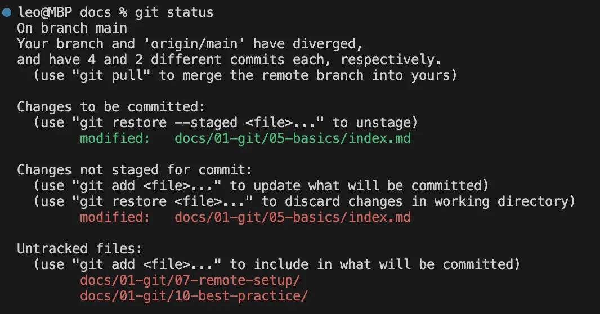

# Git 基礎指令

這篇會介紹 Git 的基礎指令，會先介紹最簡單可操作的指令，再介紹日常常用的指令集。

## 基礎操作指令
以下指令就是最基本的操作方式：
```sh
git init                    # 初始化 git
git add <file-name>         # 放到預存區
git commit -m <messages>    # 提交到 git 儲存庫
```

這些指令完成了上一篇中描述的[檔案標記狀態](/docs/git/preliminary#git-是什麼)。

## 常用本地命令
接下來介紹日常常用的指令，會先介紹所有命令，再一一介紹每個命令的選項。首先介紹本地處理常用的命令：

```sh
git status                  # 檔案狀態（新增A、修改M、刪除D、未追蹤U）
git log                     # 提交歷史
git reset                   # 修改檔案狀態
git branch                  # 分支操作
git stash                   # 暫存檔案（非預存）
git rebase                  # 修改提交歷史
```

### 提交與狀態
1. git status：查看尚未提交的修改狀況，當修改告一段落時可以 add and commit
2. git add
   - `.`, 儲存所有檔案修改
   - `-p`, 補丁模式，互動式加入預存，常用選項為
     - y, yes
     - n, no
     - d, 該檔案之後都不要加入
     - s, 切成更小的區塊
3. 使用 `git log` 查看提交歷史，加上 --oneline 印出乾淨的提交歷史

在這裡初學者只需要無腦 `git add .` 即可。


git status 分成三種狀態，從下到上分別是未追蹤、追蹤已修改、已預存。

### 還原與修改
這裡是 Git 的重頭戲，但是是基本篇所以只會講基本操作。

#### 還原 git reset
這是使用度非常高的指令，分為三種：
- `git reset --soft <hash>`：只刪 commit，其他不動
- `git reset --mixed <hash>`：刪 commit 和 add
- `git reset --hard <hash>`：除了 commit 和 add 以外，連你的寫的程式都刪了，謹慎使用！

> 使用情境：不小心提交，但還想繼續編輯：
> ```sh
> git reset --soft HEAD^
> ```

會取消最新的提交，但保留所有程式碼修改（保留在預存區 staging area）。另外兩個選項主要分成兩種情況，mixed 用於想要選擇哪些是需要 `git add` 加入的，而 hard 非常危險，commit, stage, 工作目錄**全部刪除**，需要小心使用。

> 使用情境：提交了多個小變更，想整理成一個提交：
> ```
> git reset HEAD~3
> ```

這會移除包含現在的三個提交。

> 使用情境：只還原指定檔案，到前一個提交：
> ```
> git reset HEAD~1 -- <file-name>
> ```

:::info 

1. HEAD 代表目前工作的 commit 位置
2. "^" 代表前一個提交，"~n" 代表前 n 個提交
3. -- 代表檔案分界線

:::

這裡之後的暫時不會用到，但是先把指令放在這裡，有需要可以回來看。

#### 暫存 git stash
這是一個特別的指令，會把所有檔案都放進獨立的 stash 中，再把工作目錄還原成上一次提交的版本。  
使用情境：
1. 使用 git rebase 時強制目錄不能有未存檔檔案
2. 改到一半需要改一個更重要的東西
3. 改到一半需要跳到別的分支

可以看出來他是一個暫時擋刀用的指令。

基本選項：
```sh
git stash                  # 暫存變更
git stash list             # 查看所有的 stash
git stash apply stash@{0}  # 恢復第一個暫存的變更
git stash drop stash@{0}   # 刪除 applied stash
git stash pop              # 等同 apply + drop
git stash clear            # 清除所有 stash
```

#### 修改 git rebase
這是一個非常複雜的指令，包含很多強大的功能，甚至有教學說[「不會 rebase, 等於沒學過 Git」](https://myapollo.com.tw/blog/git-tutorial-rebase/)。

這裡只講解他的基本邏輯，引用自[码农高天](https://www.youtube.com/watch?v=uj8hjLyEBmU)，是我看過講的最好，最清楚也最簡短的說明：

<center><h5>將「目前分支」移到旁邊，放進「目標分支」，再想辦法把移到旁邊的「目前分支」接上去</h5></center>

為了搞懂 rebase 看了很多文章，直到看到這句話才搞懂，真的不需要了解工具怎麼實現的，只要會用工具就好了。用都不會用就講原理的結果就是不會用也不懂原理。

其他功能主要集中在選項 `git rebase -i`，提供互動式修改方式，可以移動/刪除/修改內容/修改 commit 等，非常靈活。

:::danger

雖然初學暫時不會碰到多人合作，但還是必須強調 rebase **永遠只該用於個人分支**，尤其是會看這篇文章的人！

:::


### 分支 git branch
當你工作變複雜一條分支不夠用就會用到這些，可先跳過。
```sh
git branch                           # 查看
git branch <name>                    # 新建
git checkout <name>                  # 切換
git branch -D <name>                 # 刪除
git branch -m <old> <new>            # 改名
git merge "NAME"                     # 合併
```

## 常用遠端指令
這裡都滿直觀沒什麼好解釋的，需要解釋的是 `origin` 是 git 預設的遠端儲存庫名稱，你也可以修改名稱/新增其他儲存庫。
```sh
git clone <remote.git> <dir>         # 克隆遠端倉庫，dir為可選
git push <origin> <branch>           # 推送到遠端，後兩項可選
git pull <origin> <branch>           # 拉取並合併，後兩項可選
git fetch <remote>                   # 拉取但不合併
git remote -v                        # 顯示遠端倉庫
git remote add <name> <remote.git>   # 增加遠端倉庫並指定名稱
git remote remove <name>             # 移除遠端倉庫
git push --set-upstream <name> <branch>   # 首次上傳需要設定名稱和分支
```
