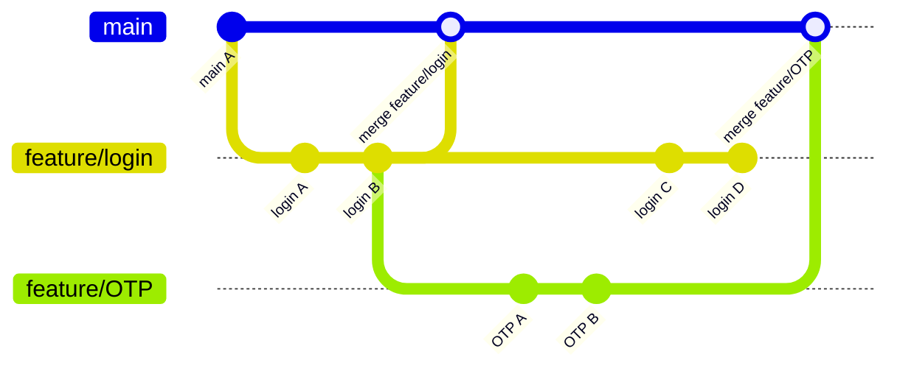

# 基礎知識
本篇文章以最快的速度帶領初學者了解 Git 基礎知識，首先介紹大的 picture 方便宏觀理解。

## Quick Overview
Git 是一個版本管理工具，每次提交 (commit) 都會計算獨一無二的 hash 以紀錄版本變更，並指向上次的 commit。除了基本的版本歷史順序，也有分支功能，可作為功能開發/修復緊急 bug 使用。上網查 git 時一定都看過這種流程圖，以本圖為例，從主分支切出 feature/login 和 feature/OTP 分支進行開發，完成後再合併回 main，這樣的意義在於不影響穩定的 main，所有開發都在別的分支進行，確認可行才合併回 main。

範例：從主分支新增分支負責登錄功能，OTP (一次性密碼) 功能又基於登錄功能開發，再切出第二分支，完成開發後合併兩個開發分支。

## 概念
實際使用時有三個層面，分別是你的硬碟、本地儲存庫 (git)、遠端儲存庫 (github/gitlab)。你的硬碟什麼版本都不知道只放檔案當前狀態，儲存庫儲存所有版本，遠端儲存庫是最後同步共享的地方。

撰寫程式時，commit 提交到本地儲存庫，push 到所有成員共用的遠端儲存庫。

> 以下修改自[官方說明](https://git-scm.com/book/zh-tw/v2/%E9%96%8B%E5%A7%8B-Git-%E5%9F%BA%E7%A4%8E%E8%A6%81%E9%BB%9E)：三種狀態   

扣掉遠端以外（我們可以暫時把他視為一個備份的存在），在本地端 Git 會把檔案標記為三種主要的狀態：已修改 modified、已預存 staged、已提交  committed。 
1. 己修改 => 檔案被修改但尚未預存
2. 已預存 => 檔案將會被存到預存區，準備被提交
3. 已提交 => 檔案己安全地存在你的本地儲存庫

這張圖解釋了檔案的狀態，在「硬碟 Working Directory」中的檔案新增或修改後，使用 `git add` 放到暫存的空間「預存區 Staging Area」，修改到一定程度時使用 `git commit` 提交到「本地儲存庫 Repository」，使用 `git checkout` 把以前的版本取出到「硬碟」中。

## 關鍵字
初學時關鍵字中英混雜有點難記憶，每個人講的也不太一樣，這裡提供一些關鍵字關係對照：
| 狀態           | 位置                      | 相關指令        |   說明         |
|-------------- |-------------------------- |----------------|-------------- |
| 未追蹤/已修改   | 工作目錄 working directory | `git add`      | 存放到預存區    |
| 已預存         | 預存區 staging area        | `git commit`   | 提交到儲存庫    |
| 已提交         | 儲存庫 repository          | `git checkout`  | 取出到工作目錄  |