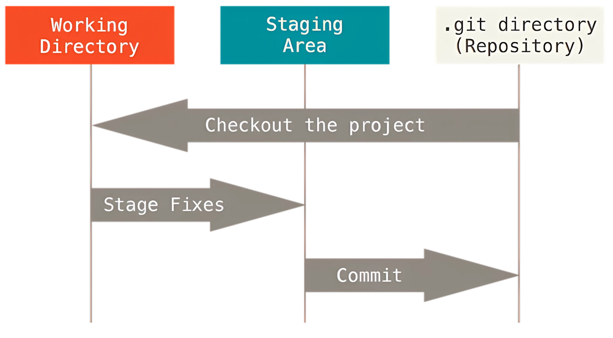

# 基礎知識

本文章以最簡短的說明帶領初學者了解 Git 基礎知識，首先介紹大的 picture 方便宏觀理解。

## Quick Overview

Git 是版本管理工具，紀錄版本的單位是一個一個的提交 (commit)，每個提交都會計算獨一無二的 hash 以紀錄版本變更，並且指向上次的提交，以便回溯過往提交。除了基本的提交歷史順序，還有一個重要的功能是分支 (branch)，意思是從提交中分出支線，以便在支線進行功能開發、修復 bug 等工作，讓每項任務可以獨立作業不互相干擾，最後在開發完成後將支線整合[^merge]回主分支，這種機制使得不同開發人員能同時處理多個功能或修復任務，而不會影響<u>**主要分支的穩定性**</u>。

[^merge]: 避免誤導所以不說合併而說整合。因為 `git merge` 指令就是合併，然而有各種方式可以完成整合不限於 `git merge`。

上網查 git 時一定都看過這種流程圖，以本圖為例，從主分支切出 login 分支，OTP 分支又基於 login 分支進行開發，確認功能穩定可行後再合併[^combine]回 main，這樣的意義在於不影響穩定的主分支，即便在某個分支開發過程中出現問題，也不會影響到其他開發者的進度或整體系統的運行。

[^combine]: 此處的整合方式使用合併 `git merge`，這個方式會保留原始分支的完整歷史結構。

```mermaid
gitGraph
  commit id: "main A"
  checkout main
  branch login
  commit id: "login A"
  commit id: "login B"


  checkout login
  branch OTP
  commit id: "OTP A"

  checkout login
  commit id: "fix login bugs"

  checkout OTP
  cherry-pick id: "fix login bugs"
  commit id: "OTP B"

  checkout main
  merge login id: "merge login branch"

  checkout login
  commit id: "login D"

  checkout main
  merge OTP id: "merge OTP branch"
```

## 概念

Git 實際運作可以分為三個層面理解，分別是硬碟、本地儲存庫 (git)、遠端儲存庫 (github/gitlab)。你的硬碟不知道任何版本資訊，只負責儲存檔案當前狀態，儲存庫是一個資料夾負責紀錄所有版本，遠端儲存庫是最後同步共享的地方。撰寫程式時，每次想要紀錄版本就<u>**提交**</u>到本地儲存庫，完成一個段落後<u>**推送**</u>提交到所有成員共用的遠端儲存庫進行協作開發[^DVCS]。

[^DVCS]: 這個段落描述的版本控制系統每個人都有完全相同鏡象，此類型系統稱為分散式版本控制系統，不是很重要但是順手解釋搜尋會看到的詞彙。另外 Git 是快照系統而不是差異系統，但知不知道對理解如何使用毫無幫助，所以本文省略介紹。

為了簡化討論，我們暫時把遠端視為一個備份的存在。在本地端，Git 會把檔案標記為三種主要的狀態，分別是已提交（committed）、已預存（staged）及已修改（modified）：

1. 已提交 -> 檔案己安全地存在你的本地儲存庫
2. 已預存 -> 已將修改的檔案新增至索引，準備提交至儲存庫
3. 己修改 -> 檔案已被更改，但尚未加入至索引

這張圖解釋了檔案的狀態，這裡我們以實際作業流程解釋

1. <u>工作目錄 (working directory, 硬碟)</u> 中的檔案修改後會進入已修改狀態
2. 使用 `git add` 將檔案放進<u>預存區 (staging area)</u>
3. 修改量累積到一個段落時使用 `git commit` 提交到<u>本地儲存庫 (repository)</u>
4. 想要還原過往的版本時，使用 `git checkout` 把以前的版本簽出[^checkout]，放進「工作目錄」中。

[^checkout]: 官方將 checkout 翻譯為簽出，這個指令的行為大致上可以說是「從儲存庫取出該版本放回硬碟」。

> 此段落修改自[官方說明](https://git-scm.com/book/zh-tw/v2/%E9%96%8B%E5%A7%8B-Git-%E5%9F%BA%E7%A4%8E%E8%A6%81%E9%BB%9E)：三種狀態

## 關鍵字

初學時關鍵字中英混雜有點難記憶，每個人講的也不太一樣，這裡提供一些關鍵字關係對照：

| 狀態           | 位置                      | 相關指令        |   說明         |
|-------------- |-------------------------- |----------------|-------------- |
| 未追蹤/已修改   | 工作目錄 working directory | `git add`      | 存放到預存區    |
| 已預存         | 預存區 staging area        | `git commit`   | 提交到儲存庫    |
| 已提交         | 儲存庫 repository          | `git checkout`  | 取出到工作目錄  |
