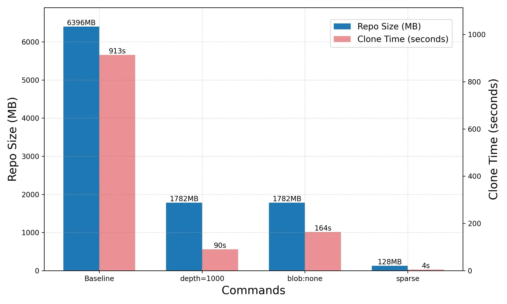

<br />

Clone 大型儲存庫又不需要全部檔案時可以使用 sparse-checkout 功能排除指定的檔案避免全部下載。

這個指令可以用於解決兩種儲存庫過大的原因，分別是 <u>**儲存庫包含大檔案或單純的文件數量過多**</u>，本教學會搭配其他指令同時使用，可以完整解決大型儲存庫下載的問題，並且最後包含實際使用範例，包含如何在十秒內克隆完樹梅派原始碼高達一百二十萬次提交的儲存庫。

<br />
<br />

## TL;DR

本章節提供兩種使用情境讓你不用看整篇就會用，而且還是最快的指令組合。使用這些指令組合後，即使 depth 設定 1000 層都不會明顯變慢，下面是簡單範例所以設定一層，平常建議 1000 起跳方便回滾歷史同時避免奇怪的問題。

### 情境一：文件數量過多，只取出特定目錄

我們以大型 monorepo [openjdk](https://github.com/openjdk/jdk) 實際測試，假設我們開發時只需要用到 `src/base` 和 `src/desktop` 兩個資料夾，指令如下：

```sh
git clone --filter=blob:none --no-checkout --depth=1 --sparse https://github.com/openjdk/jdk; cd jdk

# Git 2.37 之後因為預設啟用 cone 模式不需要這行
# git sparse-checkout init --cone

git sparse-checkout set src/java.base src/java.desktop
git checkout
```

現在我們處於 sparse checkout 的 cone 模式，此模式不支援排除目錄，只支援加入目錄，`git sparse-checkout set` 則是將規則寫入 `.git/info/sparse-checkout`。

<br />

### 情境二：儲存庫包含大檔案，排除指定檔案

剛剛是 cone 模式，此問題則需要 no-cone 模式解決。以 Blowfish 主題為例，這個儲存庫[提交太多圖片](https://github.com/nunocoracao/blowfish/issues/980)導致容量過大。

```sh
git clone --filter=blob:none --no-checkout --depth=1 --sparse https://github.com/nunocoracao/blowfish.git; cd blowfish

# Git 2.37 之後因為預設啟用 cone 模式所以需要這行
git sparse-checkout init --no-cone

git sparse-checkout set '/*' '!exampleSite/*' '!images/*' '!assets/img/*' '!*.png'
git checkout
```

請注意 cone 和 no-cone 模式的 pattern 語法不相容。no-cone 的 pattern 語法和 .gitignore 完全一樣，以上述指令為例，意思是

```
/*               加入全部檔案
!exampleSite/*   排除該目錄
!images/*        排除該目錄
!assets/img/*    排除該目錄
!*.png           排除所有png檔
```

可以看到第一行 `/*` 加上後面的語法就等同於 gitignore 的邏輯，是黑名單的概念；至於 cone 模式的語法則是簡單把白名單的加入資料夾，他也只能新增資料夾無法設定排除。

<br />
<br />

## 詳細說明

大家應該都看過 The Will Will Web 對此指令的介紹，我在讀時候就在想文章花花綠綠的好難讀，真正提筆發現全都指令很難避免，於是決定列表式寫出來看起來比較清晰，首先是指令參數介紹

1. `--filter=blob:none`: 不要下載 blobs
2. `--depth=1`: 淺克隆，只複製第一層
3. `--shallow-since=<date>`: 淺克隆，限定日期
4. `--no-checkout`: clone 後不把文件放到工作目錄
5. `--sparse`: 設定稀疏檢出 sparse-checkout
6. 上述五個指令可以獨立使用，只有 `--sparse` 本文建議搭配 `--no-checkout` 共同使用。

接下來是對 sparse checkout 本身的介紹

1. cone 代表圓錐，意思是選定一整個資料夾的目錄白名單模式，no-cone 則是和 .gitignore 一樣的黑名單模式
2. [為什麼要取名叫圓錐模式？](https://blog.miniasp.com/post/2022/05/17/Down-size-your-Monorepo-with-Git-Sparse-checkouts#:~:text=%E7%82%BA%E4%BB%80%E9%BA%BC%E8%A6%81%E5%8F%96,%E4%BB%A5%E4%B8%8B%E7%9B%AE%E9%8C%84%E7%B5%90%E6%A7%8B%EF%BC%9A)
3. 使用 no-cone 模式時可以不透過 set 指令直接編輯 `.git/info/sparse-checkout` 後進行 checkout。編輯完成後如果忘記設定 `init --no-cone` 就直接 checkout，Git 會提醒你設定衝突並且自動退回 no-cone 模式
4. 使用 `git sparse-checkout disable` 回到一般 checkout 模式

:::tip

很重要就再說一次

cone 代表圓錐，意思是選定一整個資料夾的目錄<u>**白名單模式**</u>，no-cone 則是和 .gitignore 一樣的<u>**黑名單模式**</u>
:::

<br/>
<br/>

## 疑難排解

### 應該用 cone 還是 no-cone

取決於儲存庫類型，no-cone 模式只能用於排除大檔案，他的時間複雜度是 `路徑數量*規則數量`，如果儲存庫非常大使用這個方式取出檔案，算上比較的時間可能反而比直接 clone 還慢，但是對於這種問題是大型 binaries 物件的儲存庫則非常適合。

說是這樣說，但是如果儲存庫的路徑不多，用與不用 cone 模式沒有差別。

### 使用 sparse-checkout 無法切換分支

我的解決方式

```sh
git ls-remote --branches
git fetch --depth=1 origin <remote-branch-name>:<local-branch-name>
git checkout <local-branch-name>
```

這個問題問語言模型是沒用的，因為問題不是 sparse-checkout 而是出在 depth=1 上，知乎的方式寫的又臭又長，手動指定分支不就好了，或者設定深度 1000 不會明顯變慢也免得設定分支的麻煩。

### no-cone 模式一定是黑名單嗎

因為其運作方式比較適合黑名單所以用黑明單解釋，順便和白名單對照方便記憶。黑名單的靈感來源是官方文檔就是把他當黑名單用。

### sparse-index 是什麼？

一個實驗性功能，目的是讓 git status 和 git add 速度加快，使用 `git sparse-checkout init --cone --sparse-index` 開啟，可能不兼容外部工具，請見 git core dev [寫的文章](https://github.blog/open-source/git/make-your-monorepo-feel-small-with-gits-sparse-index/)。

<br/>
<br/>

## 實際測試

### 情境一：文件數量過多

[raspberrypi/linux](https://github.com/raspberrypi/linux) 是有一百二十萬提交的大型儲存庫而且檔案數量非常多，使用此指令測試

```sh
REPO=https://github.com/raspberrypi/linux

time git clone -q $REPO
time git clone --depth=1000 $REPO $(basename $REPO)-d1k"
time git clone --depth=1000 --filter=blob:none $REPO $(basename $REPO)-d1k-blob"
time git clone --depth=1000 --filter=blob:none --no-checkout --sparse $REPO $(basename $REPO)-d1k-blob-sp" 
```

設定 sparse-checkout 時假設目標是要處理[這個 Issue](https://github.com/raspberrypi/linux/issues/6037)，於是設定要處理的目錄為：

```sh
git sparse-checkout set drivers/gpio drivers/irqchip drivers/pinctrl drivers/misc drivers/char drivers/platform arch/arm64 include/linux kernel/irq kernel/printk
```

測試結果如圖所示，sparse 方式雖然沒加上後續的 checkout 時間 9 秒，但是總計 13 秒還是非常快。



### 情境二：儲存庫包含大檔案

[xuejianxianzun/PixivBatchDownloader](https://github.com/xuejianxianzun/PixivBatchDownloader) 是一個 Chrome 擴充功能的儲存庫，使用此指令測試

```sh
REPO=https://github.com/xuejianxianzun/PixivBatchDownloader

time git clone -q $REPO
time git clone -q --filter=blob:none $REPO "$(basename $REPO)-blob"
time git clone -q --filter=blob:none --no-checkout $REPO "$(basename $REPO)-blob-nc"
time git clone -q --filter=blob:none --no-checkout --depth=1 $REPO "$(basename $REPO)-blob-nc-d1" 
time git clone -q --filter=blob:none --no-checkout --depth=1 --sparse $REPO "$(basename $REPO)-blob-nc-d1-sp" 
```

設定 sparse-checkout 時假設我們排除關於文檔的目錄，在 `.git/info/sparse-checkout` 裡面新增這些規則

- /dist/
- /notes/
- !/notes/*/
- /src/

測試結果如圖


欸不是說不能排除目錄嗎？這是撰文途中意外試到的一個小 bug，他只能排除所有子目錄，並且如果使用 `git sparse-checkout set '!/notes/*/'` 會報錯，所以請知悉<u>**這是 bug 不是 feature，只能排除所有子目錄不能排除指定目錄**</u>！！！

> 附帶一提，為什麼被測試的指令跟情境一有微妙的差別呢，因為自己寫一寫發現用那三種指令就夠了不用再去搞其他組合。情境一的三種指令依照儲存庫情況進行選擇，總之就只有這三種好用，有仔細看到這段的人又多學了一招。

## 參考資料

- https://git-scm.com/docs/git-sparse-checkout
- https://ryanagibson.com/posts/shrink-git-repo
- https://blog.miniasp.com/post/2022/05/17/Down-size-your-Monorepo-with-Git-Sparse-checkouts
