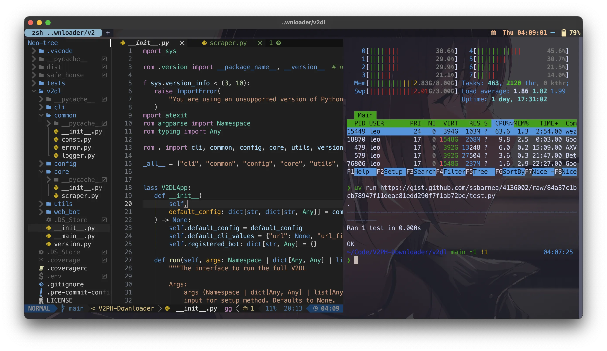

import ResponsivePlayer from '@site/src/components/ResponsivePlayer';

這是[我的 macOS dotfiles](https://github.com/ZhenShuo2021/dotfiles-macOS)，讓你可以一鍵完成整個新電腦的設定，不用一個一個慢慢按慢慢複製指令，這裡不會告訴你複製...貼上...到哪裡按什麼...，就是下載、安裝和完成設定，開箱即用並且 well-tuned。下方是 WezTerm 終端機的實際範例，這麼多功能你不用慢慢安裝每個慢慢調整，一鍵就可以安裝完。



<ResponsivePlayer url="https://www.youtube.com/watch?v=RVVCEYs4U7A" />

（如果是 Linux 用戶則記得要把 macOS 相關的資料夾移除例如 macos）

## 我用了什麼？

所有設定都基於 keep it simple 理念，外觀盡量遵照 vscode 預設主題，一律使用 powerlevel10k 推薦的 MesloLGS NF 字體：

- [終端機](../useful-tools/cross-platform-terminal#conclusion)
  1. 全部使用 oh-my-zsh + powerlevel10k，使用最少樣式，使用官方推薦的 MesloLGS NF 字體
  2. wezterm: [KevinSilvester/wezterm-config](https://github.com/KevinSilvester/wezterm-config)
  3. warp: [warpdotdev/themes](https://github.com/warpdotdev/themes)
  4. alacritty: 只有基礎設定

- 文字編輯
  1. 外觀遵循 vscode 預設風格
  2. helix: onedarker theme + ruff lsp
  3. neovim: 使用 Lazyvim 設定檔，關閉所有 lsp，鍵盤映射 ctrl+d 成黑洞刪除

- 工具
  1. gallery-dl: 精心設計的 config.json，只需修改路徑即可使用
  2. yt-dlp: 最高畫質和音質的設定

其餘 Brewfile 設定的工具有以下，只列出大項目

### 開發者

1. docker/docker-compose: 容器
2. iterm2/wezterm/warp/tmux: 終端機工具
3. helix/neovim/Lazyvim: 文字編輯器和擴展
4. fd/fzf/ripgrep: Lazyvim 推薦的搜尋工具
5. git/lazygit/gh/act: git/懶惰 git 工具/本地 github cli/actions平台

### 終端工具

1. exiftool: 相片元資料編輯器
2. imagemagick: 相片編輯工具
3. gallery-dl/yt-dlp/motrix: 圖片/影片/萬用下載工具
4. yazi: 檔案檢視器
5. hiddenbar: 狀態欄隱藏工具
6. ffmpeg: 影片轉檔

### 其他工具

1. Localsend: 跨裝置類 airdrop
2. upscayl: AI 超解析度工具
3. Spotify
4. chrome
5. joplin
6. google-drive
7. teamviewer
8. raycast
9. stats

## 安裝

```sh
git clone --depth 1 --recursive --shallow-submodules https://github.com/ZhenShuo2021/dotfiles.git ~/.dotfiles
cd ~/.dotfiles
find . -type f -name "*.sh" -exec sudo chmod +x {} \; 
script/bootstrap
```

That's all!

你首先應該修改 zsh/zshrc.symlink 以調整路徑和個人偏好設定。

修改主題和套件請在 defaults 修改，分別有 install.sh 安裝、zsh 用於設定 omz 本身、symlink 是該主題自己新增到 $HOME 目錄的文件。所有 submodule 都在 custom 分支進行修改。
