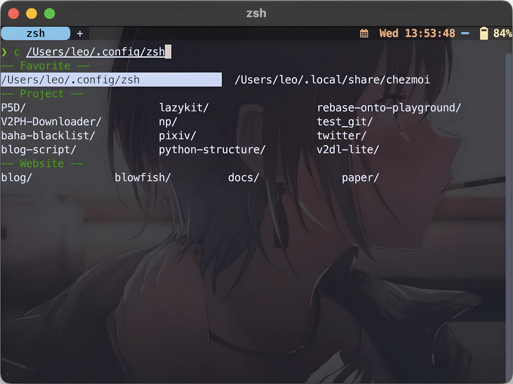
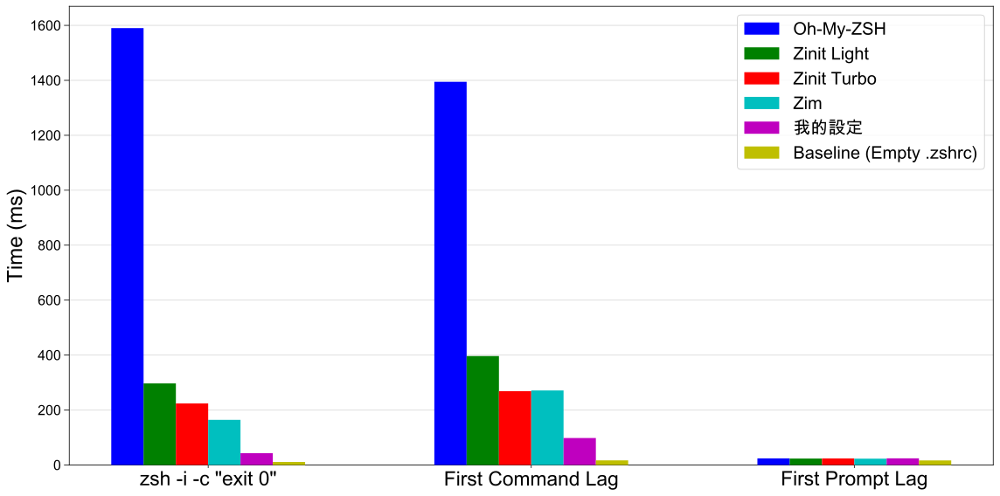

import ResponsivePlayer from '@site/src/components/ResponsivePlayer';

# 0.04 秒啟動極速 Zsh

⚡️ 有多快？  
> 0.042 秒的首次命令延遲，0.1 秒的 prompt 延遲，比 Oh-My-Zsh 快 14 倍，比 Zinit 快 4 倍，比 Zim 快 2.5 倍。

🌐 跨平台適用
> 測試 macOS/Ubuntu/TrueNas (Debian) 都正常運作。

⚙️ 設定正確
> 參考 shell 插件開發者 [agkozak](https://github.com/agkozak) 的 shell 設定，應該沒有幾個人能比 shell 開發者本人的設定更好。

🧰 功能豐富
> 內建 10 個日常實用插件，方便性沒有因為速度妥協。

<br/>


<ResponsivePlayer url="https://www.youtube.com/watch?v=RVVCEYs4U7A" />

## 一鍵安裝

> 一鍵安裝的具體設定會持續更新變化，如果有疑慮請根據[設定段落](#setup-zshrc)操作。

1. 開啟終端機貼上  
`ASK=1 sh -c "$(curl -fsSL https://raw.githubusercontent.com/ZhenShuo2021/dotfiles/main/remote_install.sh) -k -v"`
2. 第一個問題 `Minimum install (only install zsh plugins, T/F)` 按下 T

3. 如果沒安裝過 nerd font 再加上這兩行指令安裝：

```sh
brew tap homebrew/cask-fonts
brew install font-jetbrains-mono-nerd-font
```

4. 重新啟動終端機並且等待插件自動安裝完成[^vscode]
5. 輕鬆完成所有設定

現在你已經得到筆者閱讀超過百篇以上文章的精華，並且大量借鑑（抄襲）兩位資深開發者的設定檔，分別是 [narze](https://github.com/narze/dotfiles) 以及 zsh-z 和 zcomet 開發者 [agkozak](https://github.com/agkozak/dotfiles) 的設定檔，這樣還要看網路上的文章一個一個指令慢慢貼上嗎？或者是很多半路出家的文章，搞了半天發現文章內容不是最佳設定甚至錯誤？這裡一行解決而且由於是直接抄襲設定檔所以不會有錯誤的問題。

安裝後終端機改用 WezTerm 以兼容全彩顯示、圖片和完整的文字效果，修改主題樣式請執行 `p10k configure`，只要記得修改樣式的最後一個問題 `Apply changes to ~/.zshrc?` 選擇 No。

如果有幫助到你的話請給我[一顆星星](https://github.com/ZhenShuo2021/dotfiles)，我會非常感激。

[^vscode]: VSCode 如果遇到終端機顯示異常則需要修改字體，按下 `Ctrl+Shift+p` 輸入 `User Settings (JSON)`，貼上 `"terminal.integrated.fontFamily": "MesloLGS NF",`

## 前言

在網路上搜尋客製化終端機等等關鍵字會看到 Oh-My-Zsh (omz), iTerm2 等等文章，稍微深入一點之後就會看到 omz 太慢了，開始改用 Zim, Zinit 等來替代原本的 omz，但是這些文章都沒告訴初學者兩個問題：

1. omz, Zim, Zinit 到底在做什麼？
2. 為什麼內建終端機用的好好的要改用 iTerm2？

omz 這些是 <u>**Zsh 插件管理器**</u>，用途是簡化 shell 插件載入的步驟，iTerm2 則用於替換內建終端機，提供分頁、tmux 和 true color 等等內建終端機沒有的功能（不過內建終端現在應該只剩下 true color 和顯示圖片功能不支援）。知道目的後下一步就要討論應該<u>**如何選擇終端和插件管理器**</u>。終端機的部分跳過直接講結論，筆者建議用 WezTerm 並且直接在 Github 搜尋別人的設定檔，或是使用開箱即用的 Warp/Tabby，其餘不推薦，詳細討論請看專文 [各種跨平台終端機實測](../useful-tools/cross-platform-terminal)。

WezTerm 設定檔可以使用筆者自己[稍微改良過的](https://github.com/ZhenShuo2021/wezterm-config)，或者是 KevinSilvester 的[原版設定](https://github.com/KevinSilvester/wezterm-config)，提醒一下原版設定需要把預設 shell 從 fish 改為 zsh。

### 如何選擇 Zsh 插件管理器{#choose-zsh-plugin-manager}

Zsh 插件的概念最早是由 Oh-My-Zsh 提出的[^first]，因為是先行者，所以他最多人用，速度也最慢。管理器的主要功能不外乎是下載、載入和更新插件，選擇的要點有速度和方便性兩個，速度很直觀，這裡有插件管理器的載入速度測試：

- [rossmacarthur/zsh-plugin-manager-benchmark](https://github.com/rossmacarthur/zsh-plugin-manager-benchmark)
- [Eric Nielsen: Zim Speed](https://github.com/zimfw/zimfw/wiki/Speed)

方便性的評斷標準就比較複雜，以我的使用經驗來說有以下幾個重點

1. **安裝時會不會直接覆寫檔案**：如 z4h, Zim 都會直接覆寫 .zshrc 文件
2. **支不支援自動下載插件**：應該只剩下 omz 不支援
3. **設定的自由度**：對每個插件獨立管理而不是統一由管理器載入
4. **加速載入**：自動將插件編譯成二進制的 .zwc 檔
5. **插件來源豐富度**：如 Github repo, 指定 URL, 本機路徑等
6. **補全系統**：自動攔截補全的 compdef 指令，放到最後才一併執行
7. **能不能集中管理 fpath**：支援自動 symlink，避免每個插件都有一個 fpath

問題一其實很好解決[^1]，問題二也不是問題，所以問題只剩下後面五個，既然追求最快的速度，那麼最重要的就是第三項最高的設定自由度，並且支援自動編譯 zwc 檔，其餘都是次要問題。

[^1]: 在 zshrc 中檢查管理器是否安裝並且自動 clone 就好了，檢查時間算不上效能損失。
[^first]: 有興趣也可以研究 [Zsh Plugin Standard](https://zdharma-continuum.github.io/Zsh-100-Commits-Club/Zsh-Plugin-Standard.html)。

### Zim, Zinit, zsh4humans 都不是最快的插件管理器

在 [Eric Nielsen: Zim Speed](https://github.com/zimfw/zimfw/wiki/Speed) 的測試裡面不是說最快的就是這幾個嗎？讓筆者仔細說明。Zim 要求把插件放到獨立的 .zimrc 文件統一載入，這種插件載入方式會造成我們無法手動對每個插件進行管理，尤其個別設定是否使用 zsh-defer 這個的插件。zsh-defer 的用途是延遲指令實際執行，讓 shell 在沒有工作時才載入以降低實際等待時間，然而 Zim 統一載入插件的這個特色會導致我們無法控制各個插件是否啟用 zsh-defer，只能設定全開或全關，全開會因為無法達成 Zsh 補全系統要求的載入順序造成部分補全系統啟用失敗，反之<u>**不使用延遲載入，這些插件管理器就不再是比誰更快，而是慢和更慢**</u>，同樣的問題也發生在 zsh4humans 只是比較輕微（因為他真的很快）。

至於 Zinit，他內建的 turbo mode 就是延遲載入功能，但是 Zinit 作為插件管理器本體的載入速度太慢，第二大的缺點是語法過度複雜。

排除這些問題後，最後筆者找到的插件管理器就是 zcomet，快速且易於設定。

### 補全是什麼

輸入指令後按下 <kbd>Tab</kbd> 幫你自動列出可選指令，這是終端三大救贖之一，沒有這個不知道指令要打到什麼時候，範例大概是這個樣子的，這是筆者自己撰寫的函式 `c`，用於前往最愛資料夾，並且使用補全的範例：



這是特例，99.9\% 都是使用工具自帶的補全函式不需要自己寫，這裡只是想順便推廣筆者的文章 [撰寫 ZSH 自定義函式以及補全函式](https://blog.zsl0621.cc/posts/customize-zsh-function-and-comletion/)。

## 為何選擇這份設定檔

1. 是真的快，幾乎達到速度上限，而且是嚴謹的測試不像網路上的搞笑演員拿 time 指令跑 10 次就說這叫做速度測試
2. 不用搞 gnu stow，不用像 dotbot 一樣需要額外安裝，沒有複雜的語法，一行指令自動安裝
3. 內建實用插件，不多不少剛剛好
4. 極簡風格，不搞花花綠綠的分散注意力
5. 你的終端機已經完整設定，一個字都不用打就已經是人家一整篇文章的設定
6. 你的 zshrc 已經最佳設定，是筆者過濾百篇文章的結晶
7. 管理方便，從安裝到設定都在同一 repo
8. 完整註解，保證看得懂每個設定
9. 設定正確，正確使用延遲載入，自動補全正確啟用，連 zsh-z 都可以補全
10. 功能齊全，從語法上色、別名、key-binding、Git 插件一應俱全
11. 多項內建指令，如 hnc/c/gpg_test/gpg_reload/find-ext/switch_en ...
12. 所有常見問題都已解決
13. 乾淨的家目錄，能改到 .cache .config 的系統檔案全部改位置
14. 參考 Github 前 20 大 dotfiles 完成，結合他們全部優點，不用再想東想西現在就是最好的設定
15. 參考 shell 插件開發者 agkozak 的 shell 設定，筆者就問一般人自己瞎搞能比開發者本身設定的更好嗎？

網路上的中文文章一堆設定錯誤，沒有啟用延遲載入（尤其是使用 Zinit 這個強調延遲載入的插件管理器還不使用延遲載入，[如何選擇](#choose-zsh-plugin-manager)章節列出的兩個測試都顯示 Zinit light mode 之慢，這些文章也是滿搞笑的）、補全設定錯誤，筆者甚至能把正確拿來當賣點，如果按照其他中文文章設定高機率有某些功能設定錯誤。

---

## 正式開始優化 Zsh{#setup-zshrc}

aka 開始設定 zshrc，不使用安裝腳本而是讓你自己複製貼上比較清楚做了什麼事，而且一鍵安裝會參雜一些我個人的偏好設定。

### 建立 .zshrc

在家目錄中（`/Users/<name>`）打開 .zshrc 檔案，如果沒有就建立一個，貼上

```sh
# Enable Powerlevel10k instant prompt. Should stay close to the top of ~/.zshrc.
# Initialization code that may require console input (password prompts, [y/n]
# confirmations, etc.) must go above this block; everything else may go below.
if [[ -r "${XDG_CACHE_HOME:-$HOME/.cache}/p10k-instant-prompt-${(%):-%n}.zsh" ]]; then
  source "${XDG_CACHE_HOME:-$HOME/.cache}/p10k-instant-prompt-${(%):-%n}.zsh"
fi

BREW_PATH=/opt/homebrew
export PATH="$HOME/.local/bin:$PATH"
export ZSH_COMPDUMP="$HOME/.cache/zsh/zcompcache/.zcompdump"

zstyle ':zcomet:*' home-dir ~/.config/zsh/zcomet
if [[ ! -f ${ZDOTDIR:-${HOME}}/.config/zsh/zcomet/bin/zcomet.zsh ]]; then
  git clone https://github.com/agkozak/zcomet.git ${ZDOTDIR:-${HOME}}/.config/zsh/zcomet/bin
fi
source ${ZDOTDIR:-${HOME}}/.config/zsh/zcomet/bin/zcomet.zsh

# load p10k
zcomet load romkatv/zsh-defer
zcomet load romkatv/powerlevel10k

zsh-defer source ~/.zshrc.local

# To customize prompt, run `p10k configure` or edit ~/.p10k.zsh.
[[ ! -f ~/.p10k.zsh ]] || source ~/.p10k.zsh
```

第一段的 p10k-instant-prompt 是 powerlevel10k 主題特有的 instant-prompt 功能，他的原理主要是快取文件並且延後插件載入，讓我們可以馬上開始輸入不需要等待插件完全載入，所以在[官方範例](https://github.com/romkatv/powerlevel10k?tab=readme-ov-file#instant-prompt)可以看到 syntax highlight 的顏色過了一段時間才出來並且可以馬上輸入文字。

第二段是設定路徑，`BREW_PATH` 則設定 brew 路徑，M1 以上才是這個路徑，x86 (Intel CPU) 在別的路徑請自行修改，接著把 bin 資料夾加入路徑讓可執行檔可以被系統找到，最後設定 `ZSH_COMPDUMP` 設定補全系統的文件位置避免家目錄很亂，在我的一鍵安裝設定檔中幾乎所有能不放在家目錄的都被改位置了，包含 `.gitconfig` `.matplotlib` 等等，全部都放在 `.cache` 或者 `.config`。

最後是下載和載入 zcomet、載入必要插件、使用 zsh-defer 功能延遲載入其餘插件、載入主題。

### 建立 .zshrc.local

一樣在家目錄建立文件，名稱 .zshrc.local 並且貼上

```sh
# load plugins
zcomet load ohmyzsh plugins/extract
zcomet fpath ohmyzsh plugins/docker-compose   # only load completion
# zcomet load ohmyzsh plugins/git
# zcomet fpath ohmyzsh plugins/gitfast   # Same as homebrew's git completion


# configure zsh-history-substring-search
zcomet load zsh-users/zsh-history-substring-search

# Only search full prefix match
HISTORY_SUBSTRING_SEARCH_PREFIXED=1

# custom substring highlight color
# HISTORY_SUBSTRING_SEARCH_HIGHLIGHT_FOUND='fg=white,bold,bg=cyan'
# HISTORY_SUBSTRING_SEARCH_HIGHLIGHT_NOT_FOUND='fg=white,bold,bg=red'
# HISTORY_SUBSTRING_SEARCH_HIGHLIGHT_TIMEOUT=2

# disable substring match highlighting
unset HISTORY_SUBSTRING_SEARCH_HIGHLIGHT_FOUND
unset HISTORY_SUBSTRING_SEARCH_HIGHLIGHT_NOT_FOUND
bindkey '^[[A' history-substring-search-up
bindkey '^[[B' history-substring-search-down


# plugins that must be loaded last
zcomet load agkozak/zsh-z
zcomet load zsh-users/zsh-completions
zcomet load zsh-users/zsh-syntax-highlighting
zcomet load zsh-users/zsh-autosuggestions; bindkey '^f' autosuggest-accept


# optional plugins
# zcomet load lukechilds/zsh-better-npm-completion


# deprecated plugins
# zcomet load ohmyzsh lib completion.zsh   # brew fpath and zsh-completions are better


# colored manpage
export LESS_TERMCAP_mb=$'\e[1;32m'
export LESS_TERMCAP_md=$'\e[1;32m'
export LESS_TERMCAP_me=$'\e[0m'
export LESS_TERMCAP_se=$'\e[0m'
export LESS_TERMCAP_so=$'\e[01;33m'
export LESS_TERMCAP_ue=$'\e[0m'
export LESS_TERMCAP_us=$'\e[1;4;31m'


# shellenv MUST run before compinit
# put this in .zprofile if get something wrong in your completion
eval $(/opt/homebrew/bin/brew shellenv)

# Setup completion styles

# Set format for completion descriptions
zstyle ':completion:*:descriptions' format '%F{green}-- %d --%f'

# Set format for completion warnings
zstyle ':completion:*:warnings' format '%F{red}-- No matches found --%f'

# Set prompt for interactive completion selection
zstyle ':completion:*' select-prompt '%F{green}%p%f'

# Separate matches into groups, should be used with description format
zstyle ':completion:*:matches' group 'yes'
zstyle ':completion:*' group-name ''

zstyle ':completion:*:match:*' original only

# Case-insensitive tab completion
zstyle ':completion:*' matcher-list 'm:{a-z}={A-Z}'

# Allow tab insertion when completion is pending
zstyle ':completion:*' insert-tab pending

# Enable menu selection for completion
zstyle ':completion:*' menu select

# Set cache path for completion
zstyle ':completion::complete:*' cache-path "$XDG_CACHE_HOME/zsh/zcompcache"

# Misc
zstyle ':completion:*' list-separator ' ➤ '

# brew pyenv completion, must before compinit
if type pyenv &> /dev/null; then
    source "$BREW_PATH/opt/pyenv/completions/pyenv.zsh"
fi

autoload -Uz compinit
compinit -d $ZSH_COMPDUMP

# uv (python), requires compdef, must after compinit
eval "$(uv generate-shell-completion zsh)"
```

特別分開兩個檔案是比較 tricky 的部分，目的是為了繞過 zsh-defer。如果直接在 .zshrc 中使用相同設定，並且在載入插件、compinit、brew shellenv 三大耗時指令上使用 zsh-defer，會發現終端啟動還是一樣慢，但是把這些放在另一個文件使用 `zsh-defer source` 就沒這問題，這是 zsh-defer 的 behavior 而不是一個 feature，但是使用至今沒有遇到特別問題，設定、補全和函式都能正常載入，在我的 repo 中這些設定分的更細不只是兩個文件。

接著回頭講設定部分，讀者可能看過 [Ubuntu 安裝 Zsh + Oh My Zsh + Powerlevel10k 與各種插件](https://www.kwchang0831.dev/dev-env/ubuntu/oh-my-zsh)，才安裝兩三個插件對初學者來說已經滿頭大汗了，這不是文章的問題而是 omz 才有的問題，現在輕鬆的複製貼上就等同於已經安裝 10 個插件，並且使用 eval 指令設定好 brew，大量的 zstyle 設定檔，還有完整的自動補全系統，雖然是自己寫的但是自己看了都覺得相見恨晚，這些要設定完成而且正確我讀了上百篇文章並且還要排除大量錯誤資訊。

從 pyenv 往後的行數順序不可變動，他們有載入先後順序要求，pyenv 需要在 compinit 前設定好，而 uv 需要 compinit 後才會有的 compdef 才能執行，如果不是 Python 開發者可以移除 pyenv 和 uv，但這是一個很好的範例用於展示補全系統的先後順序，如果你是 Python 開發者那麼筆者強烈建議使用 uv，請參考筆者的文章 [Python UV 教學，最佳虛擬環境管理工具](../python/python-uv-complete-guide)。

以防你不會設定補全系統，這裡說明如何設定順便種樹，因為就沒有一篇文章能好好說明 Zsh 補全系統是怎麼運作的，結論很簡單，資源很難找：

1. 插件 `zsh-syntax-highlighting` `zsh-autosuggestions` 應該在最後才載入
2. 設定 fpath
3. 設定 zstyle
4. 執行 compinit
5. 設定 zstyle（如果有其餘的 zstyle 必須在 compinit 後執行的話）
6. 執行 functions requires compdef

用人話解釋，這兩個插件開發者自己說他的插件應該在最後才被載入，fpath 是 Zsh 才有的路徑，用於設定補全腳本和函數的路徑（而不是腳本或程式，這兩個的路徑是 PATH）；zstyle 有很多功能，最顯而易見的就是設定補全的樣式；接著 compinit 啟用補全系統，再執行需要依賴補全系統的指令。

### 安裝其餘工具

如果你沒有安裝過套件管理工具 brew，使用此指令安裝：

```sh
/bin/bash -c "$(curl -fsSL https://raw.githubusercontent.com/Homebrew/install/HEAD/install.sh)"
```

如果沒安裝過 brew 那應該也還沒安裝 nerd font 和 WezTerm，使用此指令安裝：

```sh
brew tap homebrew/cask-fonts
brew install font-jetbrains-mono-nerd-font
brew install --cask wezterm
```

WezTerm 是可以顯示圖片和 true color 的跨平台終端機，iTerm2 沒有跨平台所以我不推薦。所有 brew 設定都已經在上面的文件中設定完成，完全不需要費心調整。

如果想要現成的 WezTerm 設定檔可以使用我的，一樣是一行指令完成設定

```sh
git clone https://github.com/ZhenShuo2021/wezterm-config.git ~/.config/wezterm --depth=1
```

## 速度實測

<details>

<summary>錯誤百出的網路文章</summary>

前面說到搞笑演員拿 time 指令跑 10 次就說這是效能測試，首先好歹拿個 hyperfine 就可以一鍵生成統計數據，筆者使用 hyperfine 執行 100 次測試統計結果都沒有到非常穩定了，跑 10 次不是來搞笑的嗎？而且 [zsh-bench](https://github.com/romkatv/zsh-bench/) 早在 2021 就說了測試 `zsh -i -c exit` 毫無意義[^meaningless]，功課不做就開始寫文章誤導他人。

不過搞笑演員至少還可以搞笑，甚至還有很多文章使用 Zinit 結果[不使用 turbo mode](https://github.com/zimfw/zimfw/wiki/Speed)，我無話可說。

</details>

[^meaningless]: exit time (ms): how long it takes to execute `zsh -lic "exit"`; this value is meaningless as far as measuring interactive shell latencies goes

測試使用專門評估 shell 的 [zsh-bench](https://github.com/romkatv/zsh-bench/) 和直觀易懂的 hyperfine 進行測試[^test-method]，測試項目涵蓋五種框架：

- Oh-My-ZSH: 最多人使用的框架
- Zinit: 內建豐富延遲載入功能的插件管理器
- No Plugin Manager: 不使用插件管理器以減少延遲
- Zim: 標榜 [blazing speed](https://github.com/zimfw/zimfw/wiki/Speed) 的插件管理器
- zcomet: 此份 dotfile
- Baseline: 基準線，移除 .zshrc，本機能達到的最快速度

測試項目的選擇從最廣泛使用的框架到手動優化，以便準確定位效能，可以看到比 Zinit 更快，基本上追平甚至超越不使用插件管理器的速度，同時又比 Zim 易於設定。

如果使用筆者的 dotfile，裡面甚至幫你寫好了兩個 profiling 指令：簡易測試的 `zsh_prof_zprof` 和追蹤所有指令呼叫的 `zsh_prof_xtrace`，不過現在也用不太到，除了換掉 p10k 以外已經沒辦法再更快了。

如果使用筆者的 dotfile，你甚至可以透過 git 標籤得到筆者在測試不同插件管理器的時設定檔，就算不想用 zcomet 想轉換也是一秒完成的事。



你說奇怪，為什麼數據和 [repo](https://github.com/ZhenShuo2021/dotfiles) 上面的不一樣呢，因為 repo 上面的所有測試項目都公平的使用 zsh-defer 加速，但是綜觀整個網路根本沒幾個人會這樣設定，也就是說上圖才是絕大多數人終端機的開啟速度（絕大多數人的比例絕對超過 99\%，在 Github 上面搜 zshrc 就知道了），repo 上面的圖表則是每個插件管理器都使用 zsh-defer 大幅優化載入速度的結果。

並且請注意，這個測試是包含 alias/setopt/`brew shellenv`/補全系統/uv 補全系統/fpath 和 PATH 等等所有設定一起測試的真實使用環境，是更反應現實情況的實際載入延遲。

[^test-method]: 測試執行於 M1 MacBook Pro 8G RAM，zsh-bench 使用預設值，測試總共載入的插件有 powerlevel10k, zsh-defer, zsh-syntax-highlighting, zsh-autosuggestions, zsh-completions, zsh-z, zsh-history-substring-search, extract, git，每個測試都確保 brew/docker/docker-compose/yarn/npm 的指令補全必須正常運作。hyperfine 使用 `hyperfine --runs 100 --warmup 3 'zsh -i -c exit 0'` 測試，請注意 hyperfine 測試是超級簡化的測試[沒有特別意義](https://github.com/romkatv/zsh-bench?tab=readme-ov-file#how-not-to-benchmark)，他只告訴你執行這行指令的平均時間，不代表真正的體感時間。
