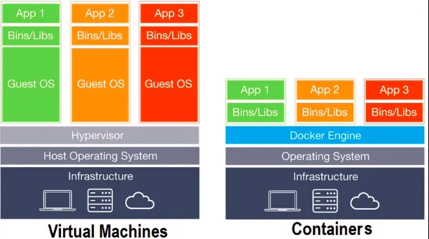
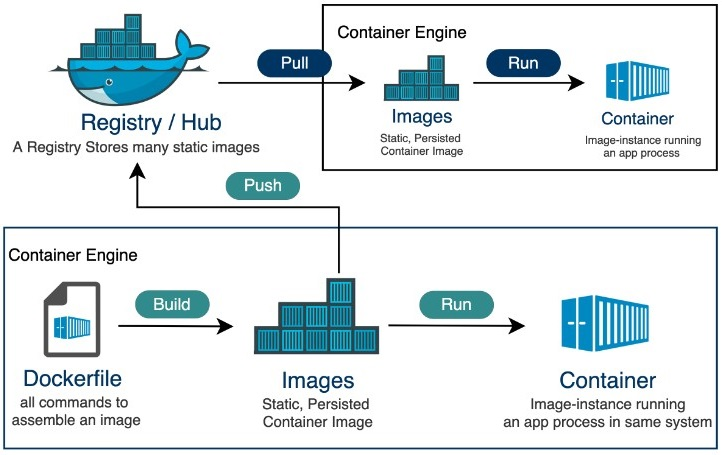

import Tabs from '@theme/Tabs';
import TabItem from '@theme/TabItem';

# 第一天學習 Docker 該知道的基礎知識

先聲明這是一個讀演算法的人玩 NAS 半路出家想說自己寫個 Docker 邊玩邊學的記錄。

## 前言

身為 NAS 用戶，Docker 最方便的就是怎麼搞都不會壞，不像傳統程式搞壞之後高機率有奇怪的[殘留設定](./clean-settings)清不掉有夠搞人，有問題就是把 mount 的東西全部 rm -rf 就清潔溜溜。不過一開始單純作為使用者使用真的不好理解，尤其是 Docker 和虛擬機的差別，拜某「看了會上癮的」的教學所賜大幅降低我的理解效率，不敢相信賣課的可以把東西講成這樣，我已經是長年關注電腦軟硬體的人第一次看都搞不懂他在說什麼。

這篇文章包含：

1. Docker 介紹，說明和傳統虛擬機的差異
2. 如何撰寫 Dockerfile 並構建自己的 Image
3. 解決 Matplotlib 的中文字體 (CJK) 問題，解法同時適用於 Docker 以外的環境
4. 如何撰寫 Docker for Github Actions 完成 Python CI
5. 常用指令小抄

# Docker 和虛擬機差異

或者說 Docker 到底如何比虛擬機還快，這是我一開始最疑惑的點。

簡單來說 Docker 就是一個超輕量化的虛擬機，和虛擬機最大差異在**不用模擬硬體**（所以你不會看到在 docker 上安裝驅動程式，但是 [VMware](https://docs.vmware.com/tw/VMware-Tools/12.4.0/com.vmware.vsphere.vmwaretools.doc/GUID-6994A5F9-B62B-4BF1-99D8-E325874A4C7A.html)/[QEMU-KVM](https://github.com/virtio-win/kvm-guest-drivers-windows) 要），並且**共用宿主 kernel**，這就是讓他輕量快速的原因。以宿主機配備 i5-7400 16G ram 而言，開一個虛擬機等同一台完整主機，記憶體分配宿主機 10G 虛擬機 6G 就差不多了，但是我在裡面架設的 ubuntu server 中開了十多個容器，加上 ubuntu 本身作業系統還吃不到 2G。



<sub>Docker 架構圖。我發現很多人都沒解釋這張圖所以第一次看有點似懂非懂。在 infra (硬體)上都必須要有作業系統，再往上會出現第一個不同，虛擬機使用管理器，而 docker 叫做 docker engine。虛擬機管理器之下是獨立的客戶 OS，而 docker 沒有 OS，直接共享宿主 OS 核心。附帶一提，VM 管理器分成兩種，以我們最容易接觸到的 VMware Workstation 為例他是屬於 type II。</sub>

<br/>
<br/>

接著馬上介紹剛剛提到的新名詞「容器」。Docker 主要組成為

1. image 鏡像
2. container 容器
3. volume 卷宗
4. network 網路

這四項組合而成。Dockerfile 作為設計圖設計這個容器該用哪些 image，再用 volume 把內部儲存空間掛載到宿主機資料夾，network 設定網路，最後合起來是運行時的實體、消耗記憶體和 CPU 資源的叫做 container。上面那隻鯨魚是 Docker Hub，是類似 Github 的地方，把 build 好的鏡像讓大家使用。



<sub>主要組成關係圖。</sub>

## Docker 的好處

講完原理那他好在哪呢？

- 快速方便的跨平台部署  
最大優勢是「**跨平台**」特性。只要打包成 Docker 映像檔，在全平台都能一致運行。

- 輕量級的虛擬化  
Docker 容器比傳統虛擬機輕量，因為它們共享主機的作業系統核心。啟動快，資源佔用少。

- 快速擴展和更新  
需要擴展應用程式時，使用 Docker 可以輕鬆啟動多個相同容器來應對負載增加。更新應用時，只需更新映像檔並重新部署容器。

## 撰寫 Dockerfile

其實這篇文章原本不是教學，標題是「第一次嘗試寫 Dockerfile」範圍只有這裡，只是想記錄我的構建過程結果越寫越多。

言歸正傳，我認為沒那麼難理解只是資源太分散，基礎版是 python slim，加上兩段構建，以及 `--virtual` 方式共三個版本：

<Tabs>
  <TabItem value="1" label="slim (basic)">

  ```dockerfile
  FROM python:3.10-slim
  WORKDIR /app
  COPY . /app

  RUN apt-get update && \
      apt-get install -y rsync fonts-noto-cjk && \
      rm -rf /var/lib/apt/lists/*
  RUN pip install --no-cache-dir -r requirements.txt

  VOLUME ["/mnt/local_path", "/mnt/remote_path", "/app/data"]
  ENTRYPOINT ["python", "-m", "p5d"]
  ```

  </TabItem>

  <TabItem value="2" label="alpine with virtual">
  
  ```dockerfile
  FROM python:3.10-alpine
  ENV PYTHONDONTWRITEBYTECODE=1
  ENV PYTHONUNBUFFERED=1

  WORKDIR /app
  COPY . .
  RUN apk add --no-cache fontconfig libstdc++ rsync
  RUN apk add --virtual .build-deps build-base curl \
      && mkdir -p /usr/share/fonts/opentype/noto \
      && curl -L -o /usr/share/fonts/opentype/noto/NotoSansCJK-Regular.ttc \
      https://salsa.debian.org/fonts-team/fonts-noto-cjk/-/raw/debian/unstable/Sans/OTC/NotoSansCJK-Regular.ttc \
      && pip install --no-cache-dir -r requirements.txt \
      && apk del .build-deps \
      && apk del build-base

  VOLUME ["/mnt/local_folder", "/mnt/remote_folder"]
  ENTRYPOINT ["python", "-m", "p5d"]
  ```

  </TabItem>

  <TabItem value="3" label="alpine with multi-stage build">
  
  ```dockerfile
  # Build stage
  FROM python:3.10-alpine AS builder
  ENV PYTHONDONTWRITEBYTECODE=1
  ENV PYTHONUNBUFFERED=1

  WORKDIR /app
  COPY . .
  RUN apk add --no-cache build-base curl
  RUN mkdir -p /usr/share/fonts/opentype/noto 
  RUN curl -L -o /usr/share/fonts/opentype/noto/NotoSansCJK-Regular.ttc https://salsa.debian.org/fonts-team/fonts-noto-cjk/-/raw/debian/unstable/Sans/OTC/NotoSansCJK-Regular.ttc
  RUN pip install --no-cache-dir -r requirements.txt

  # Final stage
  FROM python:3.10-alpine AS final
  ENV PYTHONDONTWRITEBYTECODE=1
  ENV PYTHONUNBUFFERED=1

  WORKDIR /app
  COPY --from=builder /app /app
  COPY --from=builder /usr/local/lib/python3.10/site-packages /usr/local/lib/python3.10/site-packages
  COPY --from=builder /usr/share/fonts/opentype/noto /usr/share/fonts/opentype/noto
  RUN apk add --no-cache fontconfig libstdc++ rsync

  VOLUME ["/mnt/local_folder", "/mnt/remote_folder"]
  ENTRYPOINT ["python", "-m", "p5d"]
  ```

  </TabItem>
</Tabs>

解釋 basic 版本的構建指令：

- `FROM python:3.10-slim`: 基礎鏡像，我是 python 專案所以是 python，也可以是 node, ubuntu:20.04...等  
- `ENV PYTHONDONTWRITEBYTECODE=1`: 環境變量，這裡是設定不生成 `.pyc`文件。  
- `WORKDIR /app`: 設定工作目錄，告訴Docker在容器內的`/app`目錄中執行後續命令，如果目錄不存在，會自動創建。  
- `COPY . .`: 將當前目錄的所有文件複製到容器內的工作目錄（`/app`）。  
- `RUN pip install --no-cache-dir -r requirements.txt`: 安裝 Python 套件。  
- `VOLUME ["/mnt/local_folder", "/mnt/remote_folder"]`: 設定掛載卷宗。  
- `ENTRYPOINT ["python", "-m", "p5d"]`: 容器啟動時執行的預設指令。  

很簡單吧，另外每個命令至少都會使用[一層或多層](https://www.google.com/search?q=docker+layer&oq=docker+layer)的映像檔，所以相似命令盡量用 && 合併。

### 比較不同構建方式

接下來比較不同構建方式的鏡像大小

1. slim：原始版本，使用 python slim 並且用 apt-get 安裝字體包
2. alpine：改成 python alpine，安裝必要編譯工具後沒刪除編譯工具（沒放在上面的 tab 中）
3. alpine --virtual：使用 python alpine 安裝後刪除未來用不到的包
4. alpine 多段構建：用 FROM 分隔不同階段，用於減少鏡像容量，例如 alpine 沒有編譯功能，編譯完成後直接複製到下一階段使用

容量分別是

| 方式                 | 大小          |
|--------------------|--------------|
| slim 安裝字體包      | 402MB        |
| alpine 沒刪除        | 462MB        |
| alpine `--virtual`   | 245MB        |
| 多階段構建減少容量   | 226MB        |

可以看到什麼都不管，直接使用 slim 檔案來到誇張的 402MB，alpine 雖然本體小，但是加上編譯工具反而變大。用另外兩種方式進一步優化之後可降低將近 50% 容量。進入容器內部觀察，發現 /usr/local/lib/python3.10 就佔據 190 MB，該資料夾中都是小檔案最大只有 1MB，相較本身電腦開發端的 .venv 資料夾約為 130MB 約多出 60MB。本以為優化空間也差不多了，但是參考其他專案鏡像發現專業專案的 python 資料夾還更小所以一定有優化空間，目前已知最大問題是 matplotlib 和他需求的 numpy 兩個都是容量怪物。

## 構建和執行指令

構建

```sh
docker build -t p5d . 
```

執行 p5d

```sh
docker run --rm -v /Users/leo/Pictures/downloads拷貝3/:/mnt/local_path \
-v /Users/leo/Downloads/dst/:/mnt/remote_path \
-v ~/Downloads:/app/data \
-it p5d
```

在 docker 中運行 unittest 偵錯

```sh
docker run --rm -v /Users/leo/local_folder:/mnt/local_folder \ 
-v /Users/leo/remote_folder:/mnt/remote_folder \
-v ~/Downloads:/app/data \
p5d:test python -m unittest discover -s tests -p "*.py"
```

進入容器查看，由於沒有固定存在的程式所以容器會馬上退出，所以指令要改成這樣

```sh
docker run -v /Users/leo/Pictures/downloads拷貝3/:/mnt/local_path \
-v /Users/leo/Downloads/dst/:/mnt/remote_path \
-v ~/Downloads:/app/data \
-it --entrypoint /bin/bash p5d
```

列出所有容器

```sh
docker ps -a
```

刪除所有容器

```sh
docker rm -v -f $(docker ps -qa)
```

學完之後發現大部分指令在使用 NAS 時就就學會了。

## 遇到的問題

### Matplotlib
>
> 又是 matplotlib，又是你，你最爛

好啦其實不是他，是字體問題，中日文出現一堆口口口口，這其實沒有花很久時間處理，但是處理的過程都很煩躁。

```sh
import matplotlib
import matplotlib.pyplot as plt
from matplotlib.font_manager import FontProperties

# font_path 需要手動更改
font_path = "/usr/share/fonts/opentype/noto/NotoSansCJK-Regular.ttc"
font_prop = FontProperties(fname=font_path)
font_name = font_prop.get_name()
print(f"Font name: {font_name}")

# 將字體加入列表並測試
plt.rcParams["font.sans-serif"] = [font_name] + plt.rcParams["font.sans-serif"]
plt.figure(figsize=(10, 3))
plt.text(0.5, 0.5, "中文日本語フォント동해 물과", fontsize=24, ha="center", va="center")
plt.axis("off")
plt.show()

# 顯示字體列表
print("Current sans-serif fonts:")
print(plt.rcParams["font.sans-serif"])
```

最簡單也最麻煩的設定就是字體問題，因為檔名叫 NotoSansCJK-Regular，裡面的字體不見得是 NotoSansCJK-Regular，可能是 "Noto Sans TC/JP" "Noto-Sans-TC" "Noto Sans" 等等，或者是小寫，有夠麻煩，最後終於寫對名字了結果還是口口口口最火大，途中還不知道試了哪個名字是 JP 的字體，中文可以正常顯示但是日文口口口口，到底= =

關於字體下載，我也是沒想到有天我會去 [Debian 官方倉庫](https://packages.debian.org/source/sid/all/fonts-noto-cjk) 裡面找字體，因為 apk 下載會包含多個粗細和語言，但是使用一種語言其他語言的常見字都可以顯示，為了極限縮減容量煞費苦心阿。

### Github Actions

研究一上午的結論是 Windows 不支援，至少我先催眠自己不支援，不想再搞了，一個關鍵是找 Github [現有 Actions repo](https://github.com/philips-software/run-windows-docker-container-action)，別用什麼 choco 安裝那是傻了。下方是使用 ubuntu 完成的範例。

```yaml
name: Docker Test

on:
  push:
    branches: [ main ]
  pull_request:
    branches: [ main ]

jobs:
  docker-test:
    runs-on: ubuntu-latest
    strategy:
      fail-fast: false
      
    steps:
    - name: Checkout repository
      uses: actions/checkout@v4

    - name: Set up Docker Buildx
      uses: docker/setup-buildx-action@v3

    - name: Build Docker image
      uses: docker/build-push-action@v6
      with:
        context: .
        push: false
        load: true
        tags: p5d:test

    - name: Create test directories
      run: |
        mkdir -p test_local_folder
        mkdir -p test_remote_folder

    - name: Run Docker container and execute tests
      run: |
        docker run --rm \
          -v ${{ github.workspace }}/test_local_folder:/mnt/local_folder \
          -v ${{ github.workspace }}/test_remote_folder:/mnt/remote_folder \
          --entrypoint python p5d:test -m unittest discover -s tests -p "*.py"

    - name: Clean up
      run: |
        rm -rf test_local_folder
        rm -rf test_remote_folder
```

## 補充相似工具

> 補充相似的容器化工具，這些工具如果有碰過 NAS 的人全都知道，但我懶的寫了叫 GPT 生，我叫他學我的口氣寫提示詞叫他只講重點不知道有沒有像。

不過隨著需求增加，單純的 Docker 容器還是會有一些限制。像是當你要管理一大堆容器的時候，你就會發現「手動一個個啟動」變得不太實際了。而且，有時候我們需要確保服務**永遠運行**，一旦容器掛了自動重啟，甚至還有自動擴展容器的需求。這時候我們就需要進階的工具來幫我們搞定多容器和叢集的管理。

### Docker Compose

先來講最基本的進階工具：**Docker Compose**。簡單來說，它就像是幫你打包好多個 Docker 容器的「編排工具」，也就是說你可以定義多個容器怎麼一起運行，讓不同的服務互相連接。比如你想要跑一個 Web 應用程式，前端用一個 Nginx 容器，後端用一個 Node.js 容器，資料庫用一個 MySQL 容器，這時候你就可以用 Docker Compose 一次搞定。只需要寫一個 `docker-compose.yml` 文件，定義好每個容器該用的映像、網路、卷宗（volume）等等，接著一個 `docker-compose up` 指令就讓所有東西都跑起來了。

這東西的好處就是簡化了容器之間的相互連接，不用再每個容器單獨設置網路和端口，一個配置文件搞定所有。

### Docker Swarm

接下來，如果你想要在多台機器上同時管理一大堆容器，那就要進入「**叢集管理**」的領域了。Docker 內建的叢集管理工具叫做 **Docker Swarm**。它的設計理念是「簡單易用」，想像成 Docker 自己家的叢集工具，讓多台機器組成一個「群體」（Swarm），每台機器可以自動分配和運行容器，確保你的服務即使某台機器掛了，其他機器也能頂上來。

用 Docker Swarm，你可以輕鬆在多台機器上部署容器，容器的自動擴展和縮減、負載平衡、健康檢查等功能也可以很容易實現。

### Kubernetes（K8s）

但如果你要處理**更複雜**的叢集管理，或者你的系統需要**高度可擴展**，那就會有人跟你說：「你應該用**Kubernetes（K8s）**。」這個是 Google 推出來的開源專案，現在幾乎已經是容器編排的**業界標準**。

K8s 的核心概念是將你的容器打包成「Pod」，每個 Pod 可以運行一個或多個容器，這樣你可以很靈活地管理容器的運行、擴展和部署。它可以管理數以千計的容器，實現自動調整（Scaling）、負載均衡、容錯處理（Failover）、自動重啟、甚至有進階的網路和儲存管理功能。當然，K8s 的學習曲線也比 Docker Swarm 高得多，因為它功能更強大和靈活。

簡單來說，如果你需要處理**大規模系統**，而且你不怕搞一大堆配置和學習曲線，那 K8s 就是你的最佳選擇。

### K3s

最後來講講 **K3s**，它是 Kubernetes 的「**輕量版**」。因為 Kubernetes 原本是為大規模系統設計的，所以對於資源需求會比較高。而 K3s 就是為那些資源有限的小設備或邊緣計算環境設計的，像是樹莓派或者小型的 NAS。K3s 減少了一些 Kubernetes 的進階功能，讓它變得更輕便，但保留了 Kubernetes 的核心功能。

所以，如果你想體驗 Kubernetes 的強大功能，但又不需要那麼多的複雜性和資源耗費，K3s 是個很好的選擇。

### 總結

- **Docker Compose**：適合管理單台機器上的多容器應用，輕鬆定義服務之間的關聯。
- **Docker Swarm**：Docker 自家的叢集工具，讓多台機器一起運行容器，功能簡單直接。
- **Kubernetes（K8s）**：業界標準的容器編排工具，適合大規模、高度可擴展的系統，但學習成本較高。
- **K3s**：Kubernetes 的輕量版，適合資源有限的小型設備或邊緣計算環境。

有了這些工具，你就可以根據需求選擇合適的容器管理解決方案，無論是單台機器上的簡單應用，還是多台機器上的大型分散式系統都能搞定！

## 補充常用指令

這篇文章最早只是常用指令小抄，從小抄開始長大成一篇文章。

### 檢視資訊

```sh
docker compose ls            # 列出 compose 
docker container ls          # 列出容器，等同 docker ps
docker container stop <ID>   # 取得 ID 後可一一暫停
docker system df -v          # 列出硬碟相關的詳細資訊，不過列出的遠遠不只
```

### 進入 Docker 容器內部

```sh
docker ps
docker exec -it dbf85ae17c7c /bin/sh
# 若 sh 不行可改成 bash
```

### 運行控制

```sh
docker compose up -d         # d: detach，在背景獨立持續運行服務
docker compose down          # 停止並移除容器、網路、卷
docker compose start         # 啟動已存在的服務
docker compose stop          # 停止已運行的服務
docker compose restart       # 重啟服務

docker compose rm -s -v      # 不常用，移除服務，s: 停止容器, v: 移除匿名卷
```

### 清理

```sh
docker system prune -a       # 關閉停用的容器、網路、映像、快取
docker image prune -a        # 清理無用映像
docker rm -v -f $(docker ps -qa)  # 刪除所有容器
```

## 結束

終於寫完，把讀 Docker 過程中所有東西記錄下來再變成文章沒想到可以寫這麼多。還有好像可以對自己有自信一點，原來半路出家東摸西摸也可以比大多數文章懂的還多，至少不會像賣課網站的課程預覽教學說我們會在 container 裡面部屬 image，有夠荒謬。
