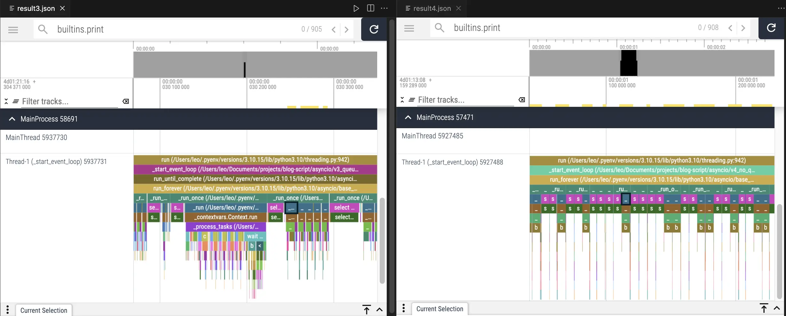

# 在獨立子線程中執行事件迴圈 asyncio

第一次寫 Python 非同步語法的紀錄，網路上很多非同步文章，但是沒看過有把非同步放在獨立線程中執行的程式碼實例，於是自己寫了一個。

由於用了 viztracer 分析好像有點厲害所以把他搬到文檔庫，不然這篇 murmur 比較多的應該要放在備忘錄。

## 程式碼說明
設計思路是把 function 和參數打包後丟給事件迴圈運行，並且用一個單獨的線程用於執行事件迴圈。

首先先建立一個 dataclass 用於把要執行函式以及函式輸入打包

```py
@dataclass
class Task:
    task_id: str
    func: Callable[..., Any]
    args: Tuple[Any, ...] = ()
    kwargs: Optional[Dict[str, Any]] = None

    def __post_init__(self) -> None:
        self.kwargs = self.kwargs or {}
```

接下來就是建立負責管理事件迴圈和線程的類別，首先初始化如下，項目有點多。

- max_workers 用於限制最高並發數量
- is_running 是程式旗標，標注線程是否還在運行
- task_queue 用於緩衝任務，因為有 max_workers 限制最高並發數量
- sem 是限制最高並發的 semaphore 鎖

```py
class AsyncService:
    def __init__(self, logger: Logger, max_workers: int = 5) -> None:
        self.max_workers = max_workers
        self.logger = logger

        self.is_running = False
        self.loop: Optional[asyncio.AbstractEventLoop] = None
        self.sem = asyncio.Semaphore(self.max_workers)
        self.thread: Optional[threading.Thread] = None
        self._lock = threading.Lock()

        self.task_queue: queue.Queue[Task] = queue.Queue()
        self.results: Dict[str, Any] = {}
        self.current_tasks: list[asyncio.Task[Any]] = []
```

接下來從程式碼執行的部分開始說明會比較清楚，要執行時 `Task` dataclass 經過一連串傳遞最後會被丟進 `_run_task` 這個方法中，先 await 結果，最後用線程鎖控制輸出寫入。雖然只有單線程應該不需要線程鎖，但是考量三個原因還是把他加上去：

1. 要是哪天忘了他只能用單線程，把程式改成多線程那就造成競爭危害了，防範於未然
2. 筆者很弱，雖然 99.9999% 確定不會造成競爭危害（因為事件迴圈本質是順序執行，除非在寫入時也 await 才有可能造成非原子操作導致競爭危害），但是不想賭那個 0.00001% 的問題
3. 相較 io 任務而言這個鎖的開銷簡直微乎其微

```py
async def _run_task(self, task: Task) -> Any:
    async with self.sem:
        print(
            f"Task {task.func.__name__} with args {task.args} and kwargs {task.kwargs} start running!"
        )
        try:
            result = await task.func(*task.args, **task.kwargs)
            with self._lock:
                self.results[task.task_id] = result
            return result
        except Exception as e:
            self.logger.error(f"Error processing task {task.task_id}: {e}")
            with self._lock:
                self.results[task.task_id] = None
```

接下來我們繼續介紹程式架構，`_run_task` 被包裝在 `_process_task` 中，前者用於真正執行任務，後者用於任務管理，是一個中間人的角色，負責從 task_queue 中取出任務註冊到事件迴圈中，並且放到 current_tasks 這個列表中準備執行。命名這麼相似的原因是在我的專案中這兩個都是繼承自一個抽象類別，後者名稱已經由父類決定好是 `_process_task`，那真正執行只好取 run 了，好啦其實是自己沒創意。

```py
async def _process_tasks(self) -> None:
    while True:
        self.current_tasks = [task for task in self.current_tasks if not task.done()]

        if self.task_queue.empty() and not self.current_tasks:
            break

        while not self.task_queue.empty() and len(self.current_tasks) < self.max_workers:
            try:
                task = self.task_queue.get_nowait()
                task_obj = asyncio.create_task(self._run_task(task))
                self.current_tasks.append(task_obj)
            except queue.Empty:
                break

        if self.current_tasks:
            await asyncio.wait(self.current_tasks, return_when=asyncio.FIRST_COMPLETED)
```

以上都還是私有函數不會被直接呼叫，而且只包含事件註冊和運行事件，還不包含運行事件迴圈以及把事件迴圈放到線程中執行（文章開頭目的：把非同步放在獨立線程中執行的程式碼實例），所以又要包裝在 `_start_event_loop` 還有 `_check_thread`，加上這兩個方法這樣整個工具函式就完成九成了，剩下一成是將任務放入佇列和停止線程跟事件迴圈，這裡我以 `add_task` 和 `add_task` 作為外部接口可以放入單一任務或是任務列表，以及 `stop` 方法作為結束所有任務的阻塞訊號。完整程式碼如下，也可以在[我的 Github 中找到](https://github.com/ZhenShuo2021/blog-script/tree/main/asyncio)：


```py
import asyncio
import queue
import threading
import time
from dataclasses import dataclass
from logging import Logger, getLogger
from typing import Any, Dict, Tuple, Callable, Optional

from help import BLOCK_MSG, NOT_BLOCK_MSG, io_task, print_thread_id, timer


@dataclass
class Task:
    """Unified task container for both threading and async services."""

    task_id: str
    func: Callable[..., Any]
    args: Tuple[Any, ...] = ()
    kwargs: Optional[Dict[str, Any]] = None

    def __post_init__(self) -> None:
        self.kwargs = self.kwargs or {}


class AsyncService:
    def __init__(self, logger: Logger, max_workers: int = 5) -> None:
        self.max_workers = max_workers
        self.logger = logger
        self.is_running = False
        self.loop: Optional[asyncio.AbstractEventLoop] = None
        self.thread: Optional[threading.Thread] = None
        self._lock = threading.Lock()

        self.task_queue: queue.Queue[Task] = queue.Queue()
        self.results: Dict[str, Any] = {}
        self.current_tasks: list[asyncio.Task[Any]] = []
        self.sem = asyncio.Semaphore(self.max_workers)

    def start(self) -> None:
        self._check_thread()

    def add_task(self, task: Task) -> None:
        self.task_queue.put(task)
        self._check_thread()

    def add_tasks(self, tasks: list[Task]) -> None:
        for task in tasks:
            self.task_queue.put(task)
        self._check_thread()

    def get_result(self, task_id: str) -> Optional[Any]:
        with self._lock:
            return self.results.pop(task_id, None)

    def get_results(self, max_results: int = 0) -> Dict[str, Any]:
        with self._lock:
            if max_results <= 0:
                results_to_return = self.results.copy()
                self.results.clear()
                return results_to_return

            keys = list(self.results.keys())[:max_results]
            return {key: self.results.pop(key) for key in keys}

    async def _process_tasks(self) -> None:
        while True:
            self.current_tasks = [task for task in self.current_tasks if not task.done()]

            if self.task_queue.empty() and not self.current_tasks:
                break

            while not self.task_queue.empty() and len(self.current_tasks) < self.max_workers:
                try:
                    task = self.task_queue.get_nowait()
                    task_obj = asyncio.create_task(self._run_task(task))
                    self.current_tasks.append(task_obj)
                except queue.Empty:
                    break

            if self.current_tasks:
                await asyncio.wait(self.current_tasks, return_when=asyncio.FIRST_COMPLETED)

    async def _run_task(self, task: Task) -> Any:
        async with self.sem:
            print(
                f"Task {task.func.__name__} with args {task.args} and kwargs {task.kwargs} start running!"
            )
            try:
                result = await task.func(*task.args, **task.kwargs)
                with self._lock:
                    self.results[task.task_id] = result
                return result
            except Exception as e:
                self.logger.error(f"Error processing task {task.task_id}: {e}")
                with self._lock:
                    self.results[task.task_id] = None

    def _check_thread(self) -> None:
        with self._lock:
            if not self.is_running or self.thread is None or not self.thread.is_alive():
                self.is_running = True
                self.thread = threading.Thread(target=self._start_event_loop)
                self.thread.start()

    def _start_event_loop(self) -> None:
        self.loop = asyncio.new_event_loop()
        asyncio.set_event_loop(self.loop)
        try:
            self.loop.run_until_complete(self._process_tasks())
        finally:
            self.loop.close()
            self.loop = None
            self.is_running = False
            self.current_tasks.clear()

    def stop(self, timeout: Optional[float] = None) -> None:
        if self.thread is not None:
            self.thread.join(timeout=timeout)
            print(f"\n===no job! clearing thread {self.thread.native_id}===")
            self.thread = None
            self.is_running = False
            print(f"===thread cleared! result: {self.thread}===\n")


@timer
def test() -> None:
    print_thread_id()
    logger = getLogger()
    task_groups = [
        [(1, "A1"), (2, "A2"), (3, "A3")],
        [(3, "B1"), (4, "B2"), (5, "B3")],
        [(3, "C1"), (4, "C2"), (5, "C3")],
        [(1, "D1"), (2, "D2"), (3, "D3")],
    ]

    manager = AsyncService(logger, max_workers=5)

    # 提交第一批任務，使用新的add_tasks方法
    for group in task_groups[:-1]:
        tasks = [Task(task[1], io_task, task) for task in group]
        manager.add_tasks(tasks)

    print(NOT_BLOCK_MSG)

    # 模擬主執行緒工作需要 2.5 秒，在程式中間取得結果
    # 會顯示 A1/A2 的結果，因為它們在 2.5 秒後完成
    time.sleep(2.5)
    results = manager.get_results()
    print(NOT_BLOCK_MSG, "(2s waiting for main thread itself)")  # not blocked
    for result in results:
        print(result)

    # 等待子執行緒結束，造成阻塞
    manager.stop()
    print(BLOCK_MSG)

    for _ in range(3):
        results = manager.get_results()
        for result in results:
            print(result)

    # 在thread關閉後提交第二批任務
    tasks = [Task(task[1], io_task, task) for task in task_groups[-1]]
    manager.add_tasks(tasks)
    manager.stop()
    results = manager.get_results()
    for result in results:
        print(result)


if __name__ == "__main__":
    print_thread_id()
    test()
```

這裡包含了一個簡單範例 `test`，實際運行是 11 秒和預期相符，讀者可以自行計算秒數驗證是否和理論相符。

## 自我檢討和心得
搜尋資料時看到有人建議撰寫主程式是非同步，然後把同步語法放到子線程中執行會比較好，寫的時候不太認同，真的用函式的時候就認同了，因為即使已經包裝成只要 `add_task` 和輸入 `Task` 就可以使用還是不太方便。

第二個是層層包裹的語句造成理解不易，使用 `add_task` 加入任務後會經過 `_check_thread` 確認線程是否存活並且建立線程，線程裡面要使用 `_start_event_loop` 建立事件迴圈，再使用 `_process_tasks` 把事件註冊到迴圈中，最後用 `_run_task` 把 `Task` dataclass 解包並且執行。這呼應第一個問題：如果去掉在子線程執行事件迴圈這件事，就可以刪掉前兩個方法，簡化為只需要註冊和運行而已，而且當主線程是非同步語法時可以省略 `_start_event_loop` 方法，因為不需要透過一個類別作為任務控制器管理事件迴圈和任務，自然也就不需要 `_start_event_loop`。會這樣寫的原因除了自己想練習以外，也是因為前一個練習是「把任務丟到子線程中執行」，所以依照同樣的想法寫了事件迴圈版本，結果比想像中的麻煩多了。不過都是試了才知道，畢竟網路上又沒這種文章，除非網路文章很爛否則筆者絕對不寫網路上已經存在的內容浪費讀者和自己彼此的時間。

第三是多個事件迴圈的管理運行，但筆者還沒到那個程度，所以 no comment。

第四有關記憶體效率，`task_queue`、`current_tasks` 和 `results` 疊床架屋，`task_queue` 用於暫存還沒執行的任務，`current_tasks` 存放已經從 `task_queue` 取出準備要執行的任務，`results` 存放任務結果，例如每個 HTTP 請求的狀態碼，一個任務要三個物件管理有點浪費資源，有 semaphore 應該就不需要 `task_queue` 和 `current_tasks`。附帶一提 `results` 不使用 queue 資料結構的原因是用戶可能會想根據 task_id 取得結果，但是 queue 只能從頭尾取值達不到這項要求。

最後補充，這個腳本跑 mypy --strict 可以過的唷。


## 更新：移除佇列版本
關於檢討中說到的疊床架屋問題，寫了一個不需要 `task_queue` 和 `current_tasks` 的版本，並且根據[這篇文章](https://medium.com/chris-place/python-asyncio-1c2f7903a193)使用 `call_soon_threadsafe` 在主線程要求子線程運行任務，並且加上 threading.Event 確保事件迴圈正常啟動避免死鎖。

```py
class AsyncService:
    def __init__(self, logger: Logger, max_workers: int = 5) -> None:
        self.logger = logger

        # 任務運行相關設定
        self._running_tasks = 0
        self.loop: Optional[asyncio.AbstractEventLoop] = None
        self.thread: Optional[threading.Thread] = None
        self._lock = threading.Lock()
        self._loop_ready = threading.Event()
        self.sem = asyncio.Semaphore(max_workers)

        # 儲存結果
        self.results: Dict[str, Any] = {}

    async def _run_task(self, task: Task) -> None:
        async with self.sem:
            print(
                f"Task {task.func.__name__} with args {task.args} and kwargs {task.kwargs} start running!"
            )
            try:
                result = await task.func(*task.args, **task.kwargs)
                with self._lock:
                    self.results[task.task_id] = result
            except Exception as e:
                self.logger.error(f"Error processing task {task.task_id}: {e}")
                with self._lock:
                    self.results[task.task_id] = None
            finally:
                with self._lock:
                    self._running_tasks -= 1

    def _start_event_loop(self) -> None:
        self.loop = asyncio.new_event_loop()
        asyncio.set_event_loop(self.loop)
        self._loop_ready.set()
        self.loop.run_forever()
        try:
            self.loop.close()
        finally:
            self.loop = None
            self._loop_ready.clear()

    def _ensure_thread_running(self) -> None:
        with self._lock:
            if self.thread is None or not self.thread.is_alive():
                self._loop_ready.clear()
                self.thread = threading.Thread(target=self._start_event_loop)
                self.thread.start()
                self._loop_ready.wait()  # 等待事件迴圈啟動

    def add_task(self, task: Task) -> None:
        self._ensure_thread_running()

        with self._lock:
            self._running_tasks += 1
            # run_coroutine_threadsafe 不需要鎖，但是 +=1 要
            asyncio.run_coroutine_threadsafe(self._run_task(task), self.loop)

    def add_tasks(self, tasks: list[Task]) -> None:
        for task in tasks:
            self.add_task(task)

    def get_result(self, task_id: str) -> Optional[Any]:
        with self._lock:
            return self.results.pop(task_id, None)

    def get_results(self, max_results: int = 0) -> Dict[str, Any]:
        with self._lock:
            if max_results <= 0:
                results_to_return = self.results.copy()
                self.results.clear()
                return results_to_return

            keys = list(self.results.keys())[:max_results]
            return {key: self.results.pop(key) for key in keys}

    def stop(self, timeout: Optional[float] = None) -> None:
        if self.thread is None or self.loop is None:
            return

        while True:
            with self._lock:
                if self._running_tasks == 0:
                    break

        self.loop.call_soon_threadsafe(self.loop.stop)  # 停止事件迴圈
        self.thread.join(timeout=timeout)

        print(f"\n===no job! clearing thread {self.thread.native_id}===")
        self.thread = None
        print(f"===thread cleared! result: {self.thread}===\n")
```

### 討論：死鎖問題
藉此機會練習多線程的問題，剛改成這個版本時沒有使用 `threading.Event` 會產生死鎖，以下分析死鎖產生原因：

1. 在 `add_task` 時馬上呼叫 `_ensure_thread_running`，得到鎖，建立線程並且啟動，釋放鎖，return
2. 回到 `add_task`，取得鎖，執行 `run_coroutine_threadsafe`，但是 `_start_event_loop` 中還沒建立完成 self.loop，引發 NoneTypeError
3. 鎖釋放失敗，下一次 `add_task` 又要求鎖，造成死鎖（註：這也會造成 `run_coroutine_threadsafe` 本身的鎖產生死鎖）

而加上 Event 則確保 self.loop 成功建立就沒有造成死鎖問題。這裡和網路教學相反的是是由子線程使用 Event 告訴主線程可以繼續了，網路教學通常是由主線程輸入 Event 告訴子線程開始工作。

```py
# 一開始沒有鎖的版本，方便讀者比較

def _start_event_loop(self) -> None:
    self.loop = asyncio.new_event_loop()
    asyncio.set_event_loop(self.loop)
    # self._loop_ready.set()  # 不使用Event
    self.loop.run_forever() # 阻塞線程
    # ...

def _ensure_thread_running(self) -> None:
    with self._lock:
        if self.thread is None or not self.thread.is_alive():
            # self._loop_ready.clear()  # 不使用Event
            self.thread = threading.Thread(target=self._start_event_loop)
            self.thread.start()
            # self._loop_ready.wait()  # 不使用Event
```


### 討論：效能問題

新的版本不只要處理死鎖效能也比原版的差，這裡我以放入三百個睡眠時間為零的 `io_task` 作為範例，單純只測試事件迴圈對於事件註冊的吞吐量，並且幫新版作弊把所有 `self._lock` 全都刪除降低影響因素。實驗結果很意外，舊版只需要 0.063 秒就可以結束所有任務，而新版卻需要耗時高達 2.88 秒，表示使用 `run_coroutine_threadsafe` 這個方法的開銷很大。

更進一步探討問題發生的原因，使用 [viztracer](https://www.youtube.com/watch?v=xFtEg_e54as) 作 profiler 檢查效能瓶頸，左邊是舊版，右邊是使用 `run_coroutine_threadsafe` 的新版。我們先解釋這些框框代表的函式以方便後續說明，靛藍色被我框起來的是 asyncio 真正執行輸入的任務時，他會呼叫自己的 `_run` 函式，可以看到所有 `run_forever` 都會調用 `_run_once`，但是在新版運行中不是每次 `_run_once` 都會執行 `_run` 而是調用了很多次紫色的 `select` 函式，舊版就沒有這個問題。

這是 Python 內部自行呼叫的函式，總結兩版最大的差異是從 `create_task` + `asyncio.wait` 變成 `run_coroutine_threadsafe`，雖然呼叫相同函式但是函式運行狀態卻不一樣。



原本想接著 zoom in 繼續分析的，但研究後發現每次執行 `_run_task` 的時間和內容都不太一樣所以就不多作分析了，但我們可以確定的是使用 `run_coroutine_threadsafe` 實作上確實有差別，除了本身有鎖以外也需要呼叫 `select` 函式，目的是用於控制 Linux 系統中的 `kqueue`，viztracer 顯示舊版呼叫次數是新版的兩倍但是每次只需要 10 microseconds，新版每次呼叫則需要消耗大概 5 milliseconds，光是 `kqueue` 就佔據整體運行時間的六成左右了，為何兩者差異這麼大等我變強再回來分析，這裡就放 `select` 函式提供大家參考。

```py
# 3.10.15/lib/selectors.py/KqueueSelector/select#line554
        def select(self, timeout=None):
            timeout = None if timeout is None else max(timeout, 0)
            # If max_ev is 0, kqueue will ignore the timeout. For consistent
            # behavior with the other selector classes, we prevent that here
            # (using max). See https://bugs.python.org/issue29255
            max_ev = max(len(self._fd_to_key), 1)
            ready = []
            try:
                kev_list = self._selector.control(None, max_ev, timeout)
            except InterruptedError:
                return ready
            for kev in kev_list:
                fd = kev.ident
                flag = kev.filter
                events = 0
                if flag == select.KQ_FILTER_READ:
                    events |= EVENT_READ
                if flag == select.KQ_FILTER_WRITE:
                    events |= EVENT_WRITE

                key = self._key_from_fd(fd)
                if key:
                    ready.append((key, events & key.events))
            return ready
```

對了，有想到這問題會不會在新版被解決，原本是在 3.10 測試，又在 3.13 跑了一次時間從 2.8 秒變成 2.2 秒。

### 更新的結論
用非同步就是要快，結果為了省 queue 和 list 變這麼慢的話那還是乖乖用好了，看起來這些久經考驗的資料結構在 Python 中的實現比較不會出問題，asyncio 相對之下還是新東西，直接用他內建的方法進行跨線程溝通會導致非預期的慢，當然也有可能是筆者使用錯誤，如果有錯請告知我再修正，謝謝。
