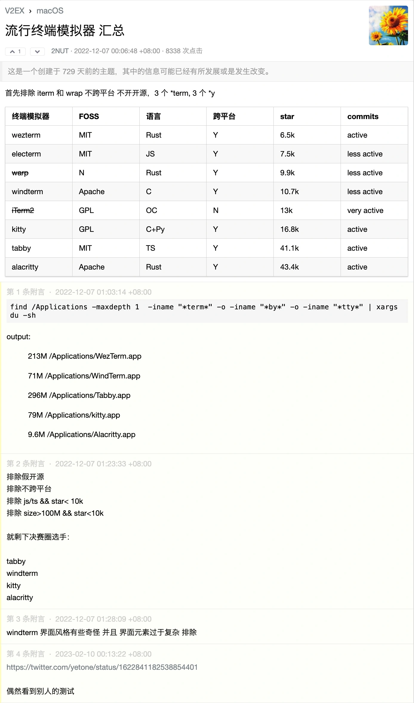
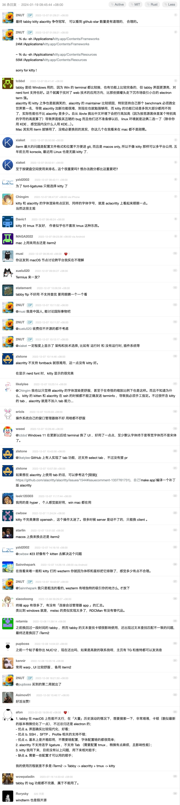

# 各種跨平台終端機整理，持續增加中

為甚麼又是整理文章？因為乾淨完整的清除比嘗試安裝更痛苦啊。本篇著重跨平台終端機所以選項沒幾個，如果不需跨平台的話可以不用讀這篇文章。

可以跳過的前言

筆者原本使用 Mac，用過 zsh 再回去用 Windows 的真的會想砸電腦，爛到不可思議。先介紹自己的終端機使用經驗，由於 iTerm2 的 i 距離左手位置太遠不好直接呼叫（其實是第一次自己裝壞了）所以後來g使用原生終端機搭配 oh-my-zsh，這個配置其實對於首次優化終端機的我而言已經很好用了，但是回頭優化 Windows 時發現 Windows 壓根沒有 zsh，所以最開始我改用 oh-my-posh，他的缺點是對比 oh-my-zsh 能抄的作業相對少，而且不是一個終端機只是一個主題等於還是在用內建超爛終端，同時我 Mac 使用已經很順手，還要多維護一份設定光想就麻煩，於是決定尋找是否有跨平台的終端機可以使用。

認真研究了[這篇文章](https://setapp.com/how-to/terminal-alternatives-for-mac)，裡面有高達十一個選手，先刪掉沒有跨平台還有付費的還剩下這五個，星星數統計於 2024/12/5

1. [Alacritty](https://github.com/alacritty/alacritty) (56.7k stars, Rust)
2. [Warp](https://github.com/warpdotdev/Warp) (21.6k stars, Rust)
3. [Rio](https://github.com/raphamorim/rio) (4.2k stars, Rust)
4. [WezTerm](https://github.com/wez/wezterm) (18.2k stars, Rust)
4. [Hyper](https://github.com/vercel/hyper) (43.5k stars, TypeScript)
5. [Tabby](https://github.com/Eugeny/tabby) (59.9k stars, TypeScript)

盤點我的需求，我需要終端機可以透過已經 key 到一半的指令篩選過往指令，最好有類似 vim 的用法例如跳到下一個單字，不在意開源，輕巧快速，最重要的是跨平台[^it]。

[^it]: iTerm2 在跨平台部分慘遭淘汰，不然做了一輪功課感覺大家到最後還是用他。

## 如果你不想看我的紀錄
:::tip 那麼...
也可以直接看這個討論串截圖，感覺講的還不錯。
:::

## 使用紀錄
從這個段落開始是我本人的使用紀錄，心得可能很菜，請大家多多包含，依照我的使用順序依序撰寫。

### Rio
根據 [GitHub Star History](https://star-history.com/#Eugeny/tabby&alacritty/alacritty&vercel/hyper&raphamorim/rio&warpdotdev/Warp&wez/wezterm&Date) 其實應該先使用 tabby 的，雖然前期平穩但近年成長快速，不過找的時候完全忘記可以這樣判斷了所以隨便選了 Rio，純粹是因為名字才第一個選他，<u>結論是難用不推</u>，進入終端要按兩下 enter，只是改回原始終端機預設字體就直接亂碼，文檔也沒寫如何解決，折騰一小時放棄。

### Warp
接下來一樣是隨便選，這篇文章就是被 Warp 驚豔到才有的，優點網路上很多我就不贅述，只說對我而言最有感的是手不用離開鍵盤。這個終端機特別的地方是他分區塊顯示，想像以往要複製指令和錯誤到網路上搜尋要從鍵盤移動到滑鼠，框選並且複製，現在只要 cmd + uparrow，shift + uparrow，就可以框選多個區塊進行複製，再加上現在是 GPT 時代，於是可以完成從發生問題到丟給 GPT 詢問整個流程行雲流水雙手完全不需要離開鍵盤的一套操作[^but]。

除此之外，他的命令輸入行也非常好用，除了支援 option + rightarrow 跳到下一個單字，還可以使用 command + leftarrow/command + A 全選完全沒有問題，也沒有 powerlevel10k 的 Enter 的問題[^bug]。

特色是 AI/工作區/筆記本，網路上文章很多我也還沒摸熟，Windows 的部分官網表示 coming soon。

[^but]: 不過這個 iTerm2 好像也做得到，但是他不支援跨平台。
[^bug]: 連接一般鍵盤使用時預設 NumLock 關閉所以每次開啟終端機都要額外按一次 NumLock。

### Alacritty
據說維護者是速度狂熱患者，下一個嘗試的就是他，待完成。

### WezTerm
下下一個，待續。

[使用快照](https://x.com/hank_zhao/status/1801800550553686305)

### Tabby
在使用時同時認知到所謂終端機速度，懶得打 clear 時會連按 enter 洗掉終端機，原生終端機完全沒問題，但是這個操作在 Warp 會卡頓[^plus-k]，在做功課的時候查到有人說 Tabby 肥大、用 TypeScript 寫的連我程式菜鳥看了覺得奇怪，reddit 的人也覺得 [hard pass](https://www.reddit.com/r/commandline/comments/rcs3va/tabby_a_terminal_for_the_modern_age/)，裡面也有人提到一個終端機 600MB，以後如果有嘗試會再更新這段。

前身是 Termius 所以理所當然的內建 SSH/SFTP。

[^plus-k]: 後來才知道可以用 command + K/L 完成。

### 遺珠之憾
篇幅問題、不夠有名、沒有更新的專案

- [Hyper](https://github.com/vercel/hyper) 原本第一個想用他，但是已經八個月沒更新而且又是用 TypeScript 寫的，pass。
- [contour](https://github.com/contour-terminal/contour/)
- [extraterm](https://github.com/sedwards2009/extraterm)
- [wsltty](https://github.com/mintty/wsltty)

## 簡易結論
如果跟我一樣要跨 Windows/Mac 的終端機就只剩下 Alacritty/Tabby/Hyper/(Warp) 可以選，Warp 尚未支援 Windows，剩下老牌又穩定成長的 Alacritty，或是使用 TypeScript 撰寫的 Tabby 二選一，Hyper 等他有更新再說否則不考慮。

2024 的今天滿幸運的，有 uv 解決 Python 一直以來的煩惱，Warp 如果完成 Windows 版本那真的是萬幸，解決 Windows 超爛終端機問題。

最後真的要提醒自己用 GitHub Star History 先統計好，盲猜太浪費時間。

## 附錄: Oh-My-?sh 優化
Posh 和 Zsh 的優化，這裡的文章都非常有用，直接複製貼上指令就完成了不用花老半天自己除錯

- [安裝新版 Oh My Posh 與插件來美化 PowerShell](https://www.kwchang0831.dev/dev-env/pwsh/oh-my-posh)
- [如何打造一個華麗又實用的 PowerShell 命令輸入環境](https://blog.miniasp.com/post/2021/11/24/PowerShell-prompt-with-Oh-My-Posh-and-Windows-Terminal)
- [Ubuntu 安裝 Zsh + Oh My Zsh + Powerlevel10k 與各種插件](https://www.kwchang0831.dev/dev-env/ubuntu/oh-my-zsh)

## 參考資料
- [11 Terminal alternatives for Mac](https://setapp.com/how-to/terminal-alternatives-for-mac)
- [cdleon/awesome-terminals](https://github.com/cdleon/awesome-terminals)
- [tabby - a terminal for the modern age](https://www.reddit.com/r/commandline/comments/rcs3va/tabby_a_terminal_for_the_modern_age/)
- [iTerm2 vs Alacritty vs Kitty, which is "best" for my use?](https://www.reddit.com/r/macapps/comments/1djs2up/iterm2_vs_alacritty_vs_kitty_which_is_best_for_my/)
- https://terminaltrove.com/ 甚至有專門比較終端機的網頁，這真的要寫文章才會找到，哪個正常人沒事會逛到這東西
