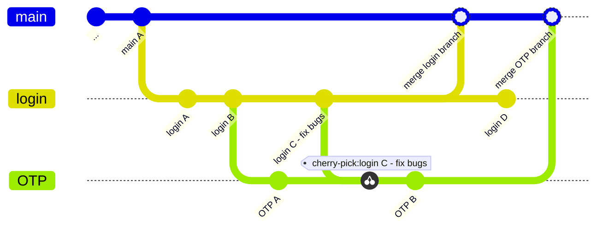
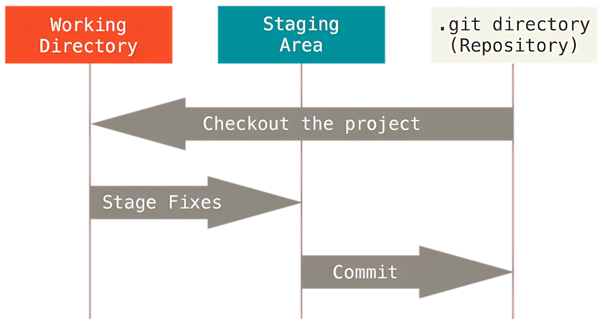

# 前言

本文介紹大的 picture 讓你可以宏觀的理解 Git 運作方式，先知道他在做什麼再學會怎麼操作他，網路很多教學文章都本末倒置，導致初學者指令會貼上但是就是不清楚自己在做甚麼。

## Quick Overview

Git 是版本管理工具，紀錄版本的<u>**單位**</u>是一個一個的提交 (commit)，每個提交都會計算<u>**獨一無二**</u>的 hash 幫提交設定序號，並且<u>**指向上次的提交**</u>，這樣連起來就可以記錄管理版本。除了基本的提交歷史順序，還有一個重要的功能是分支 (branch)，意思是從提交中分出支線，我們可以在支線進行功能開發、修復 bug 等工作，讓每個開發工作可以獨立作業不互相干擾，最後在開發完成後將支線整合[^merge]回主分支，這種機制使得不同開發人員能同時進行多項開發任務，而不會影響<u>**主要分支的穩定性**</u>。

[^merge]: 避免誤導所以不說合併而說整合。因為 `git merge` 指令就是合併，然而整合有各種方式達成不限於 `git merge`。

上網查 Git 時一定都看過這種流程圖，以本圖為例，從主分支切出 login 分支，OTP 分支又基於 login 分支進行開發，確認功能穩定可行後再整合回主分支，這樣的意義在於不影響穩定的主分支，即便在某個分支開發過程中出現問題，也不會影響到其他開發者的進度或整體系統的運行。

## 概念

> 此段落修改自[官方說明](https://git-scm.com/book/zh-tw/v2/%E9%96%8B%E5%A7%8B-Git-%E5%9F%BA%E7%A4%8E%E8%A6%81%E9%BB%9E)：三種狀態

前一個段落我們介紹完 Git 的宏觀用法，接下來我們來介紹他是如何運作的。Git 實際運作可以分為三個層面理解，分別是硬碟、本地儲存庫 (.git)、遠端儲存庫 (Github/Gitlab)。你的硬碟不知道任何版本資訊，只負責儲存檔案當前狀態；儲存庫是專案目錄的 .git 資料夾，此資料夾會紀錄所有版本資訊；遠端儲存庫則是最後上傳共享提交歷史的地方。撰寫程式時，每次想要紀錄版本就<u>**提交**</u>一個版本到本地儲存庫，完成一個段落後使用<u>**推送**</u>功能，將提交推送到所有成員共用的遠端儲存庫進行協作開發[^DVCS]。

[^DVCS]: 這個段落描述的版本控制系統架構描述了每個開發人員都有完全相同的提交歷史鏡像，這種架構稱為分散式版本控制系統，不是很重要但是順手解釋搜尋會看到的詞彙。另外 Git 是快照系統而不是差異系統，不知道也完全不影響理解和使用，所以本文省略介紹。

也就是說真正負責管理版本歷史的只有本地端的儲存庫，遠端只是負責同步的鏡像版本，接下來我們說明他是如何管理檔案的。Git 會把檔案標記為三種狀態，分別是已提交（committed）、已預存（staged）和已修改（modified）：

1. 已提交 -> 檔案己安全地存在你的本地儲存庫
2. 已預存 -> 已將修改的檔案新增至索引，準備提交至儲存庫（準備被提交但是尚未提交）
3. 己修改 -> 檔案已被更改，但尚未加入至索引（該檔案的修改沒有被儲存庫追蹤）

  

這張圖解釋了檔案的狀態，我們輔以實際作業流程解釋，讓流程和圖片兩者可以互相對照：

1. <u>工作目錄 (working directory, 硬碟)</u> 中的檔案修改後會進入已修改狀態
2. 使用 `git add` 將檔案放進<u>預存區 (staging area)</u>
3. 完成程式碼修改後使用 `git commit` 將預存區的檔案提交到<u>本地儲存庫 (repository)</u>，儲存庫如圖所示是一個名稱為 `.git` 的資料夾
4. 想要還原到過往版本時，使用 `git checkout` 把以前的版本簽出[^checkout]，放進「工作目錄」中。

[^checkout]: 官方將 checkout 翻譯為簽出，這個指令的行為是「從儲存庫取出該版本放回硬碟」，用途非常廣泛。

## 關鍵字

初學時關鍵字中英混雜有點難記憶，每個人講的也不太一樣，這裡提供一些關鍵字關係對照：

| 狀態           | 位置                      | 相關指令        |   說明         |
|-------------- |-------------------------- |----------------|-------------- |
| 未追蹤/已修改   | 工作目錄 working directory | `git add`      | 存放到預存區    |
| 已預存         | 預存區 staging area        | `git commit`   | 提交到儲存庫    |
| 已提交         | 儲存庫 repository          | `git checkout`  | 取出到工作目錄  |

## 結尾

現在你已經知道 Git 如何運作了，所有人包含遠端儲存庫都是完全相同的鏡像系統，提交由 hash 標注上獨一無二的標籤並且連著前一個提交，每個成員可以把各自的提交推送到遠端儲存庫以共享進度。

在本地時可以預存檔案，決定要提交時就使用 `git commit` 把預存的檔案放到儲存庫變成正式的提交，再完成推送作業。想要回溯歷史時，`git checkout` 就可以從儲存庫簽出舊版檔案，這樣就是一般的作業流程了。

接下來請跳到[一分鐘入門](/docs/git/beginner/one-minute)，序章的其他文章但是初學者暫時用不到。
