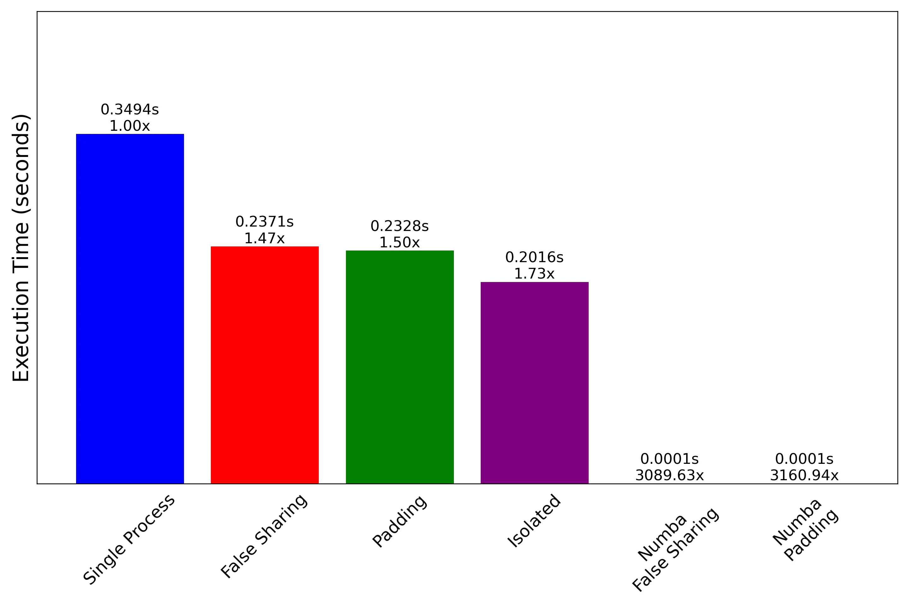
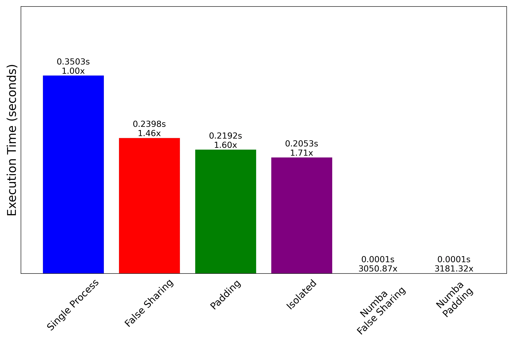
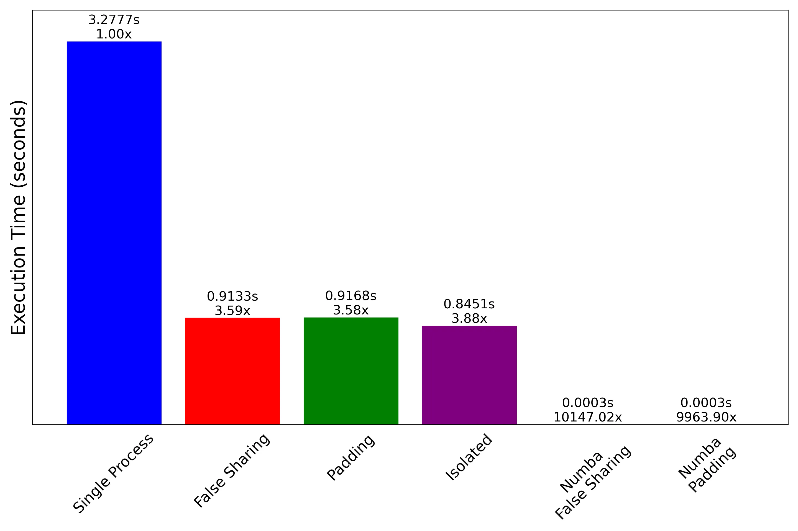

import Tabs from '@theme/Tabs';
import TabItem from '@theme/TabItem';

# Python 中的 False-Sharing

前一篇文章提到了 false-sharing，但是 Python 中好像沒看到有人在談這個問題，畢竟會討論效能的人本身就不會用 Python 寫程式，又看到[暗黑執行緒的文章](https://blog.darkthread.net/blog/false-sharing-demo-with-jquery-animation/)說

> 是台積電才要關心的事，如果你是 Samsung、hTC、Nokia，暫時可以不用煩惱怎麼對付它.

嗯嗯那我肯定是要來試試看的吧（棒讀），所以依樣畫葫蘆寫了一個簡易測試的腳本，順便作為自己強化 false sharing 記憶的筆記。

## False-Sharing 成因

其原因來自於 CPU 快取特性是一次讀取一整行，當兩個核心訪問不同的快取時，如果它們在同一行 cacheline 中，即使他們並不共用 CPU 仍然會強制同步不同核心的快取，在同步過程中造成的效能損失就是 false-sharing。

## 解決方式

先上解決方式，比我的測試更有意義。

1. 在 [Speed up C++ — false sharing](https://medium.com/@techhara/speed-up-c-false-sharing-44b56fffe02b) 這篇文章中為每個線程創建了私有的 `local_sum`，解決 false sharing 後速度快了約 5 倍。

2. 在 [The Performance Implications of False Sharing](https://coffeebeforearch.github.io/2019/12/28/false-sharing-tutorial.html) 這篇文章中則是使用 `alignas` 來完成 padding，並且從組合語言/benchmark/L1 cache hit rate 三種層面來討論 false sharing。在 false sharing 時，編譯結果顯示 99% 的時間都在競爭鎖 `lock   incl   (%rdx)` 上，benchmark 結果顯示正確使用後速度有約 1.3 倍速度提升，以 L1 Cache hit rate 來說，快取失誤率從 40% 下降至 3%。

## 效能測試

寫了以下腳本測試，測試從記憶體取出值，計算 `(current * 0.95 + 0.1) % 100`，然後放回記憶體中

```py
import time
import ctypes
import numpy as np
import matplotlib.pyplot as plt
from multiprocessing import Process, Array, Value
from numba import njit, prange

NUM_ITER = 10**6
NUM_PROCS = 4
PADDING_SIZE = 8
N_REPEATS = 20


def initialize_shared_data(arr, n_workers, use_padding=False):
    np.random.seed(84)
    random_values = np.random.random(n_workers) * 100
    if use_padding:
        for i in range(n_workers):
            arr[i * PADDING_SIZE] = random_values[i]
    else:
        for i in range(n_workers):
            arr[i] = random_values[i]


def run_single_process(n_iterations):
    current = 0.0
    start = time.time()
    for _ in range(n_iterations * NUM_PROCS):
        np.sin(current * 0.95 + 0.1)
    end = time.time()

    return end - start


# 沒有使用 padded，引發 false-sharing
def bad_worker(shared_data, worker_id, n_iterations):
    for _ in range(n_iterations):
        current = shared_data[worker_id]
        shared_data[worker_id] = (current * 0.95 + 0.1) % 100


# 使用 padded 解決 false-sharing
def good_worker(shared_data, worker_id, n_iterations):
    padded_index = worker_id * PADDING_SIZE
    for _ in range(n_iterations):
        current = shared_data[padded_index]
        shared_data[padded_index] = (current * 0.95 + 0.1) % 100


# 每個 worker 使用 scalar 進行計算，比較完全沒有矩陣問題的計算速度
# 他是一個特例，因為他連陣列都沒有
def isolated_worker(val, n_iterations):
    for _ in range(n_iterations):
        current = val.value
        val.value = (current * 0.95 + 0.1) % 100


# 測試 Numba 沒有使用 padded
@njit("void(float64[:], int16)", parallel=True)
def numba_bad_worker(shared_data, n_iterations):
    for i in prange(shared_data.shape[0]):
        for _ in range(n_iterations):
            current = shared_data[i]
            shared_data[i] = (current * 0.95 + 0.1) % 100


# 測試 Numba 使用 padded
@njit("void(float64[:], int16, int16)", parallel=True)
def numba_good_worker(shared_data, n_iterations, cache_line_size):
    for i in prange(shared_data.shape[0] // cache_line_size):
        padded_index = i * cache_line_size
        for _ in range(n_iterations):
            current = shared_data[padded_index]
            shared_data[padded_index] = (current * 0.95 + 0.1) % 100


def run_test(n_workers, n_iterations, use_padding=False, use_isolated=False):
    if use_isolated:
        # 每個進程使用獨立的常數，multiprocessing.Value 
        worker_func = isolated_worker
        shared_data = [Value(ctypes.c_double, 0.0, lock=False) for _ in range(n_workers)]
        args_func = [(shared_data[i], n_iterations) for i in range(n_workers)]
    elif use_padding:
        # 使用 padding
        worker_func = good_worker
        shared_data = Array(ctypes.c_double, n_workers * PADDING_SIZE, lock=False)
        initialize_shared_data(shared_data, n_workers, use_padding=True)
        args_func = [(shared_data, i, n_iterations) for i in range(n_workers)]
    else:
        # 不使用 padding，會產生 false-sharing
        worker_func = bad_worker
        shared_data = Array(ctypes.c_double, n_workers, lock=False)
        initialize_shared_data(shared_data, n_workers, use_padding=False)
        args_func = [(shared_data, i, n_iterations) for i in range(n_workers)]

    procs = [Process(target=worker_func, args=args) for args in args_func]
    start = time.time()
    for p in procs:
        p.start()
    for p in procs:
        p.join()
    end = time.time()

    return end - start


def run_numba_test(n_workers, n_iterations, use_padding=False):
    shared_data = np.random.random(n_workers * (PADDING_SIZE if use_padding else 1)) * 100
    start = time.time()
    if use_padding:
        numba_good_worker(shared_data, n_iterations, PADDING_SIZE)
    else:
        numba_bad_worker(shared_data, n_iterations)
    end = time.time()

    return end - start


def run_average(func, *args, repeats=N_REPEATS, **kk):
    total_time = 0.0
    for _ in range(repeats):
        total_time += func(*args, **kk)
    return total_time / repeats


if __name__ == "__main__":
    print("==============================")
    print(f"testing cache line size: {PADDING_SIZE}")
    print("==============================")
    n_iterations = NUM_ITER
    run_numba_test(NUM_PROCS, 1, use_padding=False)
    run_numba_test(NUM_PROCS, 1, use_padding=True)


    single_time = run_average(run_single_process, n_iterations)
    false_sharing_time = run_average(run_test, NUM_PROCS, n_iterations, use_padding=False)
    no_false_sharing_time = run_average(run_test, NUM_PROCS, n_iterations, use_padding=True)
    isolated_time = run_average(run_test, NUM_PROCS, n_iterations, use_isolated=True)
    numba_false_sharing_time = run_average(run_numba_test, NUM_PROCS, 1, use_padding=False)
    numba_no_false_sharing_time = run_average(run_numba_test, NUM_PROCS, n_iterations, use_padding=True)

    print(f"Single Process Time: {single_time:.4f} seconds")
    print(f"False Sharing Time: {false_sharing_time:.4f} seconds")
    print(f"No False Sharing (Padding) Time: {no_false_sharing_time:.4f} seconds")
    print(f"No False Sharing (Isolated Value) Time: {isolated_time:.4f} seconds")
    print(f"Numba False Sharing Time: {numba_false_sharing_time:.4f} seconds")
    print(f"Numba No False Sharing Time: {numba_no_false_sharing_time:.4f} seconds")

    improvement_false_sharing = single_time / false_sharing_time
    improvement_no_false_sharing = single_time / no_false_sharing_time
    improvement_isolated = single_time / isolated_time
    improvement_numba_false_sharing = single_time / numba_false_sharing_time
    improvement_numba_no_false_sharing = single_time / numba_no_false_sharing_time

    print(f"Efficiency Improvement (False Sharing): {improvement_false_sharing:.2f}x")
    print(f"Efficiency Improvement (No False Sharing, Padding): {improvement_no_false_sharing:.2f}x")
    print(f"Efficiency Improvement (No False Sharing, Isolated): {improvement_isolated:.2f}x")
    print(f"Efficiency Improvement (Numba False Sharing): {improvement_numba_false_sharing:.2f}x")
    print(f"Efficiency Improvement (Numba No False Sharing): {improvement_numba_no_false_sharing:.2f}x")

    plt.figure(figsize=(12, 8))

    labels = [
        "Single Process",
        "False Sharing",
        "Padding",
        "Isolated",
        "Numba\nFalse Sharing",
        "Numba\nPadding",
    ]
    times = [single_time, false_sharing_time, no_false_sharing_time, isolated_time, numba_false_sharing_time, numba_no_false_sharing_time]
    plt.bar(labels, times, color=["blue", "red", "green", "purple", "orange", "cyan"])
    plt.ylabel("Execution Time (seconds)", fontsize=20)
    plt.xticks(rotation=45, fontsize=16)
    plt.yticks([], fontsize=14)

    for i, t in enumerate(times):
        plt.text(i, t, f"{t:.4f}s\n{(single_time / t):.2f}x", ha="center", va="bottom", fontsize=14)

    x1, x2, y1, y2 = plt.axis()
    plt.tick_params(axis="y", which="both", left=False)
    plt.tick_params(axis="x", which="both", bottom=False)
    plt.axis((x1, x2, y1, y2 + 0.105))
    plt.tight_layout()
    plt.savefig(f"pad{PADDING_SIZE}.webp", dpi=240)
    plt.show()
```

接下來是測試結果，三章圖依序是 `PADDING_SIZE = [4, 8, 16]` 的計算時間，使用長條圖的原因是折線圖變化太小看不出來差距。可以看到當 `PADDING_SIZE` 從 4 -> 8 的時候，使用 padding 的方式對比 false-sharing 的效能從原本的基本相同變成快了 ~15%，這個效能差距在把 `PADDING_SIZE` 設定成 8 -> 16 後又沒有進一步優化了，足以顯示 false-sharing 的存在以及使用的正確性。isolated 代表每個執行緒使用獨立的 Array，Numba 則是使用 [Numba 套件加速](./numba-tutorial-accelerate-python-computing)，看了這個速度差異就知道為啥沒人在 Python 中討論 false-sharing 了，在 Python 中效能是個假議題，false-sharing 雖存在但不需要用 Python 解決他，簡單加一行裝飾器都比想破頭還有用。

> use padding=4, still incurs false-sharing



> use padding=8, false-sharing solved


> use padding=16, false-sharing solved but no further improvements



另外，Numba 在 4 -> 8 之間沒有如預期加速的原因可能是編譯器，在 [Speed up C++ — false sharing](https://medium.com/@techhara/speed-up-c-false-sharing-44b56fffe02b) 這篇文章中提到他使用 clang -O3 才有看到差異，gcc 自己把這個問題優化掉了。Numba 沒有提到他使用哪種編譯器，不過他預設使用 -O3 給 LLVM 優化。

https://numba.readthedocs.io/en/stable/reference/envvars.html#envvar-NUMBA_OPT
https://numba.readthedocs.io/en/stable/user/troubleshoot.html#debugging-jit-compiled-code-with-gdb

## 計算方式也有差

在測試中也發現當我把計算從 `(current * 0.95 + 0.1) % 100` 改成 `np.sin(current * 0.95 + 0.1)` 後， false-sharing 和 padding 之間的效能差距就不見了，有興趣的可以自己看 bytecode 研究。



## 結語

其實開頭有點記者，暗黑執行緒的文章前面有講到「與 DB、網路呼叫延遲相比，這個效能差距只是奈米等級」這句話我沒有放進去，不過寫這篇的時候確實也對這句話沒印象，回頭看才發現有這句話。

寫完整篇發現閱讀筆記比我寫的爛測試更有內容，所以把閱讀筆記移到上面。
