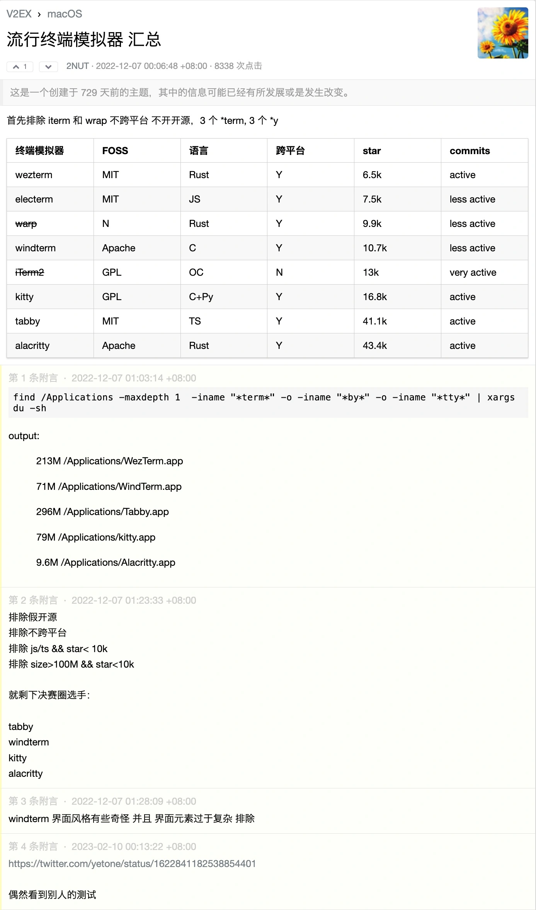
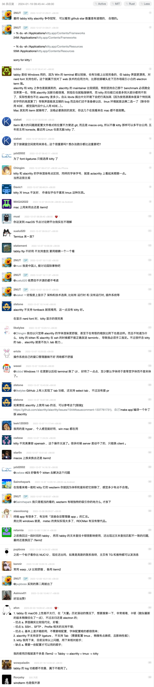
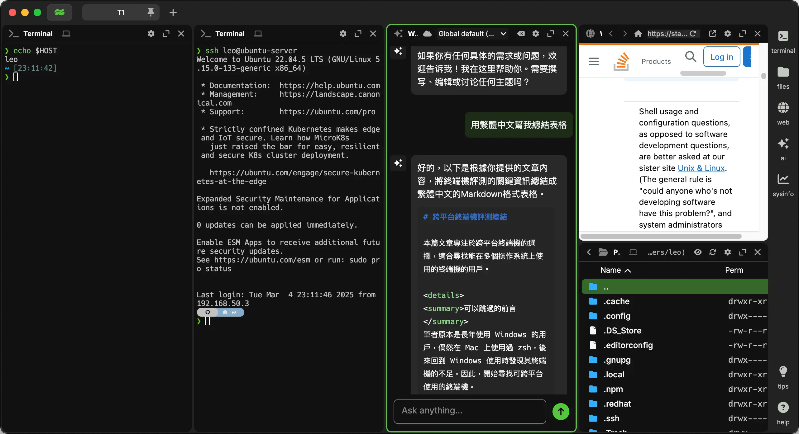

import EmblaCarousel from '@site/src/components/EmblaCarousel';

本篇著重跨平台終端機，如果不需跨平台的話可以不用讀這篇文章。

可以跳過的前言

筆者原本是長年 Windows 用戶，偶然在 Mac 上使用過 zsh 再回去用 Windows 的真的會想砸電腦，沒有比較沒有傷害，爛到不可思議。先介紹自己的終端機使用經驗，由於 iTerm2 的 i 距離左手位置太遠不好直接呼叫（其實是第一次自己裝壞了）所以後來使用原生終端機搭配 oh-my-zsh，這個配置其實對於首次優化終端機的我而言已經很好用了，使用上也沒感受到特別大的問題，但是回過頭來優化 Windows 終端時發現 Windows 壓根沒有 zsh 所以使用名字相似的 oh-my-posh，他的缺點是對比 oh-my-zsh 能抄的作業相對少，而且不是終端機只是主題，等於還是在用內建的爛終端，同時我 Mac 使用已經很順手，還要多維護一份設定光想就麻煩，於是決定尋找是否有跨平台的終端機可以使用。

認真研究了[這篇文章](https://setapp.com/how-to/terminal-alternatives-for-mac)，裡面有高達十一個選手，先刪掉沒有跨平台還有付費的還剩下這五個，星星數統計於 2025/03

1. [Alacritty](https://github.com/alacritty/alacritty) (57.9k stars, Rust)
2. [Warp](https://github.com/warpdotdev/Warp) (22.4k stars, Rust)
3. [Rio](https://github.com/raphamorim/rio) (4.7k stars, Rust)
4. [WezTerm](https://github.com/wez/wezterm) (19.5k stars, Rust)
5. [Hyper](https://github.com/vercel/hyper) (43.8k stars, TypeScript)
6. [Tabby](https://github.com/Eugeny/tabby) (62.2k stars, TypeScript)
7. [waveterm](https://github.com/wavetermdev/waveterm) (9.6k stars, Golang)

盤點我的需求，我需要終端機可以透過已經 key 到一半的指令篩選過往指令，最好有類似 vim 的用法例如跳到下一個單字，不在意開源，輕巧快速，最重要的是跨平台[^it]。

[^it]: iTerm2 在跨平台部分慘遭淘汰，不然做了一輪功課感覺大家到最後還是用他。

## 先講結論

先講結論，能用的只有這幾個

1. WezTerm 每方面都均衡，是我現在常駐使用的終端
2. Warp 開箱即用，在終端機中可以把指令當作一般文字編輯的功能非常強大，AI 很方便，但是一直更新很煩，設定檔不能匯出很愚蠢，自動補全系統和 shell 的設定非常衝突導致系統的自動補全基本不可用（這三個月來有改善，但是我不覺得他能從根本解決此問題）
3. Tabby 開箱即用但是啟動非常慢而且程式肥大
4. Wave Terminal 還在 early beta，使用類似 yabai 的 tiling 概念完成，值得期待

## 如果你不想看我的紀錄

:::tip 那麼...
也可以直接看這個討論串截圖，感覺講的還不錯。
:::

## 終端機實測

從這個段落開始是我本人的使用紀錄，依照我的嘗試的順序撰寫。

### Rio

根據 [GitHub Star History](https://star-history.com/#Eugeny/tabby&alacritty/alacritty&vercel/hyper&raphamorim/rio&warpdotdev/Warp&wez/wezterm&Date) 其實應該先使用 tabby 的，雖然前期平穩但近年成長快速，不過找的時候完全忘記可以這樣判斷了所以隨便選了 Rio，純粹是因為名字才第一個選他，<u>結論是難用不推</u>，進入終端要按兩下 enter，只是改回原始終端機預設字體就直接亂碼，折騰一小時放棄。

隔幾個月後回來更新文章又嘗試了一下，改用 MesloLGS NF 可以成功抓到字體，但是 powerlevel10k 的樣式在這個終端模擬器上顯示會有問題，如果要快可以選 Alacritty，要均衡可以選 WezTerm，網路資源贏者全拿，想不到選他的理由。

Rio 可愛 Rio 務實，可是 Rio Terminal 很難用 QQ

import image1 from './data/terminal-rio-1.webp';
import image2 from './data/terminal-rio-2.webp';

<EmblaCarousel
  images={[image1, image2]}
  options={{ loop: true }}
/>

### Warp

接下來一樣是隨便選，這篇文章就是被 Warp 驚豔到才有的，優點網路上很多我就不贅述，只說對我而言最有感的是手不用離開鍵盤。這個終端機特別的地方是他分區塊顯示，想像以往要複製指令和錯誤到網路上搜尋，手要從鍵盤移動到滑鼠，使用滑鼠框選並且複製文字，使用 Warp 之後只要 cmd + uparrow，shift + uparrow 就可以框選多個區塊進行複製，再加上現在是 GPT 時代，於是可以完成從發生問題到丟給 GPT 詢問整個流程行雲流水雙手完全不需要離開鍵盤的一套操作。

除此之外最棒的是命令輸入行<u>**等同於在一般的文字文件直接編輯文字，免去了很多不能使用鍵盤框選和剪下的問題**</u>，在體驗到 AI 之前最有感的就是這個功能，~~接受 Home End 按鍵輸入超級好用，也支援 option + rightarrow 跳到下一個單字~~（其他終端機也可以使用 `bindkey` 設定 Home 鍵），command + leftarrow/command + A 全選當然也完全沒問題，目前為止也還沒遇到什麼 Bug。

特色是 AI/工作區/筆記本，網路上文章很多我也還沒摸熟，缺點是不能顯示圖片，看起來也[沒有要解決](https://github.com/warpdotdev/Warp/issues/26)的意思。

主題方面，官方提供了基本的主題可以選擇，把[這個 repo](https://github.com/warpdotdev/themes) clone 到 `~/.warp/theme` 後就可使用，也可以在設定選單裡面上傳圖片他會自行生成顏色主題，再到 theme 資料夾修改 yaml 檔案。自己搞了一小時的感想是用原生的，窩不會配色 QQ。

> 三個月後的使用感想
>
> 如果你跟我一樣設定了[超多的 rc 設定檔](https://github.com/ZhenShuo2021/dotfiles)，甚至是寫了[自己的補全腳本](../linux/customize-zsh-function-and-comletion)，會發現自己完全不會想要使用這個終端機，因為他的[補全系統是個災難](https://github.com/warpdotdev/Warp/issues/3596)基本處於不可用狀態，只能用他內建的補全系統。

### Alacritty

據說維護者是速度狂熱患者，簡易嘗試後發現沒有和 Warp 一樣方便的文字操作功能，也不能顯示圖片，需要開源的人可以選擇這款，我的總結是他就是一個速度快而且可以顯示 true color 的終端，對筆者來說沒有誘因。

### WezTerm

最好的就是他了！

最大的優點是均衡，設定彈性很大速度也不慢，使用 lua 語言作為設定檔，還有[好看現成的設定檔](https://github.com/KevinSilvester/wezterm-config)可以拿來用那誰不愛呢？都有圖片自動處理讓文字在背景之上能清晰顯示、隨機挑選照片了，用其他終端機（如 Alacritty）找不到現成的設定檔，我才不想花時間讀文檔從零到一百完全手寫浪費時間，而且還沒有人家功能多和好看。想要在 zsh 上使用 WezTerm 的可以參考[我的 fork](https://github.com/ZhenShuo2021/wezterm-config)。

- [使用快照 1](https://x.com/hank_zhao/status/1801800550553686305)
- [使用快照 2](https://github.com/KevinSilvester/wezterm-config/tree/master/.github/screenshots)

### Tabby

在使用時同時認知到所謂終端機速度，懶得打 clear 時會連按 enter 洗掉終端機，原生終端機完全沒問題，但是這個操作在 Warp 會卡頓才意識到效能問題（後來才知道可以用 command + K/L），在做功課的時候查到有人說 Tabby 肥大、還用 TypeScript 寫的，[reddit 上](https://www.reddit.com/r/commandline/comments/rcs3va/tabby_a_terminal_for_the_modern_age/) 也在嘲諷他是*使用 TypeScript 的「現代」終端機*，更狠的直接說 hard pass，裡面也有人提到一個終端機 600MB。

實際使用如同我的猜測，很漂亮而且很慢，前身是 Termius 所以理所當然的內建 SSH/SFTP，這應該是他扣掉外觀的最大優勢。

### Wave Terminal

號稱整合 AI、瀏覽器、文字編輯的跨平台終端機，太新了，在我撰文當下才發表不到一個月，是我幾個月後回來更新文章又順手刷了一下 reddit 才看到這個終端，使用 ts 前端，golang 後端，比起全部使用 ts 的 Tabby 理智多了。

上手體驗五分鐘的感想是，如果 Warp 最大的賣點是終端文字編輯 + AI 的話，他的賣點是多工並行 + AI。

他的 Github Readme 已經寫的很清楚特色就是避免頻繁的切換視窗，因為現代開發常常要編輯文件、查看遠端伺服器、預覽文件、查看系統、上網查問題、問 AI 等等，他的目的就是解決這些問題。我個人的第一印象就是開發者絕對大量使用 [yabai](https://github.com/koekeishiya/yabai) 這個工具，yabai 就是把所有視窗平鋪在螢幕上不使用堆疊，請看下方擷圖你一定也會這麼覺得：

左側是我的本機 shell，右邊一個是我的 server，然後是內嵌的 AI、網頁功能查詢 stackoverflow、還有本機硬碟，想法很有趣，未來深度體驗後再回來更新。

還在 early beta 階段，隨便測試都有很多問題，喜歡嘗鮮的人可以試試看。

### 遺珠之憾

篇幅問題、不夠有名、沒有更新的專案

- [Hyper](https://github.com/vercel/hyper) 原本第一個想用他，但是已經八個月沒更新而且又是用 TypeScript 寫的，pass。
- [contour](https://github.com/contour-terminal/contour/)
- [extraterm](https://github.com/sedwards2009/extraterm)
- [wsltty](https://github.com/mintty/wsltty)

## 心得{#thoughts}

現在我要處理複雜工作就用 Warp，簡單工作使用 WezTerm。為啥不全用 Warp 呢？因為 WezTerm 好看用了心情就好。2024 的今天滿幸運的，有 uv 解決 Python 一直以來的煩惱，又有 Warp 這個超強終端誕生，解決 Windows 超爛終端機問題。

這邊附上我的文章總結表格，剛好就是叫 wave-term 內嵌的 AI 整理的：

|  名稱       | 優點                                                     | 缺點                                                        |
|-------------|--------------------------------------------------------|-----------------------------------------------------------|
| **Alacritty** | 速度快。                                            | 只有速度快以及能自定義這兩項優點，其餘所有優點他都沒有。               |
| **WezTerm** | 每方面均衡，靈活的配置，筆者的最愛。                      | 沒有其他實用特別功能，就是一個中規中舉的終端機。                            |
| **Warp**    | 出色的指令文字編輯能力，支持鍵盤快捷操作。                   | 更新頻繁，無法顯示圖片，補全系統與系統補全衝突。              |
| **Tabby**   | 開箱即用的用戶介面，優秀的內建 SSH/SFTP。                    | 程式體積大，性能非常遲緩。                                   |
| **Rio**     | 無                                                      | 界面複雜，使用體驗差，連設定。                      |
| **Wave Terminal** | 解決頻繁切換窗口的需求，支持多任務操作。              | 仍處於開發階段。                                         |

## 參考資料

- [11 Terminal alternatives for Mac](https://setapp.com/how-to/terminal-alternatives-for-mac)
- [cdleon/awesome-terminals](https://github.com/cdleon/awesome-terminals)
- [tabby - a terminal for the modern age](https://www.reddit.com/r/commandline/comments/rcs3va/tabby_a_terminal_for_the_modern_age/)
- [iTerm2 vs Alacritty vs Kitty, which is "best" for my use?](https://www.reddit.com/r/macapps/comments/1djs2up/iterm2_vs_alacritty_vs_kitty_which_is_best_for_my/)
- https://terminaltrove.com/ 甚至有專門比較終端機的網頁，這真的要寫文章才會找到，哪個正常人沒事會逛到這東西
