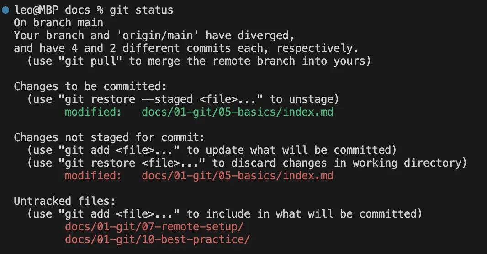
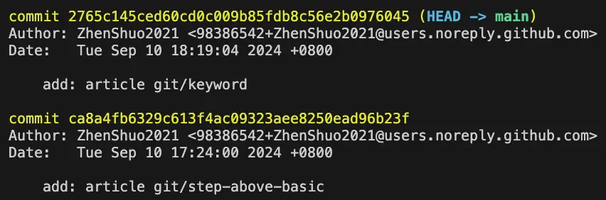

# Git 一分鐘入門

本文介紹 Git 最基礎的指令，只會說明如何增加新的提交記錄。

## 入門指令

以下是入門指令：

```sh
git init                    # 初始化，建立儲存庫 .git 資料夾
git add <pathspec>          # 放到預存區，可使用 git add . 預存所有檔案
git commit -m <messages>    # 提交到儲存庫
```

> 看不懂 pathspec？請見[看懂文檔](../preliminaries/read-git-docs#pathspec)。

這些指令完成了序章的[檔案標記狀態](../preliminaries/basic-knowledge#file-status)。完成提交後我們試著用以下指令查看檔案狀態和提交歷史：

```sh
git status                  # 檔案狀態（新增A、修改M、重新命名R、刪除D、未追蹤U）
git log                     # 顯示提交歷史
git ll                      # 或者使用前面設定的縮寫顯示提交歷史
```

請注意檔案狀態的縮寫，看不懂這個會對入門使用造成非常大的困擾，分別是`新增(A)dd`、`修改(M)odified`、`重新命名(R)ename`、`刪除(D)edeted`、`未追蹤(U)ntracked`。未追蹤代表還沒預存也沒被儲存庫追蹤的檔案，新增同上但是已經被預存，其餘三者則是對已經被追蹤的檔案所進行的操作。

使用 `git status` 的範例如下圖所示，分成三種狀態，從上到下分別是已預存、已修改、未追蹤。



再來是 git log 範例，黃色字體的結構是 `commit <hash> (目前位置 -> 所在分支)`



## 何時提交

知道如何提交版本紀錄之後，接下來我們說何時該提交。一般而言我們都希望每次提交的版本變化盡可能在一個小的範圍內，這樣版本歷史紀錄才能有效發揮用途。以一個簡單例子說明，假設一次提交包含新增函式和修改錯誤，這樣未來想進行版本操作時（例如放棄新增的函式），就會發現修改錯誤的記錄也要被取消了。除此之外，快速的定位問題、增加每次提交的可讀性也都是應該讓提交範圍縮小的  原因。

:::tip 應該在什麼時候進行提交？

每當有一個基本可運行的模組就該提交。

:::

## 結語

本文只包含了提交新版本，日常使用方式是

1. `git status` 查看修改了哪些檔案
2. `git add` 放進預存區
3. `git commit` 提交到儲存庫
4. `git log` 查看提交歷史
