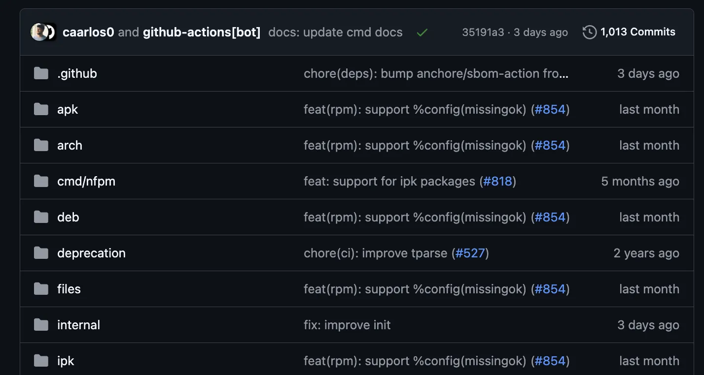

# Git 慣例式提交

學會基本操作後，撰寫能夠簡單讀懂、能夠被快速定位的提交訊息也很重要，所謂的慣例式提交就是把提交分成幾大種類方便查詢，用起來的感覺像是這樣：

> nFPM 的提交模版



## 分類

慣例式提交大致有以下幾種分類

- feat: 功能類型變更 (feature)。
- fix: 修復臭蟲。
- perf: 效能優化 (performance)。
- refactor: 程式碼重構，可能是優化程式架構。
- test: 單元測試。
- chore: 雜務。
- revert: 撤銷提交，如 git revert。
- style: 格式化變數等等，無生產相關程式碼變更。
- docs: 修改文檔。

## 格式

之後提交就依照這些分類進行提交，提交格式如下：

```sh
git commit -m "分類: 標題

（可選）修改範圍

- 修改內容一
- 修改內容二
- 修改內容三"
```

以下是一個慣例式提交的範例，每個公司、組織、專案都不一樣但是大同小異，跟大家一樣就可以了

```sh
fix: 修復頁面滾動卡住問題

drission_bot.py

- 修復自動滾動時偶發卡住的問題
- 修正滾動位置計算錯誤
- 調整等待時間避免DOM更新不完全
```

## 工具

[Conventional Commits](https://www.conventionalcommits.org/en/about/) 列出很多工具可以使用，這裡整理出 stars 最多的幾個：

- 不需要 npm 的
  1. [commitizen](https://github.com/commitizen-tools/commitizen)
  2. [commitlint](https://commitizen-tools.github.io/commitizen/)

- 需要 npm 的
  1. [cz-cli](https://github.com/commitizen/cz-cli)
  2. [standard-version](https://github.com/conventional-changelog/standard-version)
  3. [semantic-release](https://github.com/semantic-release/semantic-release)

還有自動化 CHANGELOG 工具 [git-cliff](https://github.com/orhun/git-cliff)，以及很多人用並且有好心人士繁體中文化的 [lazygit](https://github.com/jesseduffield/lazygit) TUI (terminal ui) 工具。

## 自動化

Git 工具除了慣例式的提交訊息，也可以整合自動化工具在每次提交前檢查提交內容，非常好用。完整文章請見 [初嘗 Python 工作流自動化](/memo/python/pre-commit-first-try)。

## 玩具

幫無聊的生活增加一點樂趣

- [gitmoji](https://github.com/carloscuesta/gitmoji), [gitmoji-cli](https://github.com/carloscuesta/gitmoji-cli): 幫 commit 加上 emoji
