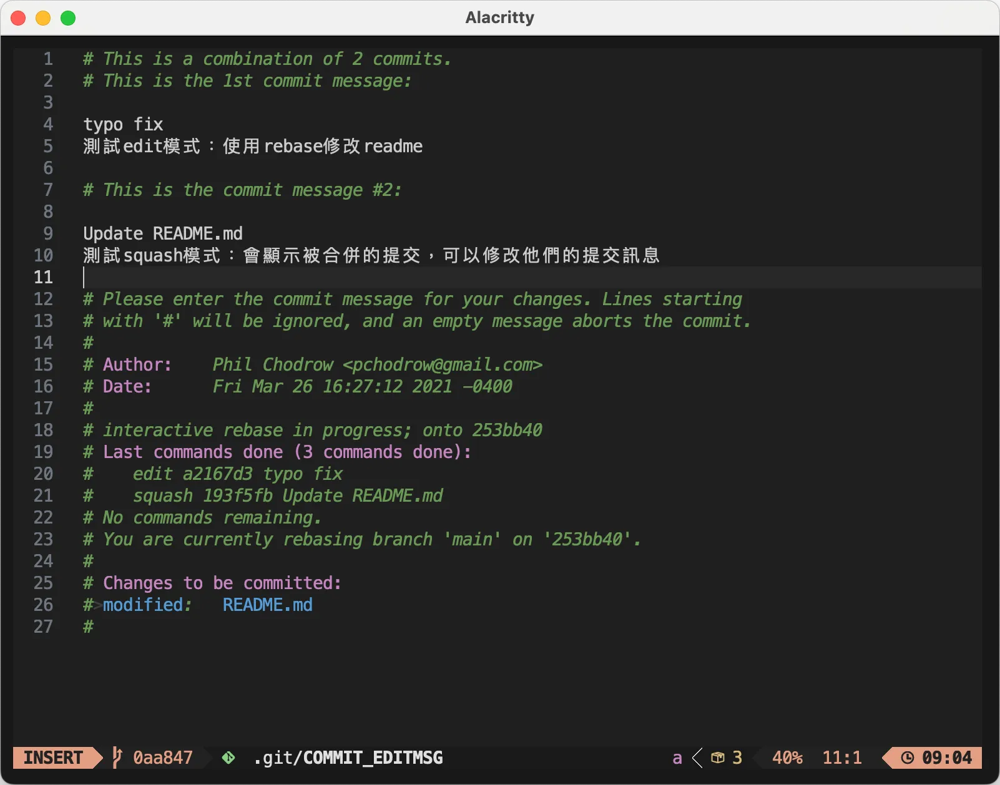
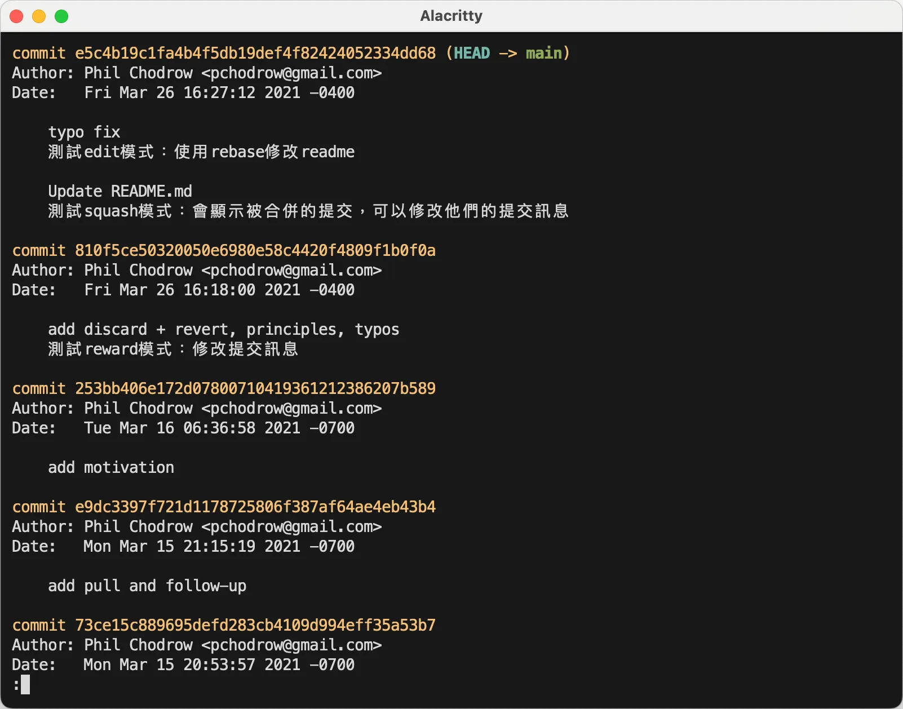

import EmblaCarousel from '@site/src/components/EmblaCarousel';

互動式變基是 Git 最強大的指令，包含移動提交、刪除提交、修改提交內容、修改提交訊息全部都可以做到。原理仍舊是基於變基，但是使用時完全不會感覺到分支操作。互動式變基常用的選項有五個：

- **p, pick**：預設，選擇該提交  
- **r, reword**：修改提交訊息  
- **e, edit**：修改提交內容  
- **s, squash**：合併到前一個提交  
- **f, fixup**：合併到前一個提交，不顯示被合併的提交訊息

本文簡單示範幾個 rebase 選項，要練習的話請使用 [範例 repo](https://github.com/PIC16B/git-practice) 操作，還想學會大魔王 onto 的話請看[搞懂 Rebase Onto](../advance/rebase-onto)。

## 修改範例

import image1 from './data/rebase-1.webp';
import image2 from './data/rebase-2.webp';
import image4 from './data/rebase-4.webp';
import image5 from './data/rebase-5.webp';
import image6 from './data/rebase-6.webp';
import image7 from './data/rebase-7.webp';
import image8 from './data/rebase-8.webp';

我們使用範例 repo 對最近的三個提交分別進行 reward, edit 和 squash 操作。

```sh
# 複製範例 repo
git clone https://github.com/PIC16B/git-practice -q && cd git-practice

# rebase 最近三個提交
git rebase -i HEAD~3
```

接下來就會進入互動式變基的修改頁面，預設都是 pick 也就是不改變，從上到下分別是由舊到新。我們把三個 pick，由上到下依序改為 r (reward 修改提交訊息) e (edit 編輯提交) s (squash 合併到前一個提交)，修改完的結果如圖，之後按下 `Esc` 回到 Vim 命令模式，輸入 `wq` 儲存並離開


之後會由舊到新開始進行互動式變基，第一個會進入 reward 模式修改提交訊息，跳出提交訊息修改視窗，修改完成後儲存退出


接著進入 edit 修改模式，edit 模式中可以任意更改，我們修改 README.md 文件，簡單加上一句測試文字，這裡要注意，如果只是要修改提交，改完後使用 `git add README.md` 預存，再使用 `git rebase --continue` 前往下一個 rebase 作業，不需要使用 `git commit`。輸入 `git rebase --continue` 後會跳出提交訊息修改視窗，修改完成就會進入下一個提交的變基

:::tip

互動式變基過程中如果使用 `git commit` 會變成插入一個新的提交。

:::

<EmblaCarousel
  images={[image4, image5, image6]}
  options={{ loop: true }}
/>

最後進入合併模式 squash，這裡和第一個 reward 一樣只會顯示提交訊息修改的視窗，會顯示被合併的提交的訊息。我加上一行測試後儲存離開，互動式變基就結束了。



使用 `git log` 檢查，發現提交訊息確實被修改，最新的提交也確實被合併了。



## 可以在互動式提交過程中進行提交嗎？

在互動式變基過程中使用 `git commit` 會插入一個新的提交。

在[使用變基 Rebase 合併分支](./rebase)有提到變基過程中的提交只是被暫存，沒有限制你哪些事情不能做，所以甚至可以在變基過程中使用 `git cherry-pick` 等等指令任意的修改提交。

## 重構初始提交

使用 `--root` 可以重構初始提交，但是 rebase 就已經夠危險了，除非有絕對需求要重構 root 否則還是盡量避免吧。
