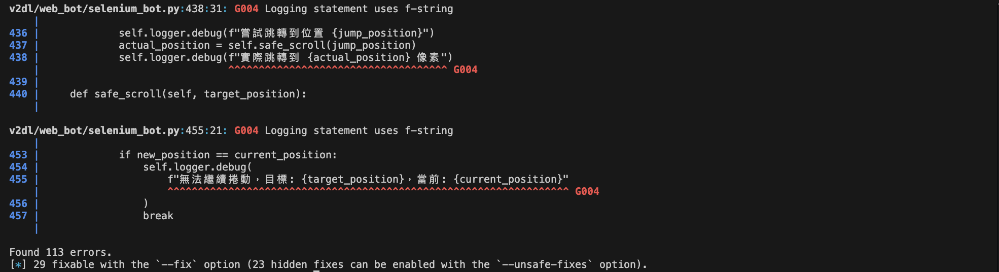
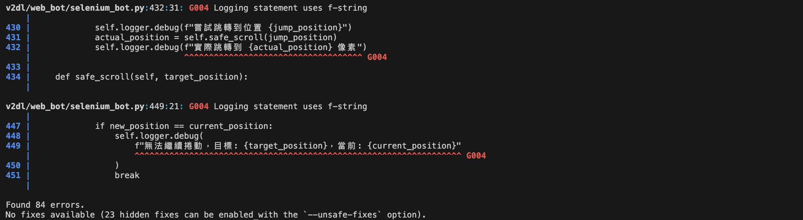
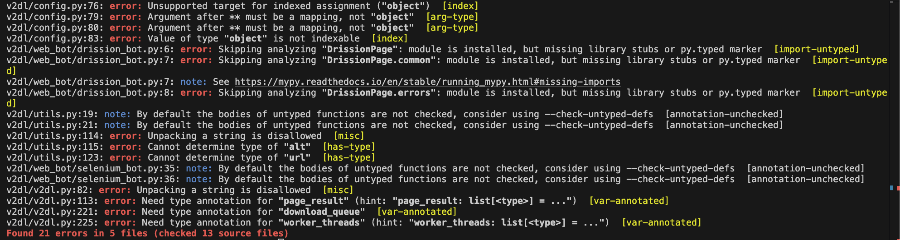
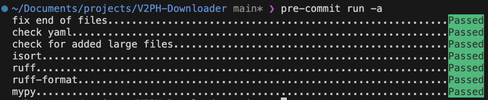

import Tabs from '@theme/Tabs';
import TabItem from '@theme/TabItem';

# 初嘗 Python 工作流自動化

看了很多 [*Code and Me*](https://blog.kyomind.tw/pyproject-toml/) 的文章，想說自己也來試試工作流自動化看好了，所以這篇是使用紀錄。

他的工作流自動化文章數量非常多，隨便點沒有特別找就有以下幾篇：

- [Python 開發：pyproject.toml 介紹 + 使用教學](https://blog.kyomind.tw/pyproject-toml/)
- [Python 專案從 Flake8、Black 遷移至 Ruff 指南](https://blog.kyomind.tw/migrate-to-ruff/)
- [Python 開發：Ruff Linter、Formatter 介紹 + 設定教學](https://blog.kyomind.tw/ruff/)
- [確保 isort 正確排序本地模組：pyproject.toml 與 pre-commit 設定](https://blog.kyomind.tw/isort-local-module-sorting/)
- [Python 開發：pre-commit 設定 Git Hooks 教學](https://blog.kyomind.tw/pre-commit/)

但是很可惜的沒有統整的文章，細節也太多，於是本文簡短紀錄自己的設定，包含 pyproject.toml + pre-commit。在搜尋資料的時候有發現資訊很少，查到後面才想到一整個專案只要有一個人負責設定就好了，那當然沒什麼人知道怎麼設定。

目前我已知的工作流自動化包含了以下幾點：

1. <u>靜態型別檢查 Type Checking</u>: 檢查變數型別有沒有使用錯誤。
2. <u>程式碼風格檢查 Linter</u>: 檢查程式碼是否違反 PEP 中的建議，也可以自行設定使用哪種風格。
3. <u>程式碼格式化工具 Formatter</u>: 自動格式化程式碼，讓所有程式碼維持相同格式。
4. <u>單元測試 Unittest</u>: 測試你的程式碼是否在各種邊界情況中正常運作。
5. <u>覆蓋率測試 Coverage</u>: 檢查有哪些程式碼沒有被單元測試覆蓋。
6. <u>安全檢查</u>: 檢查有沒有[提交隱私訊息](https://github.com/pre-commit/pre-commit-hooks/blob/main/pre_commit_hooks/detect_aws_credentials.py)。

經過一段時間的研究，最後我選擇的是 mypy (type check)，ruff (linter+formatter)，pytest (unittest)，沒測試覆蓋率 (因為測試只寫一個測試不想自暴其短)。

選擇 mypy 的原因是 pyright 整天在跟我說檢查不到套件，用 mypy 一行 disable import-not-found 就好了；ruff 功能強大且高效，pytest 則是從內建的 unittest 轉過來，語法確實比較簡潔，也整合 pdb 偵錯，coverage 我就只是玩過而已了。

> ruff 官網介紹自己核心理念不是創造新功能，而是在現有功能下達到更快的執行速度，這點非常好，一堆套件都不寫和競爭者差在哪，浪費大家時間，要自己研究或踩坑才知道。
> 
> 實際在 format 時，以我的爛 code 為例一個一千行的檔案使用 black formatter 都會卡一下了，大型專案還得了。yapf 沒有試過，PEP8 則是修改太少，沒有按下去修正一堆的那種愉悅感。

說在前面，這只是自己一個人找東西玩的紀錄，別問我不同設定差在哪，窩不知道。

## pyproject.toml
參考[官方文檔](https://python-poetry.org/docs/pyproject/)。

### 設定建構系統 build-system

必填，設定使用哪種打包工具。

```toml
# 例如以往 setup.py 中的常見的 setuptools
requires = ["setuptools", "wheel"]
build-backend = "setuptools.build_meta"

# 或者新穎的 poetry
requires = ["poetry-core>=1.0.0"]
build-backend = "poetry.core.masonry.api"

# 或者更新的 hatch
requires = ["hatchling>=1.24.2", "hatch-vcs>=0.3.0"]
build-backend = "hatchling.build"
```

### 專案元資料 metedata

從這裡開始每個專案都不太一樣，由於我自己使用 poetry，所以只介紹 poetry，首先是必填項目。

> 文章更新：如果想要使用 uv，請觀看筆者的 [uv 教學文章](/docs/python/python-uv-complete-guide)。

```toml
[tool.poetry]
name = "發布到PyPI的名字"
version = "套件版本"
description = "簡短描述，在PyPI的列表簡介顯示"
authors = ["Your Name <your.email@example.com>"]
```

這些選填基本上都會附上
```toml
maintainers = ["Maintainer Name <maintainer@example.com>"]
repository = "儲存庫網址"
homepage = "專案網站"
license = "MIT"
readme = "README.md"
```

classifiers 和 keywords 是 PyPI 的標籤，方便搜尋和分類使用
```toml
classifiers = [
    "Topic :: Multimedia :: Video",
    "Development Status :: 5 - Production/Stable",
    "Environment :: Console",
    "Programming Language :: Python",
    "Programming Language :: Python :: 3 :: Only",
    "Programming Language :: Python :: 3.9",
]
keywords = ["python", "cli", "scraper"]
```

### 依賴
在這裡可以設定專案依賴的套件：

```toml
[tool.poetry.dependencies]
python = "^3.10"
colorama = "^0.4.6"
DrissionPage = "^4.1.0.9"
```

- ^：允許向上兼容的版本
- ~：允許補丁版本更新
- ==：精確版本
- Optional dependencies：可選依賴

以及開發者使用的依賴：

```toml
[tool.poetry.group.dev.dependencies]
ruff = "^0.7.1"
mypy = "^1.13.0"
pre-commit = "^4.0.0"
```

### 入口點
如果是 cli 工具可以設定套件入口點，在 your_package 資料夾中的 cli.py，裡面的 main 函式。

```toml
[tool.poetry.scripts]
mycli = "your_package.cli:main"
```

### 開發工具設定
此處開始才是 pyproject.toml 的核心優勢，可以設定完整的工具設定保持專案開發的一致性。以 ruff 為例：

```toml

[tool.ruff]
# 設定每行長度
line-length = 100
# 設定不檢查的檔案和資料夾
exclude = [".git", "build", ".tox", ".eggs", "safe_house"]
preview = true
target-version = "py310"

[tool.ruff.format]
# 設定 formatter 格式
docstring-code-format = true
quote-style = "double"

[tool.ruff.lint.per-file-ignores]
# 這些檔案不檢查 T201 規則
"v2dl/cli/account_cli.py" = ["T201"]
"v2dl/utils/security.py" = ["T201"]

[tool.ruff.lint]
# linter 使用的規則
explicit-preview-rules = true
allowed-confusables = ["，", "。", "（", "）"]
ignore = [
    "E402",    # module-import-not-at-top-of-file
]
select = [
    "E",      # pycodestyle Error
]

[tool.ruff.lint.isort]
# isort 使用的規則
force-single-line = false
combine-as-imports = true
length-sort-straight = true
relative-imports-order = "closest-to-furthest"
```

### 完整的設定結果
ruff.lint 和 ignore 都是從大專案抄來的，例如 yt-dlp/pytorch/numpy/matplotlib 等等，如果想要自行設定可以[在 ruff 官網中查看所有規則](https://docs.astral.sh/ruff/rules/)，相信我看完之後你就會想直接抄作業了。在工作區根目錄設定完成後 VSCode 似乎能自動偵測，我沒有任何 IDE 就自動顯示檢查結果了。

```toml
[build-system]
requires = ["poetry-core>=1.0.0"]
build-backend = "poetry.core.masonry.api"

[tool.poetry]
name = "v2dl"
version = "0.1.4"
description = "V2PH downloader"
authors = ["ZhenShuo2021 <leo01412123@gmail.com>"]
repository = "https://github.com/ZhenShuo2021/V2PH-Downloader"
homepage = "https://github.com/ZhenShuo2021/V2PH-Downloader"
license = "MIT"
readme = "README.md"

[tool.poetry.dependencies]
python = "^3.10"
colorama = "^0.4.6"
DrissionPage = "^4.1.0.9"
python-dotenv = "^1.0.1"
selenium = "^4.25.0"
lxml = "^5.3.0"
PyYAML = "^6.0.2"
pynacl = "^1.5.0"
questionary = "^2.0.1"
httpx = "^0.27.2"
pathvalidate = "^3.2.1"

[tool.poetry.group.dev.dependencies]
ruff = "^0.7.1"
mypy = "^1.13.0"
pre-commit = "^4.0.0"
pytest = "^8.3.3"
tox = "^4.23.0"
isort = "^5.13.2"

[tool.poetry.scripts]
v2dl = "v2dl:main"

[tool.mypy]
# 此處大部分設定是從 matplotlib 抄來的
ignore_missing_imports = true
strict = true
check_untyped_defs = true
disallow_untyped_defs = true
disallow_incomplete_defs = true
warn_redundant_casts = true
warn_unreachable = true
warn_unused_ignores = true
follow_imports = "silent"
disable_error_code = [
    "import-untyped",
    "import-not-found",
    "no-untyped-call",
    "no-any-return",
    "unused-ignore",
]
enable_error_code = [
  "ignore-without-code",
  "redundant-expr",
  "truthy-bool",
]


[tool.ruff]
line-length = 100
exclude = [".git", "build", ".tox", ".eggs", "safe_house"]
preview = true
target-version = "py310"

[tool.ruff.format]
docstring-code-format = true
quote-style = "double"

[tool.ruff.per-file-ignores]
"v2dl/cli/account_cli.py" = ["T201"]
"v2dl/utils/security.py" = ["T201"]

[tool.ruff.lint]
# 此處大部分設定是從 yt-dlp 抄來的
explicit-preview-rules = true
allowed-confusables = ["，", "。", "（", "）"]
ignore = [
    "E402",    # module-import-not-at-top-of-file
    "E501",    # line-too-long
    "E731",    # lambda-assignment
    "E741",    # ambiguous-variable-name
    "UP036",   # outdated-version-block
    "B006",    # mutable-argument-default
    "B008",    # function-call-in-default-argument
    "B011",    # assert-false
    "B017",    # assert-raises-exception
    "B023",    # function-uses-loop-variable (false positives)
    "B028",    # no-explicit-stacklevel
    "B904",    # raise-without-from-inside-except
    "C401",    # unnecessary-generator-set
    "C402",    # unnecessary-generator-dict
    "PIE790",  # unnecessary-placeholder
    "SIM102",  # collapsible-if
    "SIM108",  # if-else-block-instead-of-if-exp
    "SIM112",  # uncapitalized-environment-variables
    "SIM113",  # enumerate-for-loop
    "SIM114",  # if-with-same-arms
    "SIM115",  # open-file-with-context-handler
    "SIM117",  # multiple-with-statements
    "SIM223",  # expr-and-false
    "SIM300",  # yoda-conditions
    "TD001",   # invalid-todo-tag
    "TD002",   # missing-todo-author
    "TD003",   # missing-todo-link
    "PLE0604", # invalid-all-object (false positives)
    "PLE0643", # potential-index-error (false positives)
    "PLW0603", # global-statement
    "PLW1510", # subprocess-run-without-check
    "PLW2901", # redefined-loop-name
    "RUF001",  # ambiguous-unicode-character-string
    "RUF012",  # mutable-class-default
    "RUF100",  # unused-noqa (flake8 has slightly different behavior)
]
select = [
    "E",      # pycodestyle Error
    "W",      # pycodestyle Warning
    "F",      # Pyflakes
    "I",      # isort
    "Q",      # flake8-quotes
    "N803",   # invalid-argument-name
    "N804",   # invalid-first-argument-name-for-class-method
    "UP",     # pyupgrade
    "B",      # flake8-bugbear
    "A",      # flake8-builtins
    "COM",    # flake8-commas
    "C4",     # flake8-comprehensions
    "FA",     # flake8-future-annotations
    "ISC",    # flake8-implicit-str-concat
    "ICN003", # banned-import-from
    "PIE",    # flake8-pie
    "T20",    # flake8-print
    "RSE",    # flake8-raise
    "RET504", # unnecessary-assign
    "SIM",    # flake8-simplify
    "TID251", # banned-api
    "TD",     # flake8-todos
    "PLC",    # Pylint Convention
    "PLE",    # Pylint Error
    "PLW",    # Pylint Warning
    "RUF",    # Ruff-specific rules
]

[tool.ruff.lint.isort]
force-single-line = false
combine-as-imports = true
length-sort-straight = true
relative-imports-order = "closest-to-furthest"
```

## .pre-commit-config.yaml
自動化幫你在 commit 前進行檢查，我只能說他是個神器，相見恨晚，從此再也不需要 `mypy ...` `ruff ...` `pytest ...` `isort ...`，所有檢查一行指令完成。


```sh
# 原本有超多指令
isort --line-length=100
ruff check file --fix
ruff format
mypy file --disable-error-code=import-untyped --disable-error-code=no-untyped-def --check-untyped-defs
pytest -s -v

# 設定完成後只需要一行
pre-commit run -a
```

### 安裝
```sh
# 安裝 pre-commit 套件
pip install pre-commit

# 安裝到專案的 git hook，並且安裝設定的 hooks
pre-commit install --install-hooks
```

這樣以後提交時就會自動執行 .pre-commit-config.yaml 中設定的所有 hooks，也可以使用 `pre-commit run -a` 手動執行，提交時加上 `--no-verify` 參數即可跳過 hooks。

### 完整的設定結果

```yaml
repos:
  # 此項是基本的 commit hook 設定
  - repo: https://github.com/pre-commit/pre-commit-hooks
    rev: v5.0.0
    hooks:
      - id: end-of-file-fixer
      - id: check-yaml
      - id: check-added-large-files
      - id: detect-private-key
      - id: debug-statements
      - id: check-case-conflict

  # 檢查安全性問題
  - repo: https://github.com/PyCQA/bandit
    rev: 1.7.10
    hooks:
      - id: bandit
        args: ["-ll"]

  # 檢查過時語法
  - repo: https://github.com/asottile/pyupgrade
    rev: v3.19.0
    hooks:
      - id: pyupgrade

  # 分別執行 lint 和 format
  - repo: https://github.com/astral-sh/ruff-pre-commit
    rev: v0.7.4
    hooks:
      - id: ruff
        args: [--fix, --exit-non-zero-on-fix]
      - id: ruff-format

  # 靜態型別檢查
  - repo: https://github.com/pre-commit/mirrors-mypy
    rev: v1.13.0
    hooks:
      - id: mypy
        args: ["--config-file=pyproject.toml"]
        exclude: ^(safe_house/|tests/)
        additional_dependencies:
          - types-PyYAML

  # 單元測試
  - repo: local
    hooks:
      - id: pytest
        name: pytest
        entry: "pytest -s -v"
        language: system
        pass_filenames: false
        always_run: true

  # pyproject.toml 修改時自動更新 requirements.txt
  - repo: local
    hooks:
    - id: run-pip-compile
      name: Run pip compile
      entry: bash -c 'uv pip compile pyproject.toml -o requirements.txt'
      language: system
      files: ^pyproject.toml$
```

## Github workflow 自動發布套件
這雖然和本文目的不同不過也算是 Python 自動化的一部分，從此之後不需要再使用 poetry build/publish 指令，只要在提交時加上 tag 就會自動發布。


```yaml
name: PyPI Publish

# 設定觸發條件
on:
  release:
    types: [created]

  push:
    tags:
      - 'v*.*.*'

# 設定工作流程
jobs:
  publish:
    name: Build and Publish to PyPI
    environment: publish_pypi
    runs-on: ubuntu-latest

    permissions:
      id-token: write
      contents: read

    steps:
      # 讀取 repo
      - name: Checkout repository
        uses: actions/checkout@v4

      # 設定 Python 環境
      - name: Set up Python
        uses: actions/setup-python@v5.3.0
        with:
          python-version: '3.x'

      # 安裝 Poetry
      - name: Install Poetry
        uses: snok/install-poetry@v1
        with:
          version: 1.7.1
          virtualenvs-create: true
          virtualenvs-in-project: true

      # 安裝套件的依賴項目
      - name: Install dependencies
        run: poetry install --no-dev

      # 構建套件
      - name: Build package
        run: poetry build

      # 發布到 PyPI
      - name: Publish to PyPI
        uses: pypa/gh-action-pypi-publish@release/v1
```


## 使用範例
這既是我第一次設定這些文件，也是我第一次使用程式碼品質工具，第一次使用的錯誤多到炸裂：

> 第一次檢查 ruff 的警告數量高達 113 個


<br/>

> ruff 也有自動修復功能，對於一些小錯誤可以自行修復，自行修復 29 個錯誤後的結果，還剩下 84 個：


<br/>

> mypy 初次檢查也是嚇死人


<br/>

> 經過好一段努力後終於修復所有問題


不得不說這有點像是玩遊戲的通關獎勵，送你一堆綠色 pass。


## 心得
潮～爽～DER～ pre-commit 一行指令完成所有工作。

好啦正經一點，基本的 pre-commit-hooks 可以檢查是否提交大檔案，也真的讓我發現有一兩次不小心提交圖片檔案了。

這些工具也可以幫我們多學一些平常不會碰到的知識，比如說 ruff 警告 try-except 後面的 logger 加上 exc_info=True 時，會提醒你[直接使用 logger.exception](https://docs.astral.sh/ruff/rules/logging-redundant-exc-info/#why-is-this-bad) 簡寫，還有 logger 使用 f-string 會造成[效能問題](https://docs.astral.sh/ruff/rules/logging-f-string/)，以及自動檢查程式碼中的 [magic number](https://docs.astral.sh/ruff/rules/magic-value-comparison/) 等等，還滿方便的。

isort 會自動幫我們排列所有 import 語句，這方面見仁見智，至少避免了強迫症每次都想手動排列浪費的時間。

mypy 的話則是地獄，為了改他多學了泛型，直接多寫了一篇文章（[Type Hint 教學：從入門到進階的 Python 型別註釋](/docs/python/type-hint-typing-complete-guide)），不過這就是初期成本，無法避免。

pytest 則可以在每次提交時自動執行，讓你想懶也不行，大家都知道打字會死，我相信沒有任何人想在提交時多打 --no-verify，寧願不打讓他自己跑測試假裝自己有在做事。

coverage 則是痛苦面具，程式碼寫完就夠累了還要寫測試，還好我沒用（？）

:::tip 2024/11/19 更新

隨著使用時間拉長也檢查到了更多問題，提供一些檢查工具幫助到我的實際案例。

最大宗的是 mypy，雖然是靜態檢查但是被檢查到程式邏輯問題：忘記把字串加上 `""` 變成變數名稱，這個變數剛好存在，又剛好和比較的方式永遠相等，被 mypy 發現該處永遠為 True；另一個是永遠不會進入的 if 語句，是在修改某處後另一處會造成的變化，沒有全部修正完成也被 mypy 提醒。還有幾個比較小的問題不記得了，總之滿有用的，尤其是程式越來越長之後。

bandit 則教了一些安全技巧，例如使用 `subprocess.Popen` 中有一個 shell 參數，使用 `shell=True` 代表輸入會直接丟到殼層解析處理，這時如果有人輸入惡意指令，例如 `ls /home/user; rm -rf /important_folder`，假設我們只檢查他開頭是不是輸入 `rm -rf`，攻擊者只需要在前面加上一個 `ls` 就可以輕易規避檢查，尤其是我們知道[文字檢查是檢查不完的](https://www.youtube.com/watch?v=cUTYk-LyWQY)，永遠都有想不到的狀況，與其擔心出現問題不如一開始就不要用。

新加入的 pyupgrade 則是偶爾會提醒有更簡潔語法，避免使用舊版語法。
:::
