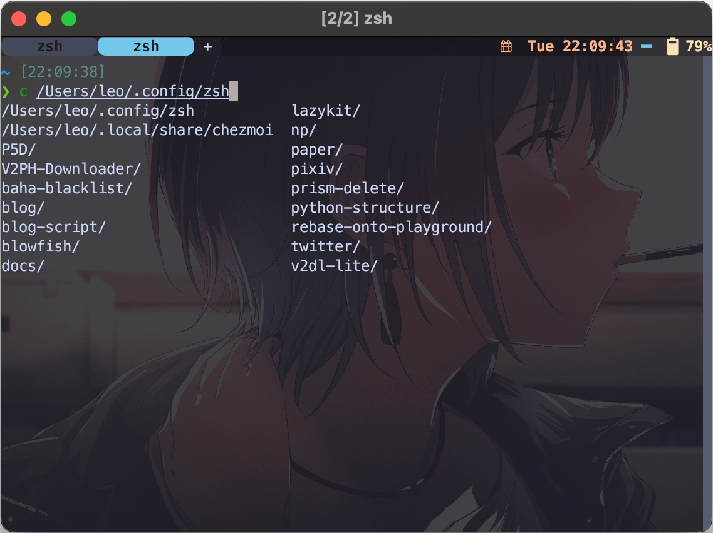
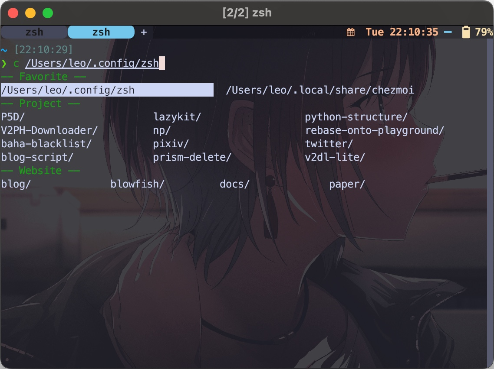

直接上範例。

## 範例一：hugo new content

舉例來說，我想把 `hugo new content` 這個指令簡寫為 `hnc` 並且支援補全，第一步先建立一個檔案名稱為 hnc 的腳本放在 fpath 裡面，不能用 alias，alias 不給補全，腳本如下：

```sh
#!/bin/zsh
# 
# use hnc as shortcut for `hugo new content` with auto-completions
hugo new content $@
```

接下來一樣在 fpath 路徑中新增一個 `_hnc` 文件用於設定補全，並且支援排除指定目錄

```sh
#compdef hnc
# 
# https://unix.stackexchange.com/questions/14434/path-files-and-compadd-ignore-files-parameter

_hnc() {
  local -a ignored
  # 已經 2025 了所以我想過濾掉所有 2024 的自動補全
  ignored=('about' 'archives' 'tags' 'categories' '2024*' '**/2024*')
  _path_files -/ -W "$PWD/content" -F ignored
}

_hnc
```

_path_files 是用於補全檔案名稱的指令，第一個 `-/` 表示只補全目錄，`-W` 告訴他從該路徑開始補全，`-F` 設定過濾條件。如果你的 zshrc 沒設定過補全記得加上這幾行以啟用

```sh
# 把路徑加入 fpath
fpath=(/dir/to/fpath $fpath)

# 載入該函式和補全系統
autoload -U /dir/to/fpath/*(:t)
autoload -U compinit

# 啟動補全系統
compinit
```

這樣就完成惹，並且支援目錄排除。

## 範例二：前往最愛資料夾

受到 holman 的 dotfiles 啟發，他寫了一個 [c 函式和他的補全](https://github.com/holman/dotfiles/tree/644d8748d1ecabe59d607b5463c48ef220b67b74/functions) 用於跳到專案目錄，並且直接補全專案目錄底下的每個專案。這裡我把他擴充成

1. 除了補全專案資料夾，還可以直接顯示最愛資料夾
2. 使用 Zsh 補全功能分類補全的目錄

程式碼大如下

```sh reference title="c 函式本身"
https://github.com/ZhenShuo2021/dotfiles/blob/9a4886d96df1dc76601bcf9a4450403197f0014b/home/private_dot_config/zsh/fpath/c
```

<br/>

大概意思是在專案目錄下尋找專案，如果專案目錄不存在就嘗試把輸入當作一般 cd 處理，如果專案目錄存在就跳到 cd 切換，如果 cd 失敗印出錯誤訊息。

<br/>

```sh reference title="c 函式的補全"
https://github.com/ZhenShuo2021/dotfiles/blob/9a4886d96df1dc76601bcf9a4450403197f0014b/home/private_dot_config/zsh/fpath/_c
```

撰寫補全函式用了兩個 Zsh 函式，這兩個函式的用途是：

- `_describe`: 把陣列傳遞給補全函式
- `_alternative`: 幫補全結果上標籤，例如 `'favorite:Favorite:_favorite_list'` 代表補全 `favorite` 項目，顯示分類名稱是 `Favorite`，以 `_favorite_list` 函式完成補全。

可以看這篇文章 [zsh-completions-howto.org](https://github.com/zsh-users/zsh-completions/blob/master/zsh-completions-howto.org) 有更多資訊，不過實際上我是看 brew site-functions 依樣畫葫蘆的，在 `/opt/homebrew/share/zsh/site-functions` 裡面存放所有 Zsh 補全函式。

## 美化補全

照上面的設定完成後就可以啟用補全系統了，以 c 函式為例補全會變這樣：



雖然可以用但是有點醜，這裡我們喊一下 do re mi sol 可以改成這樣：



設定就是把這些加到你的 .zshrc 中

```sh
# Set format for completion descriptions
zstyle ':completion:*:descriptions' format '%F{green}-- %d --%f'

# Set format for completion warnings
zstyle ':completion:*:warnings' format '%F{red}-- No matches found --%f'

# Set prompt for interactive completion selection
zstyle ':completion:*' select-prompt '%F{green}%p%f'

# Separate matches into groups, should be used with description format
zstyle ':completion:*:matches' group 'yes'
zstyle ':completion:*' group-name ''

zstyle ':completion:*:match:*' original only

# Case-insensitive tab completion
zstyle ':completion:*' matcher-list 'm:{a-z}={A-Z}'

# Allow tab insertion when completion is pending
zstyle ':completion:*' insert-tab pending

# Enable menu selection for completion
zstyle ':completion:*' menu select

# Set cache path for completion
zstyle ':completion::complete:*' cache-path "$XDG_CACHE_HOME/zsh/zcompcache"

# Misc
zstyle ':completion:*' list-separator ' ➤ '
# zstyle ':completion:*' list-dirs-first true
# zstyle ':completion:*' list-packed true
# zstyle ':completion:*' rehash true

# Not using cache
# zstyle ':completion:*' use-cache no

# fuzzy matching
# zstyle ':completion:*' completer _complete _match _approximate
# zstyle -e ':completion:*:approximate:*' \
#   max-errors 'reply=($((($#PREFIX+$#SUFFIX)/3))numeric)'
```

什麼！！！哪裡找的到這麼多設定，這些是我到處抄 Github 大佬的設定檔弄來的，而且過濾掉很多舊版過時設定，順便推銷，如果你覺得這些設定很讚，可以用我的 dotfiles 設定檔，這是[介紹文章](/memo/linux/fastest-zsh-dotfile)，設定檔的 repo 在[這裡](https://github.com/ZhenShuo2021/dotfiles)。

## 加速載入

補全系統載入速度很慢會讓你的終端第一次啟動時卡住約 0.2 秒，這是 `compinit` 問題不是我的腳本問題，建議使用 [zsh-defer](https://github.com/romkatv/zsh-defer) 延遲載入他，這樣你既有補全系統，又有速度幾乎完全一樣的終端載入速度。

再次推銷，如果你的終端機很慢也可以用我的 dotfiles 設定檔，*不會有任何設定檔的載入速度能比我的快*。

## 苦難

俗話說的好，授人以漁不如直接給他魚，為了這個簡單的自動補全從頭到尾花了兩週，實際耗時超過四小時，我不希望有人受到一樣的折磨...腳本不難難在找不到資訊，找了老半天才偶然才
[這篇文章](https://unix.stackexchange.com/questions/14434/path-files-and-compadd-ignore-files-parameter)，哭啊我的兩個禮拜。

我是全中文圈第一個寫 zsh 自動補全的人，如果你搜尋 `_path_files` 然後限制所有中文網頁會得到精美的 10 項搜尋結果，全世界沒半個中文用戶寫這過東西。

## 參考

- [zshcompsys(1) - Linux man page](https://linux.die.net/man/1/zshcompsys)
- [_path_files and compadd ignore-files parameter](https://unix.stackexchange.com/questions/14434/path-files-and-compadd-ignore-files-parameter)
