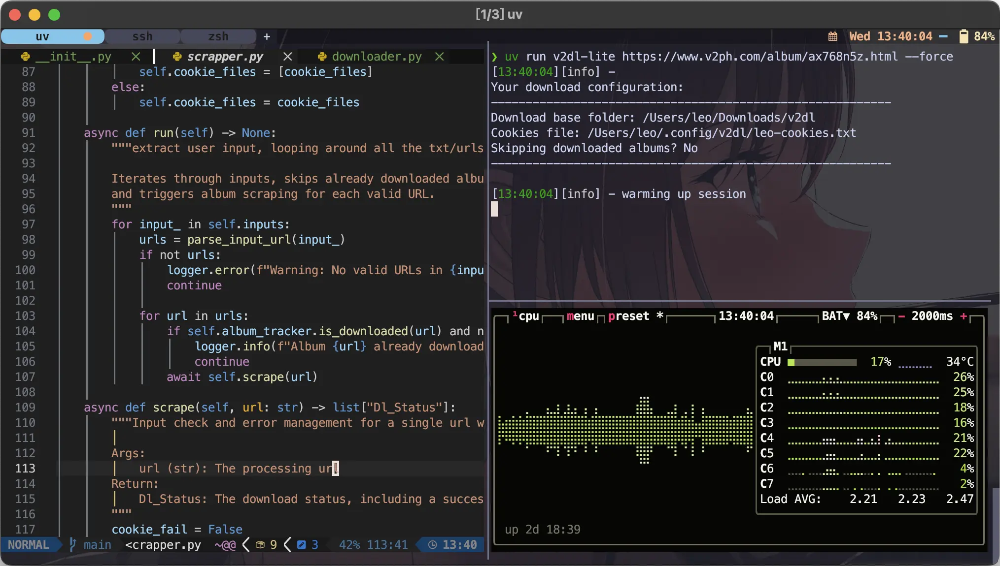
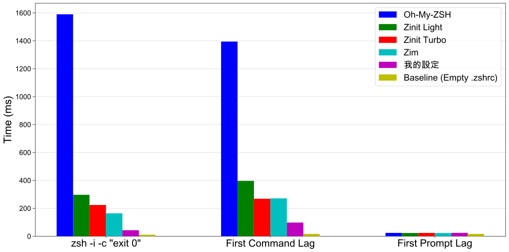

import VideoPlayer from '@site/src/components/VideoPlayer';
import Tabs from '@theme/Tabs';
import TabItem from '@theme/TabItem';

# 五行指令輕鬆設定啟動速度 0.03 秒的極速 Zsh

<h3>⚡️ 速度超快</h3>

0.03 秒的離開延遲，0.08 秒的 prompt 延遲，比 Oh-My-Zsh 快 14 倍，比 Zinit 快 4 倍。

<h3>🚀 輕鬆安裝</h3>

不必慢慢複製貼上，五行指令完成所有安裝！

<h3>🌐 跨平台適用</h3>

測試 macOS/Ubuntu/TrueNas (Debian) 都能正常運作。

<h3>⚙️ 設定正確</h3>

參考 shell 插件開發者 [agkozak](https://github.com/agkozak) 的設定完成，應該沒有幾個人的 shell 設定能比 shell 開發者本人的設定更好。

<h3>🧰 功能豐富</h3>

包含 10 個日常實用插件，方便性沒有因為速度妥協！

<br/>



## 一鍵安裝

如果對一鍵安裝有疑慮請[手動設定](#setup-zshrc)。

1. 開啟終端機貼上安裝指令，這會下載筆者的設定檔

```
MINIMUM=1 sh -c "$(curl -fsSL https://raw.githubusercontent.com/ZhenShuo2021/dotfiles/main/remote_install.sh) -k -v"
```

2. 由於內建終端機不支援完整的顯示功能，所以下載更好的終端機和字體

<Tabs>
  <TabItem value="macOS" label="macOS">

  安裝 brew，如果已經安裝則跳過此行
  
  ```sh
  /bin/bash -c "$(curl -fsSL https://raw.githubusercontent.com/Homebrew/install/HEAD/install.sh)"
  ```

  安裝 [WezTerm](https://wezterm.org/index.html) 終端機和字體
  
  ```sh
  brew tap homebrew/cask-fonts
  brew install --cask font-meslo-for-powerlevel10k
  brew install --cask wezterm
  ```

  </TabItem>

  <TabItem value="Linux" label="Linux">
  
  安裝 [WezTerm](https://wezterm.org/index.html) 終端機

  ```sh
  curl -fsSL https://apt.fury.io/wez/gpg.key | sudo gpg --yes --dearmor -o /etc/apt/keyrings/wezterm-fury.gpg
  echo 'deb [signed-by=/etc/apt/keyrings/wezterm-fury.gpg] https://apt.fury.io/wez/ * *' | sudo tee /etc/apt/sources.list.d/wezterm.list
  sudo apt update && sudo apt install wezterm
  ```

  安裝字體

  ```sh
  mkdir -p "$HOME/.local/share/fonts"
  for style in Regular Bold Italic "Bold Italic"; do
    wget "https://github.com/romkatv/powerlevel10k-media/raw/master/MesloLGS%20NF%20$style.ttf"
    mv "MesloLGS NF $style.ttf" ~/.local/share/fonts/
  done
  fc-cache -f -v
  ```

  </TabItem>
</Tabs>

3. 使用 `exec zsh` 刷新後插件會開始自動安裝，輕鬆完成所有設定！

現在你已經得到筆者閱讀超過百篇以上文章的精華，並且大量借鑑（抄襲）兩位資深開發者的設定檔，分別是 [agkozak](https://github.com/agkozak/dotfiles)，[zsh-z](https://github.com/agkozak/zsh-z) 和 [zcomet](https://github.com/agkozak/zcomet) 的開發者，以及 [narze](https://github.com/narze/dotfiles) 的設定檔，等同於直接使用兩位專家的正確設定，不是網路上的不知名教學文章，還不用一個一個指令慢慢貼上，而且速度超快、功能齊全。

:::tip

- 之後終端機改用 WezTerm 以支援圖片顯示、全彩顏色和完整的文字效果，修改主題樣式請執行 `p10k configure`，唯一需要注意的是修改主題的最後一個問題會詢問是否修改 `~/.zshrc?`，選擇 No。

- VSCode 終端機也要修改字體，開啟 VSCode 在上方的輸入欄位貼上 `>Preferences: Open User Settings (JSON)` 後打開文件，貼上 `"terminal.integrated.fontFamily": "MesloLGS NF"`。

- 如果不喜歡 WezTerm 可以改用開箱即用的 [Warp](https://www.warp.dev/download) 或 [Tabby](https://tabby.sh/)，詳細討論請看專文[各種跨平台終端機實測](../useful-tools/cross-platform-terminal-comparison)。

- 如果有幫助到你的話別忘了[給筆者一顆星星](https://github.com/ZhenShuo2021/dotfiles)。

:::

## 前言

在網路上搜尋客製化終端機等等關鍵字會看到 Oh-My-Zsh (omz), iTerm2 等等文章，稍微深入一點之後就會看到 omz 太慢了，開始改用 Zim 或 Zinit 來替代原本的 omz，但是這些文章都沒告訴初學者兩個問題：

1. omz, Zim, Zinit 到底在做什麼？
2. 內建終端機用的好好的為什麼要改用 iTerm2？

對於第一個問題，這些是 <u>**Zsh 插件管理器**</u>，用途是簡化 shell 插件載入的流程；第二個問題 iTerm2 則用於替換內建終端機，提供分頁、tmux 和 true color 等等內建終端機沒有的功能（不過內建終端現在應該只剩下 true color 和顯示圖片功能不支援）。知道目的後下一步就要討論應該<u>**如何選擇插件管理器和終端**</u>。

### 如何選擇終端機

終端機的選擇重點有這幾個：

1. 開啟速度
2. 基礎功能（全彩顏色，圖片顯示，新分頁，分割視窗）
3. 額外功能（請見[各種跨平台終端機實測](../useful-tools/cross-platform-terminal-comparison)）
4. 客製化（提供設定狂熱者的客製化空間）

終端機不是本文重點所以直接講結論，筆者建議用 WezTerm 並且直接在 Github 搜尋別人的設定檔，或是使用開箱即用的 [Warp](https://www.warp.dev/download) 或 [Tabby](https://tabby.sh/)，詳細請見[專文討論](../useful-tools/cross-platform-terminal-comparison)。WezTerm 設定檔可以使用 KevinSilvester 的[原版設定](https://github.com/KevinSilvester/wezterm-config)或是筆者[改良過的版本](https://github.com/ZhenShuo2021/wezterm-config)，提醒一下原版設定需要把預設 shell 從 fish 改為 zsh。

### 如何選擇 Zsh 插件管理器{#choose-zsh-plugin-manager}

優化 shell 之前我們首先要選一個好的插件管理器，Zsh 插件的概念最早是由 Oh-My-Zsh 提出的，雖然最多人用，但是有速度慢和不方便兩大問題，所以才會看到網路上各種跳家的文章。他的主要功能不外乎是下載、載入和更新插件，選擇的重點同樣是速度和方便性，速度很直觀，已經有人測試過各種不同插件管理器的載入速度：

- [Eric Nielsen: Zim Speed](https://github.com/zimfw/zimfw/wiki/Speed)
- [rossmacarthur/zsh-plugin-manager-benchmark](https://github.com/rossmacarthur/zsh-plugin-manager-benchmark)

篩選過後最快並且還有更新的是 zsh4humans, Zinit, Zim 和 zcomet。方便性的評斷標準就比較複雜，以筆者的使用經驗來說有以下幾個重點

1. **安裝時會不會直接覆寫檔案**：如 z4h, Zim 都會直接覆寫 .zshrc 文件
2. **支援自動下載插件**：應該只剩下 omz 不支援
3. **設定的自由度**：可以獨立管理每個插件而不是統一由管理器載入
4. **加速載入**：自動將插件編譯成二進制的 .zwc 檔
5. **插件來源豐富度**：如 Github repo, 指定 URL, 本機路徑等
6. **補全系統**：自動攔截補全的 compdef 指令，放到最後才一併執行
7. **集中管理 fpath**：支援自動 symlink，避免每個插件都有一個 fpath

問題一其實很好解決，在 zshrc 中檢查管理器是否安裝並且自動 clone 就好了，檢查時間算不上效能損失，問題二也只剩下 omz 還有這個問題，所以問題只剩下後面五個。

### Zim, Zinit, zsh4humans 都不是最快的插件管理器

前面給出的[速度測試](https://github.com/zimfw/zimfw/wiki/Speed) 不是顯示最快的是他們三個嗎？讓筆者仔細說明。Zim 要求把插件放到獨立的 .zimrc 文件統一載入，這種載入方式導致我們無法獨立設定每個插件是否使用 [zsh-defer](https://github.com/romkatv/zsh-defer/) 這個功能。zsh-defer 的用途是延遲指令執行，等到 shell 沒有工作時才執行載入以降低實際等待時間，然而 Zim 統一載入插件的特色會導致我們無法控制各個插件是否啟用 zsh-defer，只能設定全開或全關，全開會因為無法達成 Zsh <u>**指令補全**</u>要求的載入順序，造成部分補全系統啟用失敗，反之<u>**不使用 zsh-defer，這些插件管理器就不再是比誰更快，而是慢和更慢**</u>，同樣的問題也發生在 zsh4humans；至於 Zinit，他內建的 turbo mode 就是延遲載入功能，但是 Zinit 本體載入速度太慢而且語法過於複雜。

排除這些問題後，最後筆者找到的插件管理器就是 zcomet，速度快且易於設定。

### Zsh 指令補全{#completion}

輸入指令後按下 <kbd>Tab</kbd> 觸發補全 Zsh 會自動列出可選參數或輸入，這是終端三大救贖之一，沒有這個功能不知道指令要打到什麼時候，範例大概是這個樣子的，這是筆者自己撰寫的函式 `c`，用於前往最愛資料夾，並且使用補全的範例：

<VideoPlayer url="https://youtu.be/6nfQFb8vxbY"/>

:::info
c 函式是特例，99.9\% 都是使用工具自帶的補全函式不需要自己寫，這裡是想順便推廣文章[撰寫 ZSH 自定義函式以及補全函式](custom-zsh-completion)。
:::

除了路徑補全，指令本身的參數，甚至是會變動的 Git 分支、標籤等等，Zsh 都可以補全，如影片範例所示。

<VideoPlayer url="https://youtu.be/h02xXIsUjRw"/>

這裡順便說明如何設定，因為就沒有一篇文章能好好說明 Zsh 補全系統是怎麼運作的，結論很簡單，資源很難找：

1. 插件 `zsh-syntax-highlighting` `zsh-autosuggestions` 應該在最後才載入
2. 設定 fpath
3. 設定 zstyle
4. 執行 compinit
5. 設定 zstyle（如果有其餘的 zstyle 必須在 compinit 後執行的話）
6. 執行 functions requires compdef

用人話解釋，這兩個插件開發者自己說他的插件應該在最後才被載入；fpath 是 Zsh 才有的路徑，用於設定補全腳本和函數的路徑（而不是腳本或程式，這兩個的路徑是 PATH）；zstyle 有很多功能，最顯而易見的就是設定補全的樣式；接著 compinit 啟用補全系統，再執行需要依賴補全系統的指令。

## 為何選擇這份設定檔

不只快而且功能齊全。

1. ⚡ **是真的快**，0.03s 的離開延遲和 0.08s 的 prompt 延遲，幾乎達到速度上限，而且使用專用工具測試，不像網路上的搞笑演員拿 `time` 指令跑 10 次就說這叫做速度測試
2. 📂 集中管理安裝腳本和設定檔
3. 📚 完整註解
4. 🔲 極簡風格：沒有花花綠綠的分散注意力
5. 🎨 WezTerm 主題
6. ✏️ neovim 設定檔
7. ✅ zsh-syntax-highlighting 語法上色
8. ✅ zsh-autosuggestions 指令歷史建議
9. ✅ zsh-completions 指令補全
10. ✅ zsh-z 快速切換目錄
11. ✅ colored-man-pages
12. ✅ GPG、homebrew 和 Git 等套件的常見問題都已經解決
13. ✅ 指令補全
14. 🧹 **乾淨的家目錄**，只要能改位置的設定檔幾乎全部改到 `.cache` `.config`。
15. 🌍 **參考 GitHub 前 20 大 dotfiles** 完成，結合他們全部優點，不用再想東想西，現在就是最好的設定。  
16. 👨‍💻 **參考 shell 插件開發者 agkozak 的 shell 設定**，一般人自己瞎搞能比開發者本身設定的更好嗎？  

---

## 手動優化 Zsh{#setup-zshrc}

不使用安裝腳本而是讓你自己複製貼上比較清楚做了什麼事，而且一鍵安裝方式有參雜筆者個人的偏好設定。

### 建立 .zshrc

在家目錄中（`/Users/<name>`）打開 .zshrc 檔案，如果沒有就建立一個，貼上

```sh
# Enable Powerlevel10k instant prompt. Should stay close to the top of ~/.zshrc.
# Initialization code that may require console input (password prompts, [y/n]
# confirmations, etc.) must go above this block; everything else may go below.
if [[ -r "${XDG_CACHE_HOME:-$HOME/.cache}/p10k-instant-prompt-${(%):-%n}.zsh" ]]; then
  source "${XDG_CACHE_HOME:-$HOME/.cache}/p10k-instant-prompt-${(%):-%n}.zsh"
fi

BREW_PATH=/opt/homebrew
export PATH="$HOME/.local/bin:$PATH"
export ZSH_COMPDUMP="$HOME/.cache/zsh/zcompcache/.zcompdump"

zstyle ':zcomet:*' home-dir ~/.config/zsh/zcomet
if [[ ! -f ${ZDOTDIR:-${HOME}}/.config/zsh/zcomet/bin/zcomet.zsh ]]; then
  git clone https://github.com/agkozak/zcomet.git ${ZDOTDIR:-${HOME}}/.config/zsh/zcomet/bin
fi
source ${ZDOTDIR:-${HOME}}/.config/zsh/zcomet/bin/zcomet.zsh

# load p10k
zcomet load romkatv/zsh-defer
zcomet load romkatv/powerlevel10k

zsh-defer source ~/.zshrc.local

# To customize prompt, run `p10k configure` or edit ~/.p10k.zsh.
[[ ! -f ~/.p10k.zsh ]] || source ~/.p10k.zsh
```

第一段的 p10k-instant-prompt 是 powerlevel10k 主題特有的 instant-prompt 功能，他的原理是快取文件並且延後插件載入，讓我們可以馬上開始輸入不需要等待插件完全載入，所以在[官方範例](https://github.com/romkatv/powerlevel10k?tab=readme-ov-file#instant-prompt)可以看到 syntax highlight 的顏色過了一段時間才出來並且可以馬上輸入文字。

第二段是設定路徑，`BREW_PATH` 則設定 brew 路徑，M1 以上才是這個路徑，x86 (Intel CPU) 在別的路徑請自行修改，接著把 bin 資料夾加入路徑讓可執行檔可以被系統找到，最後設定 `ZSH_COMPDUMP` 設定補全系統的文件位置避免家目錄很亂，在筆者的一鍵安裝設定檔中幾乎所有能改位置的都改了，包含 `.gitconfig` `.matplotlib` 等等，全部都放在 `.cache` 或者 `.config`。

最後是載入 zcomet、載入必要插件、延遲載入其餘插件、載入主題。

### 建立 .zshrc.local

一樣在家目錄建立文件，名稱 .zshrc.local 並且貼上

```sh
# load plugins
zcomet load ohmyzsh plugins/extract
zcomet fpath ohmyzsh plugins/docker-compose   # only load completion
# zcomet load ohmyzsh plugins/git
# zcomet fpath ohmyzsh plugins/gitfast   # Same as homebrew's git completion


# configure zsh-history-substring-search
zcomet load zsh-users/zsh-history-substring-search

# Only search full prefix match
HISTORY_SUBSTRING_SEARCH_PREFIXED=1

# custom substring highlight color
# HISTORY_SUBSTRING_SEARCH_HIGHLIGHT_FOUND='fg=white,bold,bg=cyan'
# HISTORY_SUBSTRING_SEARCH_HIGHLIGHT_NOT_FOUND='fg=white,bold,bg=red'
# HISTORY_SUBSTRING_SEARCH_HIGHLIGHT_TIMEOUT=2

# disable substring match highlighting
unset HISTORY_SUBSTRING_SEARCH_HIGHLIGHT_FOUND
unset HISTORY_SUBSTRING_SEARCH_HIGHLIGHT_NOT_FOUND
bindkey '^[[A' history-substring-search-up
bindkey '^[[B' history-substring-search-down


# plugins that must be loaded last
zcomet load agkozak/zsh-z
zcomet load zsh-users/zsh-completions
zcomet load zsh-users/zsh-syntax-highlighting
zcomet load zsh-users/zsh-autosuggestions; bindkey '^f' autosuggest-accept


# optional plugins
# zcomet load lukechilds/zsh-better-npm-completion


# deprecated plugins
# zcomet load ohmyzsh lib completion.zsh   # brew fpath and zsh-completions are better


# colored manpage
export LESS_TERMCAP_mb=$'\e[1;32m'
export LESS_TERMCAP_md=$'\e[1;32m'
export LESS_TERMCAP_me=$'\e[0m'
export LESS_TERMCAP_se=$'\e[0m'
export LESS_TERMCAP_so=$'\e[01;33m'
export LESS_TERMCAP_ue=$'\e[0m'
export LESS_TERMCAP_us=$'\e[1;4;31m'


# shellenv MUST run before compinit
# put this in .zprofile if get something wrong in your completion
eval $(/opt/homebrew/bin/brew shellenv)

# Setup completion styles

# Set format for completion descriptions
zstyle ':completion:*:descriptions' format '%F{green}-- %d --%f'

# Set format for completion warnings
zstyle ':completion:*:warnings' format '%F{red}-- No matches found --%f'

# Set prompt for interactive completion selection
zstyle ':completion:*' select-prompt '%F{green}%p%f'

# Separate matches into groups, should be used with description format
zstyle ':completion:*:matches' group 'yes'
zstyle ':completion:*' group-name ''

zstyle ':completion:*:match:*' original only

# Case-insensitive tab completion
zstyle ':completion:*' matcher-list 'm:{a-z}={A-Z}'

# Allow tab insertion when completion is pending
zstyle ':completion:*' insert-tab pending

# Enable menu selection for completion
zstyle ':completion:*' menu select

# Set cache path for completion
zstyle ':completion::complete:*' cache-path "$XDG_CACHE_HOME/zsh/zcompcache"

# Misc
zstyle ':completion:*' list-separator ' ➤ '

# brew pyenv completion, must before compinit
if type pyenv &> /dev/null; then
    source "$BREW_PATH/opt/pyenv/completions/pyenv.zsh"
fi

autoload -Uz compinit
compinit -d $ZSH_COMPDUMP

# uv (python), requires compdef, must after compinit
eval "$(uv generate-shell-completion zsh)"
```

儲存後重新啟動終端就完成了，是不是超簡單！功能還比網路上其他文章多，速度也更快。

特別分開兩個檔案是比較 tricky 的部分，目的是為了繞過 zsh-defer，如果這些設定全部寫在 .zshrc 會發現終端啟動還是一樣慢，但是把這些放在另一個文件使用 `zsh-defer source` 就沒這問題，這是 zsh-defer 的 behavior 而不是一個 feature，但是使用至今沒有遇到特別問題，設定、補全和函式都能正常載入，在一鍵安裝中這些分的更細不只是兩個文件。

接著回頭講設定部分，讀者可能看過 [Ubuntu 安裝 Zsh + Oh My Zsh + Powerlevel10k 與各種插件](https://www.kwchang0831.dev/dev-env/ubuntu/oh-my-zsh)，才安裝兩三個插件對初學者來說已經滿頭大汗了，這不是文章的問題而是 omz 不支援自動安裝，使用筆者的設定檔連命令行都不用開，輕鬆的複製貼上就等同於已經安裝 10 個插件，還包含 zstyle 設定檔和完整的自動補全系統，這些雖然是自己寫的但是自己看了都覺得相見恨晚，為了搞定這些筆者讀了上百篇文章並且排除大量錯誤資訊才正確完成設定。

從 pyenv 往後的行數都在設定補全系統，順序不可變動，他們有載入先後順序要求：pyenv 需要在 compinit 前執行，而 uv 需要 compinit 後才會有的 compdef 才能執行，這是用於展示補全系統先後順序的良好範例。附帶一提，如果你是 Python 開發者，筆者強烈建議使用 uv，請參考筆者的文章 [Python uv 教學，最佳專案管理工具](/python/uv-project-manager-1)。

### 安裝其餘工具

如果你沒有安裝過套件管理工具 brew，使用此指令安裝：

```sh
/bin/bash -c "$(curl -fsSL https://raw.githubusercontent.com/Homebrew/install/HEAD/install.sh)"
```

如果沒安裝過 brew 那應該也還沒裝過 nerd font 和 WezTerm，使用此指令安裝：

```sh
brew tap homebrew/cask-fonts
brew install --cask font-meslo-for-powerlevel10k
brew install --cask wezterm
```

WezTerm 是可以顯示圖片和 true color 的跨平台終端機，很多人用的 iTerm2 沒有跨平台而且[速度慢](https://www.lkhrs.com/blog/2022/07/terminal-latency/)所以筆者不推薦。所有 brew 設定都已經在上面的文件中設定完成，完全不需要費心調整。

如果想要現成的 WezTerm 設定檔可以使用筆者的，一樣是一行指令完成設定，在終端機執行以下指令：

```sh
git clone https://github.com/ZhenShuo2021/wezterm-config.git ~/.config/wezterm --depth=1
```

clone 後就完成設定，開啟 wezterm 就可立即使用！

## 速度實測

<details>

<summary>錯誤百出的網路文章</summary>

前面說到搞笑演員拿 time 指令跑 10 次就說這是效能測試，首先好歹拿個 hyperfine 就可以一鍵生成統計數據，筆者使用 hyperfine 執行 100 次測試統計結果都沒有到非常穩定了，跑 10 次不是來搞笑的嗎？而且 [zsh-bench](https://github.com/romkatv/zsh-bench/) 早在 2021 就說了測試 `zsh -i -c exit` 毫無意義，功課不做就開始寫文章誤導他人。

那為什麼開頭還要用離開延遲 `zsh -lic "exit"` 呢？原因是為了噱頭，因為所有人都這樣測試，筆者不可能拿正確的指標 0.08 秒來說自己的最快吧，網路上有很多 0.05, 0.06 秒的，但他們測試的是沒有意義的 `zsh -i -c exit`。

:::warning 毫無意義

zsh-bench 裡面介紹是這樣寫的
> exit time (ms): how long it takes to execute `zsh -lic "exit"`; this value is meaningless as far as measuring interactive shell latencies goes.

:::

除此之外甚至還有很多文章使用 Zinit 結果[不使用 turbo mode](https://github.com/zimfw/zimfw/wiki/Speed)，筆者無話可說，對他們來說從慢到不行變成有點慢確實也是變快。

</details>

測試使用專門評估 shell 的 [zsh-bench](https://github.com/romkatv/zsh-bench/) 測試，測試項目涵蓋五種框架：

- Oh-My-ZSH: 最多人使用的框架
- Zinit: 內建豐富延遲載入功能的插件管理器
- No Plugin Manager: 不使用插件管理器以減少延遲
- Zim: 標榜 [blazing speed](https://github.com/zimfw/zimfw/wiki/Speed) 的插件管理器
- zcomet: 此份 dotfile
- Baseline: 基準線，移除 .zshrc，本機能達到的最快速度

測試項目的選擇從最廣泛使用的框架到手動優化，以便準確定位效能，可以看到比 Zinit 更快，基本上追平甚至超越不使用插件管理器的速度，同時又比 Zim 易於設定。

如果使用筆者的 dotfile，裡面還有兩個 profiling 指令：簡易測試的 `zsh_prof_zprof` 和追蹤所有指令呼叫的 `zsh_prof_xtrace`，不過雖然可以 profile，但是現在也沒辦法再更快了。

如果使用筆者的 dotfile，你甚至可以透過 git 分支切換得到筆者在測試不同插件管理器的時設定檔，就算不想用 zcomet，遷移到其他插件管理器也是一秒完成的事。



等一下好像有點奇怪，為什麼數據和 [repo](https://github.com/ZhenShuo2021/dotfiles) 上面的不一樣呢，因為 repo 上面的所有測試項目都使用 zsh-defer 加速，但是綜觀整個網路根本沒幾個人會這樣設定，也就是說上圖的競爭對手速度才是大部分人的終端機實際開啟速度，這個「大部分」的比例絕對超過 99\%，在 Github 上面搜 zshrc 就知道了，而且在繁體中文圈這個比例甚至可能會是 99.95\%。

並且請注意，這個測試是包含 `alias`/`setopt`/`brew shellenv`/`補全系統`/`uv 補全系統`/`fpath` 和 `PATH` 等等所有設定一起測試的真實使用環境，是反應現實情況的真實載入延遲。
