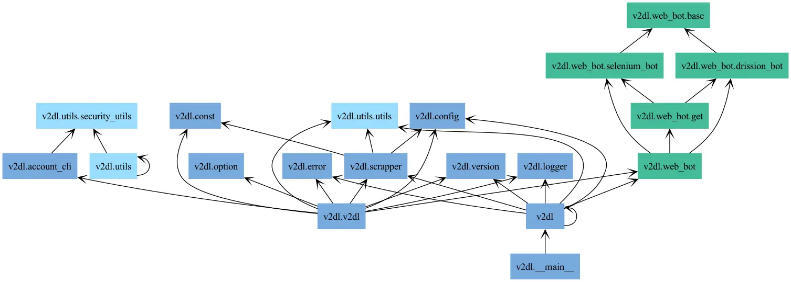
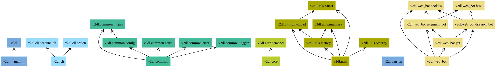
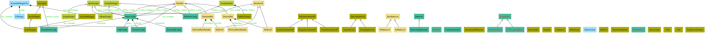
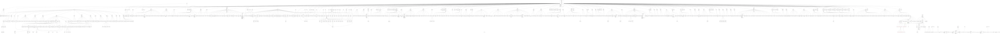
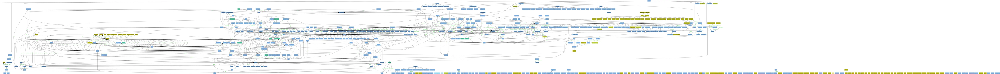
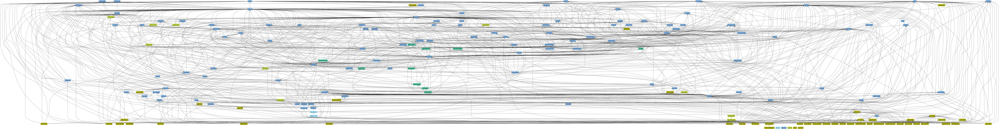

# Pyreverse 指令小抄和測試範例

最近寫的小小爬蟲專案用了各種程式碼品質工具，例如 mypy 和 ruff 等等，然後又被我發現一個小工具 Pyreverse，可以分析出類別之間的 UML 關係圖還有檔案之間的 import 關係。

## 安裝

Pyreverse 在 pylint 包中，需要下載 pylint 以及繪圖軟體 graphviz。

```bash
pip install pylint
brew install graphviz   # Windows 安裝要自己找安裝包並設定環境變數
```

## 使用指令

接下來就可以開始分析，語法是 `pyreverse -o <格式> -p <名稱> <要分析的檔案>`。分析的檔案也可以直接是一整個 package，我們以 gallery-dl 為例，用法會變成

```bash
git clone --depth=1 https://github.com/mikf/gallery-dl.git
pyreverse -o png -p test ./gallery-dl/gallery_dl
```

如果遇到解析度問題可以設定輸出成 pdf，首先要轉成 dot 檔案再經由 graphviz 轉換成 pdf，並且加上顏色，然後只顯示類別名稱，指令如下

```bash
pyreverse --colorized --only-classnames -o dot -p gallery-dl ./gallery-dl/gallery_dl
dot -Tpdf classes_gallery-dl.dot -o classes_gallery-dl.pdf
```

## 測試範例 - 我自己的爬蟲程式

以我自己寫的[爬蟲程式](https://github.com/ZhenShuo2021/V2PH-Downloader/)來說，分析後可以看到原本檔案之間的 import 關係有點混亂，下面兩張圖是分別是修改前和修改後的，可以看到載入關係解耦很多：




然而 class 就沒辦法了，我暫時也想不到有什麼方法讓他看起來乾淨一點，錯綜複雜主因是 config 變數會在各個類別之間傳遞



## 測試範例 - gallery-dl

gallery-dl 是一個支援多網站的爬蟲套件。

> 依序是 UML 和檔案載入關係圖




超級寬，目前還沒找到解決方法。

不過我想說的不是很寬，而是看到這個結果而想到在搜尋程式設計上常看到的一段文字：「多用組合，少用繼承」。這句話沒有錯，是在警告我們濫用繼承會造成耦合以及子類無法完全遵照父類等等的問題，但是我看到的文章是直接把這句話當成 banner，就讓我有點誤解我無論何時都要依照這個準則撰寫。觀察 gallery-dl 的 UML 圖和原始碼可以發現適當使用繼承也可以讓程式達到高擴展、高維護性，同樣的情況也發生在 yt-dlp，這兩個都是 Python 最多星星的套件了，可以質疑我但不可以質疑他們。

不過這都是爬蟲套件，實際上其他工具可能會有不同行為。

## 測試範例 - mypy

mypy 是一個 Python 靜態檢查套件，和上面的爬蟲的範例不同類型，可以看到非常複雜，所以自己的專案錯綜複雜也不用想太多，人家都活的好好的我們在這瞎操心什麼。

> 依序是 UML 和檔案載入關係圖



