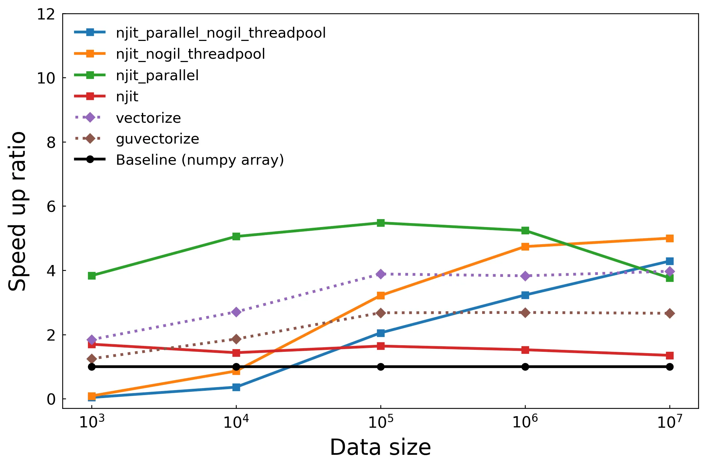
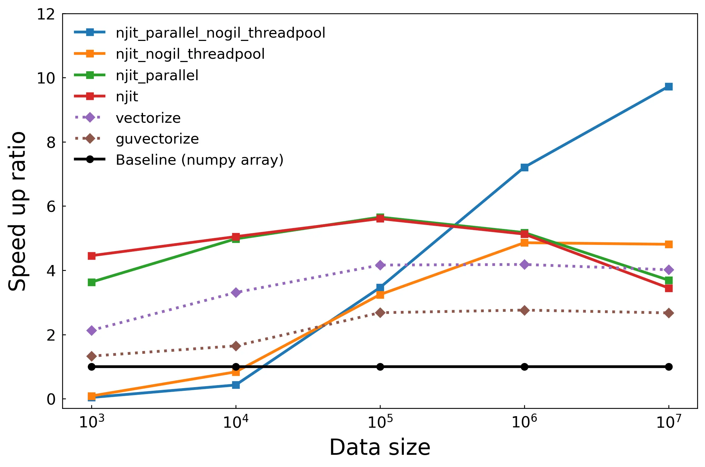
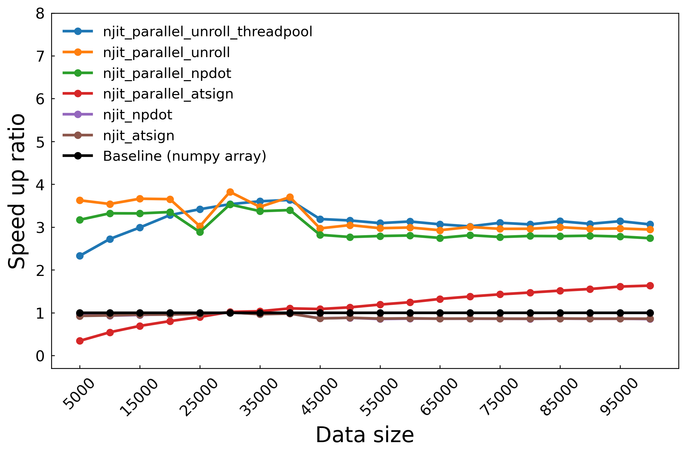
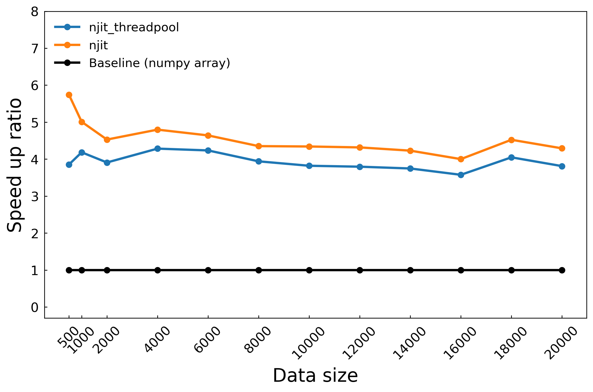

import Tabs from '@theme/Tabs';
import TabItem from '@theme/TabItem';

# Numba 效能深入實測：矩陣計算與訊號還原演算法

這篇文章我們將使用三種不同的計算場景評估 Numba 的效能表現，目的在全方面的評估 Numba 的實際效能。為了避免了其他文章常見的問題<u>效能測試的結論只適用於該場景</u>，筆者選擇的測試涵蓋了常見的科學與數值計算情境：

1. **三角函數計算**：使用簡單的三角函數運算作為參考，測試 Numba 在基礎計算中的加速效果，讓讀者能有一個初步的理解，並測試開關 SVML 對效能的影響。

2. **矩陣相乘**：矩陣相乘是最基本也是最常見的操作。我們比較在 Numpy 已經高度優化的矩陣運算上 Numba 還能提升多少效能。

3. **訊號還原演算法**：最後，我們測試一個實際應用：訊號還原演算法。此演算法涉及大量迭代的計算場景，測試 Numba 在迭代運算中的效能表現。

這三個測試案例代表已經涵蓋數值計算中大多數的運算類型，從簡單的運算到大規模數據處理，再到複雜迭代，避免了許多效能測試的結論侷限在特定場景。除此之外，我們也會討論一些問題，像是向量化裝飾器（如 guvectorize），Numba 的加速效果依然因應用場景和硬體環境的不同而異。

在測試中，我們使用的基準線是 numpy 陣列運算[^1]，橫軸是資料維度，縱軸是加速倍率，測試程式碼可以在[這裡](https://github.com/ZhenShuo2021/blog-script/tree/main/python/numba)找到。結束測試後，在 <u>SVML 偵錯</u>和<u>深入探討效能問題</u>這兩個章節，我們會整理其他效能相關問題，其中也包含前一篇文章的內容整理。

本文所有測試在虛擬機架設的 Ubuntu Server 22.04/i5-7400/8G RAM 上執行。

[^1]: 網路上拿迴圈運算當作 baseline 根本是在搞，拿一個絕對不會這樣寫的方式當比較基準毫無意義。

## Case1: 三角函數

這個章節我們主要比較各種不同裝飾器的效能差異，以及開關 SVML 對效能帶來的影響，計算以下三角函數：

$$
\sum_{i=1}^{n} \left( \sin(x_i)^2 + \cos(x_i)^2 \right)
$$

我知道平方相加是一，這是一個示範範例，透過簡單的計算讓我們對性能提升有直觀的了解。此測試和文檔範例相同，只多加了 summation 模擬常見的 reduction 操作。比較項目總共有

- njit: 基本 Numba 設定 `@njit`
- njit_parallel: 開啟自動平行化功能 `@njit(parallel=True)`
- njit_nogil_threadpool: 將陣列拆分給多線程計算 `@njit + ThreadPoolExecutor`
- njit_nogil_parallel_threadpool: 將陣列拆分給多線程計算之外又開啟自動平行化功能 `@njit(parallel=True) + ThreadPoolExecutor`
- vectorize: 使用向量化裝飾器 `@vectorize`，使用 parallel=True, nopython=True
- guvectorize: 使用通用向量化裝飾器 `@guvectorize`，使用 parallel=True, nopython=True

一律不使用 fastmath 以減少變因。第一張圖先關閉 SVML，第二章圖再測試開啟後的效能變化。

### 關閉 SVML

可以看到單純使用 njit 裝飾器的方式效能僅有小幅提高，不過只加上五個字就可以有 1.5~2 倍的效能提升已經很不錯了。接著來看使用 threadpool 線程池的兩種實現方式，在資料數量小的時候效能差勁，隨著資料數量上升效能提升穩定提高，因為每次啟動線程和資料同步的開銷漸漸被平分掉，從這裡我們知道在資料數量少的時候使用 threadpool 方式是不明智的。接下來看到綠色線代表的 Numba 自動平行化功能，可以輕鬆的達到最高程度的效能提升，然而當資料數量過多時效能逐漸下降，筆者猜測可能是記憶體存取問題。最後兩條虛線是向量化裝飾器 vectorize 和 guvectorize，效能提升幅度低於平行化，但是對於超高維度資料並沒有發生效能降低問題。

這張圖我們可以得到結論，如果能開啟自動平行化功能就盡量開啟，提升幅度最高，程式碼也最簡潔方便。



### 使用 SVML

下圖是測試開啟 SVML 後的性能測試，njit 和 njit_nogil_threadpool 效能大幅提升，可以清楚看到 SVML 帶來的效能差異，njit 方法提升到和 njit_parallel 一樣的約五倍效能提升；使用多線程的 njit_nogil_threadpool 方法更是隨著數據增加效能逐步提升，到一千萬筆數據時來到將近十倍的效能提升[^2]。不過不是所有函數都得到 SVML 加速，還需要檢查哪裡出問題（例如官方文檔說 parallel 也要加速，但這裡的測試沒有），此處我們可以呼應上一篇文章中 Numba 像是黑箱的評語，因為很方便所以我們不知道他到底做了什麼事，好在 Numba 有提供 inspect_types, gdb, inspect_asm, parallel_diagnostics 等偵錯方式。



[^2]: 由此可知那些連 SVML 都不知道有沒有裝的「效能測試」文章真的是來亂的。

## Case2: 訊號還原

前面是簡單的測試，這裡測試真實世界常見的演算法，以訊號還原任務測試 Numba 能帶來多少的性能提升，本章節包含開頭提到的矩陣相乘和訊號還原演算法兩種測試，其中訊號還原是稀疏訊號處理，使用 OMP 演算法。

簡單說明稀疏訊號處理和 OMP 演算法，稀疏訊號處理和一般的 $\mathbf{y} = \mathbf{S}\mathbf{x} + \mathbf{n}$ 問題一模一樣，都是想辦法從接收訊號 $\mathbf{y}$ 還原原始訊號 $\mathbf{x}$。唯二的差別是 $\mathbf{y}$ 的維度遠小於 $\mathbf{x}$ 的維度，導致其為一個未定的矩陣問題，以及輸入訊號零值非常多，想辦法使用這個特徵還原訊號。

OMP 演算法則是每次迭代中找出 $\mathbf{x}$ 最有可能的非零值位置，由該位置還原訊號後，下次迭代再透過上次的資訊還原，所以說這是一個高度迭代的演算法。

### 矩陣相乘

還原訊號前我們要先生成接收訊號 $\mathbf{y}$，也就是進行矩陣相乘，程式碼如下：

```py
def generate_data(n_observation, n_feature, sparsity, noise_level=0.1):
    """
    Generates the sensing matrix, true coefficients, and observation vector.

    Args:
      n_observation (int):  The number of samples.
      n_feature (int): The number of features.
      sparsity (float):  The sparsity level.
      noise_level (float): The standard deviation of the noise.

    Returns:
      S (float): A n_observation-by-n_feature dimension matrix.
      x (float): A n_feature dimension vector.
      y (float): A n_observation dimension vector.
    """
    np.random.seed(42)
    S = np.random.randn(n_observation, n_feature)
    x = np.zeros(n_feature)
    support = np.random.choice(n_feature, int(sparsity * n_feature), replace=False)
    x[support] = np.random.randn(len(support))
    y = S @ x + np.random.randn(n_observation) * noise_level
    return S, x, y
```

這裡我們做了一個有趣的測試，額外比較了 `np.dot(S, x)` 和 `S @ x` 的效能差異，在圖中的 label 分別以 npdot 和 atsign 代表，unroll 則是表示把矩陣相乘拆開成兩個迴圈，也就是 $
\mathbf{y}_{i} = \sum_{j=1}^{n} S_{ij} x_j $ 的形式。

不使用迴圈平行化時，使用 njit_npdot 和 njit_atsign 的效能可以說是一模一樣（njit_npdot 被蓋住了），但是開啟平行化之後， njit_npdot 效能直接飛天，從這裡我們發現到即使在我們眼裡這兩個 expression 是一樣的，經過 Numba 編譯結果可能不同，所以盡可能寫簡單的表達方式。在這個範例中效能提升約在三倍之間，是因為 Numpy 本身已經對矩陣相乘有很多優化，所以效能提升就不如前面那麼明顯，同樣的情況也出現在捲積計算，讀者可以自行嘗試。在各種方法之間，使用 njit_parallel_unroll 方法將迴圈效能是最高的，印證前一篇提到的 Numba likes loop，但是對比使用 njit_parallel_npdot 的提升幅度有限，所以沒必要特別將矩陣相乘拆開成迴圈計算。



### 迴圈迭代

在這裡我們一共迭代兩個演算法：OMP 演算法和他用到的 LSQR 演算法，LSQR 就是加上 QR 分解的 least square 演算法，可以理解成用迴圈逼近的反矩陣。

由於是前後相關的迭代，無法開啟平行化處理，所以只有兩種測試方式。這個演算法常見的輸入維度大概是輸出的 1~10 倍之間，可以看到在 5 倍 (500) 時效能將近六倍提升還是挺不錯的，測試到輸入維度是 200 倍也沒有明顯的效能降低，維度再增加測試時間指數上升所以只測到這裡。此測試顯示 Numba 在吃重迭代的演算法，即使輸入維度相對低（100x500，相較於影像處理動輒十幾萬筆數據）的情況，對比原生 Python 陣列計算仍然可以保持約 4.5 倍的效能提升。



以下是兩個演算法的實作，不用看只要知道很多迴圈就好了。

```py
def omp(S, y, sparsity, itrMax=100):
    """
    Orthogonal Matching Pursuit (OMP) algorithm.

    Args:
      S: Sensing matrix (numpy array)
      y: Measurement vector (numpy array)
      sparsity: Sparsity level (integer)
      itrMax: Maximum number of iterations (integer)

    Returns:
      x: Estimated sparse signal (numpy array)
    """

    n_feature = S.shape[1]
    support = int(sparsity * n_feature)
    x = np.zeros(n_feature)
    residual = y
    support_set = np.zeros(n_feature, dtype=np.bool_)

    for _ in range(max(itrMax, support)):
        corr_max = 0
        est_act = 0
        for ii in range(n_feature):
            corr = abs(np.dot(residual, S[:, ii]))
            if corr > corr_max:
                corr_max = corr
                est_act = ii

        support_set[est_act] = True
        S_active = S[:, support_set]
        x_hat = njit_lsqr_numpy(S_active, y)
        residual = y - S_active @ x_hat

        if np.sum(support_set) >= support:
            break
    x[support_set] = x_hat
    return x
```

<details>
    <summary>LSQR 太長了</summary>

```py

def lsqr_numpy(A, b, itnlim=0, damp=0.0, atol=1.0e-9, btol=1.0e-9, conlim=1.0e8):
    """
    Solve the least-squares problem using LSQR.

    The function minimizes the residual ||Ax - b||, where A is the matrix and b is the target vector.

    Args:
        A (np.ndarray): Coefficient matrix of shape (m, n).
        b (np.ndarray): Target vector of shape (m,).
        itnlim (int, optional): Maximum number of iterations. Defaults to 0 (3 * n).
        damp (float, optional): Regularization parameter. Defaults to 0.0.
        atol (float, optional): Absolute tolerance for convergence. Defaults to 1.0e-9.
        btol (float, optional): Relative tolerance for convergence. Defaults to 1.0e-9.
        conlim (float, optional): Condition limit. Defaults to 1.0e8.

    Returns:
        np.ndarray: Solution vector x that minimizes ||Ax - b||.
    """
    m, n = A.shape

    if itnlim == 0:
        itnlim = 3 * n

    dampsq = damp * damp

    itn = 0
    istop = 0
    ctol = 0.0
    if conlim > 0.0:
        ctol = 1.0 / conlim
    Anorm = Acond = 0.0
    z = xnorm = xxnorm = ddnorm = res2 = 0.0
    cs2 = -1.0
    sn2 = 0.0

    x = np.zeros(n)
    xNrgNorm2 = 0.0

    u = b.copy()
    beta = np.linalg.norm(u)
    if beta > 0:
        u /= beta

        v = A.T @ u
        alpha = np.linalg.norm(v)

    if alpha > 0:
        v /= alpha
        w = v.copy()

    x_is_zero = False
    Arnorm = alpha * beta
    if Arnorm == 0.0:
        x_is_zero = True
        istop = 0

    rhobar = alpha
    phibar = beta
    bnorm = beta
    rnorm = beta
    r1norm = rnorm
    r2norm = rnorm

    # Main iteration loop.
    while itn < itnlim and not x_is_zero:
        itn = itn + 1

        u = A @ v - alpha * u
        beta = np.linalg.norm(u)
        if beta > 0:
            u /= beta

            Anorm = sqrt(Anorm**2 + alpha**2 + beta**2 + damp**2)

            v = A.T @ u - beta * v
            alpha = np.linalg.norm(v)
            if alpha > 0:
                v /= alpha

        rhobar1 = sqrt(rhobar**2 + damp**2)
        cs1 = rhobar / rhobar1
        sn1 = damp / rhobar1
        psi = sn1 * phibar
        phibar = cs1 * phibar

        rho = sqrt(rhobar1**2 + beta**2)
        cs = rhobar1 / rho
        sn = beta / rho
        theta = sn * alpha
        rhobar = -cs * alpha
        phi = cs * phibar
        phibar = sn * phibar
        tau = sn * phi

        t1 = phi / rho
        t2 = -theta / rho
        dk = (1.0 / rho) * w

        x += t1 * w
        w *= t2
        w += v
        ddnorm += np.linalg.norm(dk) ** 2

        xNrgNorm2 += phi * phi

        delta = sn2 * rho
        gambar = -cs2 * rho
        rhs = phi - delta * z
        zbar = rhs / gambar
        xnorm = sqrt(xxnorm + zbar**2)
        gamma = sqrt(gambar**2 + theta**2)
        cs2 = gambar / gamma
        sn2 = theta / gamma
        z = rhs / gamma
        xxnorm += z * z

        Acond = Anorm * sqrt(ddnorm)
        res1 = phibar**2
        res2 = res2 + psi**2
        rnorm = sqrt(res1 + res2)
        Arnorm = alpha * abs(tau)

        r1sq = rnorm**2 - dampsq * xxnorm
        r1norm = sqrt(abs(r1sq))
        if r1sq < 0:
            r1norm = -r1norm
        r2norm = rnorm

        test1 = rnorm / bnorm
        if Anorm == 0.0 or rnorm == 0.0:
            test2 = float("inf")
        else:
            test2 = Arnorm / (Anorm * rnorm)
        if Acond == 0.0:
            test3 = float("inf")
        else:
            test3 = 1.0 / Acond
        t1 = test1 / (1 + Anorm * xnorm / bnorm)
        rtol = btol + atol * Anorm * xnorm / bnorm

        if itn >= itnlim:
            istop = 7
        if 1 + test3 <= 1:
            istop = 6
        if 1 + test2 <= 1:
            istop = 5
        if 1 + t1 <= 1:
            istop = 4

        if test3 <= ctol:
            istop = 3
        if test2 <= atol:
            istop = 2
        if test1 <= rtol:
            istop = 1

        if istop > 0:
            break

    return x
```

</details>

## 向量化裝飾器

這三個測試中向量化裝飾器好像都沒什麼表現的機會，但是要看使用場景才對，像是在[這篇文章](https://medium.com/@mflova/making-python-extremely-fast-with-numba-advanced-deep-dive-3-3-695440b62030)中效能提升就非常可觀，對比使用 njit_parallel，向量化裝飾器還能再提升 5.5 倍的速度。

## SVML 偵錯

這個段落介紹 SVML 的偵錯和常見問題，根據此 [Github issue](https://github.com/numba/numba/issues/5562#issuecomment-614034210) 完成，如何安裝 SVML 請見前一篇文章，測試程式碼都可以在文章開頭的[連結](https://github.com/ZhenShuo2021/blog-script/tree/main/numba)中找到。

在檔案中加上

```py
import llvmlite.binding as llvm
llvm.set_option('', '--debug-only=loop-vectorize')
```

並且在要測試的函式中使用

```py
ty = nb.types.complex128[:]
foo.compile((ty, ))   # 一定要加上逗號變成 tuple

print(foo.inspect_asm(foo.signatures[0]))
```

之後執行檔案就可以檢測 SVML 啟用狀況，以該 issue 來說，可以加上 `| grep svml` 來擷取使用 SVML 的機器碼。如果 SVML 向量化失敗會顯示記憶體衝突、不安全、已經被向量化或被禁止向量化等等訊息，則根據這些資訊來除錯。失敗的原因筆者也整理了以下幾點問題：

1. 使用 fastmath  
雖然 fastmath 在文檔中沒有說到的是他和 SVML 掛勾，但筆者以上述的 Github issue 進行測試，如果顯示機器碼 `movabsq $__svml_atan24` 代表安裝成功，此時我們將 fastmath 關閉後發現向量化失敗，偵錯訊息顯示 `LV: Found FP op with unsafe algebra.`。

2. 計算類型  
使用 inspect_asm 方法可以檢查 Numba 編譯的機器碼，經過測試不是所有運算都會調用 SVML，有些簡單運算會直接使用內建指令集，所以 grep svml 沒 grep 到只是剛好沒用到 SVML 而已，例如簡單的加減乘除可能不會調用 SVML 的向量化計算，而是使用本機的機器碼，以 ARM (Apple Silicon) 為例，可以檢查是否包含這些機器碼

```sh
python test.py | grep -E '\b(vadd|vsub|vmul|vdiv|fadd|fsub|fmul|fdiv)\b'`
```

3. 數據類型 Dtype  
數據類型也影響 SVML 是否開啟，例如 complex value 不支援某些 SVML 向量化。

## 深入探討效能問題

考慮上一篇內容太廣泛和可能有人直接點進來這篇，既然這篇是在講效能，於是整理一下優化技巧。

- 基礎
    1. [Loop fusion、Loop invariant code motion、Allocation hoisting](https://numba.readthedocs.io/en/stable/user/parallel.html#diagnostics:~:text=To%20aid%20users%20unfamiliar%20with%20the%20transforms%20undertaken%20when%20the%20parallel%20option%20is%20used%2C%20and%20to%20assist%20in%20the%20understanding%20of%20the%20subsequent%20sections%2C%20the%20following%20definitions%20are%20provided%3A)
    2. 順序讀取記憶體內容，[不要跳來跳去](https://stackoverflow.com/questions/26998223/what-is-the-difference-between-contiguous-and-non-contiguous-arrays)
    3. 盡可能 [inline 函式、避免除法](https://stackoverflow.com/questions/67743726/numba-fast-math-does-not-improve-speed)
    4. 提前分配陣列：每次 function call 都是很昂貴的，不要一直建立小陣列

- 指令集
    1. 善用 CPU 指令集 SIMD/AVX 指令集，[適當向量化計算](https://github.com/numba/numba/issues/5562#issuecomment-614034210)
    2. 不是所有操作都需要向量化，尤其在 Numba 中[錯誤使用向量化反而可能帶來性能衰退](https://pythonspeed.com/articles/slow-numba/)

- I/O 操作
    1. 記憶體和快取：注意記憶體和快取連續性、減少記憶體分配和資料移動、分塊計算以提高快取命中率
    2. 減少減少記憶體複製的 I/O 操作，要[搬就一次搬](https://pythonspeed.com/articles/optimizing-dithering/)
    3. prefetch 預取，不過 Numpy 中好像沒必要做這件事

- 分支預測
    1. CPU 計算速度遠大於記憶體速度，可以[強迫計算避免分支預測問題](https://pythonspeed.com/articles/speeding-up-numba/)，或者想盡辦法移除條件判斷
    2. 調整 if 語句的優先順序，讓開銷大的擺在後面

- 平行化問題
    1. false-sharing，CPU 快取是一次讀一行 64 bytes，如果任一份資料被寫入，即使另外一個執行緒寫入目的地是別份資料，還是會把整條 cache line 標記為 dirty 重新讀取，造成 I/O 浪費，可用 padding 解決。
    2. Load imbalance，分配的任務比重不一樣，別人算完在發呆我還在繼續算

- Last but not least, [profile your code](https://pythonspeed.com/articles/numba-profiling/)

## 結語

跑 benchmark 比想像中麻煩...

<details>
<summary>合併文章：寫出高效程式，因為內容重疊也不長，沒必要分兩篇</summary>

###### 寫出高效程式

寫不完，根本寫不完。

這篇文章目的是摘要 [Numba 教學](./numba-tutorial-1) 中優化技巧，下面章節<u>我自己寫的技巧</u>指的是我在該教學中自己寫的，其他章節則是教學中引用的文章，把這些全部丟給 GPT 叫他摘要文章重點，以後有機會才有可能再整理這些文章，因為光我自己寫的就三萬字，累死了，而且整理別人的文章也沒什麼意義。

不外乎幾個重點，使用迴圈而不是陣列計算（對於 Numba 的特殊情況）、優化分支處理、注意記憶體和快取連續性、減少記憶體分配和資料移動、分塊計算以提高快取命中率、利用 CPU 指令集。

###### 我自己寫的技巧

**基礎優化技巧**

- **Numba 喜歡迴圈:** 使用 `prange` 取代 `range`  顯式標記平行迴圈，Numba 會自動進行平行化處理。
- **Numba 喜歡 NumPy：**  盡量使用 NumPy 的函式和陣列操作，例如用 `np.sum()` 取代迴圈計算總和。
- **Numba 喜歡廣播：** 利用 NumPy 的廣播機制簡化程式碼並提升效能。
- **使用 `@jit` 裝飾器：**  
  - `nopython=True`  啟用嚴格的 Numba 編譯模式，通常能獲得最佳效能。
  - `fastmath=True`  放寬 IEEE 754 精度限制，可能提升效能，但需注意數值誤差。
  - `cache=True` 將編譯結果快取，避免重複編譯。
  - `parallel=True` 啟用自動平行化，需注意競爭危害。
  - `nogil=True`  釋放全局直譯器鎖，允許平行執行，需注意線程安全。
- **避免在函式內修改數據結構：**  例如，避免在 Numba 優化的函式內修改陣列的形狀或資料類型。
- **保持順序記憶體讀取：**  例如，盡量以連續的方式存取陣列元素，避免跳躍式存取。
- **函式中不要包含 I/O 操作：**  例如，檔案讀寫或網路請求等 I/O 操作會降低 Numba 的效能，應盡量避免。

**進階優化技巧**

- **安裝 SVML、TBB 和 OpenMP 庫：**  這些庫可以進一步提升 Numba 的效能，特別是在平行計算方面。
- **使用 `@vectorize` 或 `@guvectorize` 裝飾器：**  將純量函式向量化，利用 SIMD 指令集提升效能。`guvectorize`  比  `vectorize` 更強大，允許任意形狀的輸入和輸出。
- **使用 Numba 診斷工具：**  分析 Numba 程式碼的效能瓶頸，例如使用 `numba -s` 檢查 SVML 是否啟用。
- **threading layers 設定：**  根據需求設定 Numba 的線程層，例如使用 `set_num_threads()`  設定線程數量。
- **迴圈優化：**  
  - 迴圈融合：將多個迴圈合併成一個，提升資料局部性。
  - 迴圈序列化：避免巢狀平行迴圈，只平行化最外層迴圈。
  - 提出不變的程式碼：將迴圈內不變的計算移到迴圈外。
  - 分配外提：避免在迴圈內重複分配記憶體，例如將 `np.zeros`  拆分成  `np.empty`  和賦值操作。

###### [The wrong way to speed up your code with Numba](https://pythonspeed.com/articles/slow-numba/)

- **避免 NumPy 風格的陣列操作:** 雖然 Numba 支援 NumPy API，但直接套用 NumPy 的陣列導向寫法，可能會錯失優化機會。
- **使用 `for` 迴圈進行逐元素操作:** Numba  可以高效地編譯  `for`  迴圈，逐元素操作可以減少記憶體分配和提升執行速度。
- **減少記憶體分配:** 避免產生不必要的臨時陣列，特別是大型陣列，可以大幅降低記憶體使用量。

**文章範例說明:**

文章以彩色圖片轉灰階為例，比較了三種方法的效能：

1. **純 NumPy:** 使用 NumPy 的陣列操作，產生大量臨時陣列，記憶體使用量高。
2. **Numba + NumPy 風格:** 使用 Numba 編譯，但仍採用 NumPy 的陣列操作，效能提升有限，記憶體使用量仍然很高。
3. **Numba +  `for` 迴圈:** 使用 Numba 編譯，並採用 `for` 迴圈逐元素操作，效能提升顯著，記憶體使用量大幅降低。

###### [Python gives you fast development—and slow code](https://pythonspeed.com/products/lowlevelcode/)

- **使用編譯語言或 JIT 編譯器：**  將效能瓶頸程式碼使用 Cython、Rust 或 Numba 等編譯，可以提升執行速度。
- **理解 CPU 特性：**  現代 CPU 具有指令級平行、分支預測、SIMD 和記憶體快取等特性，善用這些特性可以大幅提升程式碼效能。
- **指令級平行：**  CPU 可以同時執行多個指令，編寫程式碼時應考慮如何利用此特性。
- **分支預測：**  CPU 會預測程式碼分支走向，減少分支錯失可以提升效能。
- **SIMD：**  單指令多資料流，可以同時對多個資料進行運算，提升向量化程式碼的效能。
- **記憶體快取：**  CPU  快取經常存取的資料，提升資料局部性可以減少記憶體存取延遲。

**其他重點：**

- **平行化：**  使用多線程或多程序可以提升效能，但需考慮演算法是否適合平行化，以及平行化帶來的額外開銷和複雜性。
- **數值計算：**  文章主要關注數值計算的效能優化，適用於科學家、資料科學家和研究軟體工程師等使用 NumPy 等函式庫的場景。

###### [Diagnostics Numba Codes](https://numba.readthedocs.io/en/stable/user/parallel.html#diagnostics)

**效能優化技巧重點整理：**

- **使用 Numba 診斷工具：**
  - 設定環境變數 `NUMBA_PARALLEL_DIAGNOSTICS` 或呼叫 `parallel_diagnostics()` 可以輸出平行化轉換的診斷資訊，幫助理解程式碼的平行化過程。
  - 診斷資訊包含迴圈融合、迴圈序列化、迴圈不變程式碼外提和分配外提等資訊。
- **設定 chunk size：**
  - 對於迴圈每次迭代工作量不均勻的情況，可以透過 `numba.set_parallel_chunksize()` 設定 chunk size，將迭代分成大小不同的 chunk，動態分配給線程，以平衡負載和減少排程開銷。
  - 使用 `numba.get_parallel_chunksize()` 可以取得目前的 chunk size。
  - 可以使用 `parallel_chunksize()` with 語句上下文管理器來簡化 chunk size 的設定和還原。

**其他重點：**

- **迴圈融合：** 將多個迴圈合併成一個，提升資料局部性。
- **迴圈序列化：** 避免巢狀平行迴圈，只平行化最外層迴圈。
- **迴圈不變程式碼外提：** 將迴圈內不變的計算移到迴圈外。
- **分配外提：** 避免在迴圈內重複分配記憶體。

**總結：**

Numba 提供了診斷工具和 chunk size 設定功能，可以幫助開發者更好地理解和優化程式碼的自動平行化過程，提升程式碼的效能。

###### [28000x speedup with Numba.CUDA](https://curiouscoding.nl/posts/numba-cuda-speedup/)

**程式碼優化：**

- **使用 `@jitclass` 裝飾器：** 將整個類別 JIT 編譯，提升效能。
- **展開 `np.roll`：** Numba  更擅長優化手動的迴圈，展開  `np.roll`  可以提升效能。
- **使用多線程：** 使用  `multiprocessing`  函式庫進行多線程平行計算，提升效能。
- **使用 GPU：** 將程式碼移植到 GPU 上執行，利用 GPU 的平行計算能力提升效能。
- **減少同步操作：** 減少 GPU 執行緒之間的同步操作，提升效能。
- **優化共享記憶體存取模式：**  確保執行緒存取共享記憶體時，不會在同一指令內存取同一個 bank 的多個地址，提升效能。
- **增加每個執行緒的工作量：**  讓每個執行緒處理更多資料，提升 GPU 利用率。
- **將資料快取到共享記憶體：**  將頻繁存取的資料快取到共享記憶體，減少全域記憶體存取，提升效能。
- **將 hashes 和 signs 儲存在共享記憶體：**  進一步提升共享記憶體的使用率，提升效能。
- **調整每個 kernel 處理的序列數量：**  根據 GPU  的排程特性，調整每個 kernel  處理的序列數量，提升效能。
- **使用 tuple 傳遞序列：**  使用 tuple  傳遞多個序列，可以簡化程式碼，但可能導致效能下降。
- **使用更好的硬體：**  使用更高效能的 GPU  可以提升效能。

**效能分析：**

- **使用 profiler：** 使用  `nvprof`  等 profiler  工具分析程式碼的效能瓶頸，例如同步操作、記憶體存取模式等。
- **分析 stall reasons：**  分析程式碼停滯的原因，例如同步操作、記憶體存取延遲等。
- **分析 shared memory access pattern：**  分析共享記憶體的存取模式，找出潛在的效能問題。
- **分析 kernel compute：**  分析 kernel  的計算量和計算類型，例如浮點運算、整數運算等。
- **分析 kernel latency：**  分析 kernel  的延遲，例如同步操作、記憶體存取延遲等。
- **分析 occupancy：**  分析 GPU  的佔用率，找出潛在的效能瓶頸。

**其他技巧：**

- **避免 64 位元浮點運算：**  64  位元浮點運算的效率比  32  位元浮點運算低，應盡量避免。
- **使用 `fastmath=True`：**  允許 Numba  放寬浮點運算的精度限制，可能提升效能，但需注意數值誤差。
- **使用 dynamic shared memory：**  可以使用動態共享記憶體，但可能導致效能下降。

###### With Dask

https://blog.dask.org/2019/04/09/numba-stencil  
https://medium.com/capital-one-tech/dask-numba-for-efficient-in-memory-model-scoring-dfc9b68ba6ce  

使用 Dask 進行資料級別的平行化
使用 Dask 優化記憶體存取量

###### [Understanding CPUs can help speed up Numba and NumPy code](https://pythonspeed.com/articles/speeding-up-numba/)

- **減少分支預測失敗：**
  - `if` 語句和其他條件判斷會導致 CPU 分支預測，預測失敗會降低效能。
  - 盡量編寫線性程式碼，減少分支數量。
  - 對於條件判斷較多的程式碼，可以考慮使用其他演算法或資料結構來減少分支。
- **利用 SIMD 指令：**
  - SIMD 指令可以同時對多個資料進行運算，提升向量化程式碼的效能。
  - 編譯器可以自動將部分程式碼向量化，但需要程式碼結構有利於向量化。
  - 減少分支預測失敗也有利於編譯器進行向量化。
- **選擇合適的資料類型：**
  - Numba 會根據資料類型生成不同的機器碼，選擇合適的資料類型可以提升效能。
  - 例如，如果知道資料不會超過特定範圍，可以使用更小的資料類型。

**其他重點：**

- **CPU 指令級平行：**  現代 CPU 可以同時執行多個指令，編寫程式碼時應考慮如何利用此特性。

###### [Profiling your Numba code](https://pythonspeed.com/articles/numba-profiling/)

**效能分析後，被診斷到的問題和優化技巧：**

1. **簡化數值轉換:**
    - 原始程式碼中，使用 `np.round()` 和 `np.uint8()` 進行數值轉換的程式碼佔用了大量的執行時間 (40% 的 Numba 程式碼執行時間)。
    - 透過將以下程式碼：

    ```python
    if old_value < 0:
        new_value = 0
    elif old_value > 255:
        new_value = 255
    else:
        new_value = np.uint8(np.round(old_value / 255.0)) * 255
    ```

    - 簡化為：

    ```python
    new_value = 0 if old_value < 128 else 255
    ```

    - 可以大幅減少執行時間，使程式碼執行速度提升 3 倍。

2. **調整程式碼順序以提升指令級平行性:**
    - 分析結果顯示，不同的程式碼順序會影響指令級平行性，進而影響效能。
    - 原始程式碼中，`result[y, x + 1] += error * 7 // 16`  這行程式碼佔用了 34.9% 的 Numba 程式碼執行時間。
    - 透過調整程式碼順序，可以降低這行程式碼的執行時間佔比，提升指令級平行性。

文章主要討論了指令級並行性（Instruction-Level Parallelism, ILP）對性能的影響。根據文章的結論，我們可以這樣優化這個特定問題：

1. 重排指令順序：
   正如文章所示，僅僅改變計算順序就能顯著影響性能。我們可以嘗試將最耗時的操作（在原始程式碼中是 `result[y, x + 1] += error * 7 // 16`）放在後面。這樣做可以讓 CPU 有機會並行執行其他操作，從而提高整體性能。

2. 利用 CPU 的推測執行：
   CPU 能夠推測性地執行後面的程式碼。我們可以將不太依賴於前面結果的計算放在前面，讓 CPU 有更多機會進行推測執行。

3. 減少分支預測失誤：
   雖然文章沒有直接提到這點，但我們可以推測，將最可能執行的分支（比如 `if y < last_y`）放在前面可能會有助於減少分支預測失誤，從而提高 ILP。

4. 考慮循環展開：
   雖然文章中的程式碼片段沒有顯示完整的循環結構，但如果這些操作是在循環中的，考慮手動展開循環可能會增加 ILP 的機會。

5. 性能分析：
   如文章所示，使用性能分析工具來測試不同的指令排序是很有價值的。我們可以嘗試多種不同的排序，並使用性能分析工具來確定哪種排序能够得到最好的性能。

6. 理解底層硬件：
   文章強調了理解 CPU 執行模型的重要性。在優化過程中，我們需要考慮到現代 CPU 的複雜性，包括流水線、乱序執行等特性。

這些建議直接針對文章中提到的問題和結論。優化的核心在於理解和利用 CPU 的指令級並行性，通過重新排序指令來最大化 ILP 的效果。

###### [The wrong way to speed up your code with Numba](https://pythonspeed.com/articles/slow-numba/)

這篇文章主要說明了使用 Numba  優化程式碼時，不應受限於 NumPy 的陣列導向思維，而應該採用更底層的逐元素操作，才能充分發揮 Numba 的效能優勢。

**效能優化技巧重點整理：**

- **避免 NumPy 風格的陣列操作:** 雖然 Numba 支援 NumPy API，但直接套用 NumPy 的陣列導向寫法，可能會錯失優化機會。
- **使用 `for` 迴圈進行逐元素操作:** Numba 可以高效地編譯 `for` 迴圈，逐元素操作可以減少記憶體分配和提升執行速度。

**文章範例說明:**

文章以彩色圖片轉灰階為例，比較了三種方法的效能：

1. **純 NumPy:** 使用 NumPy 的陣列操作，產生大量臨時陣列，記憶體使用量高。
2. **Numba + NumPy 風格:** 使用 Numba 編譯，但仍採用 NumPy 的陣列操作，效能提升有限，記憶體使用量仍然很高。
3. **Numba +  `for` 迴圈:** 使用 Numba 編譯，並採用 `for` 迴圈逐元素操作，效能提升顯著，記憶體使用量大幅降低。

**軟體架構的影響:**

- NumPy 的全陣列範式限制了演算法的實現方式。
- 使用 Numba 等編譯語言，可以擺脫 NumPy 的限制，採用更靈活的演算法結構，例如逐元素操作。
- 靈活的演算法結構可以減少記憶體使用、實現 NumPy 無法實現的演算法，並提升程式碼執行速度。

**總結:**

使用 Numba 優化程式碼時，不應受限於 NumPy 的陣列導向思維，而應該根據演算法需求，採用更底層的逐元素操作，才能充分發揮 Numba 的效能優勢，提升程式碼執行速度並降低記憶體使用量。

###### [Speeding up your code when multiple cores aren’t an option](https://pythonspeed.com/articles/optimizing-dithering/)

這篇文章示範了如何優化 Floyd-Steinberg 錯誤擴散抖動演算法的 Numba 程式碼，透過減少分支預測失敗、優化記憶體使用和減少記憶體讀寫等技巧，逐步提升程式碼的效能。

**效能優化技巧重點整理：**

1. **優化捨入操作：**
    - 原始程式碼中，使用 `if-elif-else` 進行捨入操作，包含了分支預測，可能導致效能下降。
    - 透過將捨入操作簡化為單個條件判斷 `new_value = 0 if old_value < 128 else 255`，可以減少分支預測失敗，提升效能。

2. **優化記憶體使用：**
    - 原始程式碼使用了 3N bytes 的記憶體，其中 N 為輸入圖片的像素數量。
    - 透過觀察演算法特性，發現只需要儲存 2 行像素的資料，可以將記憶體使用量降低到 N bytes，減少了 2/3 的記憶體使用。

3. **減少記憶體複製：**
    - 原始程式碼在處理每一行像素後，會將下一行的資料複製到目前行。
    - 透過使用兩個陣列分別儲存目前行和下一行的資料，可以避免複製操作，提升效能。

4. **消除邊界條件判斷：**
    - 原始程式碼中，使用 `if` 語句判斷邊界像素，導致分支預測。
    - 透過在暫存陣列的頭尾增加額外的元素，可以消除邊界條件判斷，減少分支預測失敗，提升效能。

5. **減少記憶體讀寫：**
    - 原始程式碼中，頻繁讀寫暫存陣列，導致記憶體存取延遲。
    - 透過使用區域變數儲存中間值，可以減少記憶體讀寫次數，提升效能。

6. **放寬精度要求：**
    - 原始程式碼中，每個優化版本都確保結果與原始版本完全一致。
    - 透過放寬精度要求，可以進行一些額外的優化，例如集中處理除以 16 的操作，提升效能。

**其他重點：**

- **指令級平行性 (ILP)：** CPU 可以同時執行多個指令，提升效能。
- **分支預測：** CPU 會預測程式碼分支走向，預測失敗會降低效能。
- **SIMD (單指令多資料流)：** CPU 可以使用單個指令同時處理多個資料，提升效能。
- **記憶體階層：** CPU 擁有不同層級的快取，以及更快的暫存器，可以提升記憶體存取效能。

###### [How to Write Fast Numerical Code](https://users.ece.cmu.edu/~franzf/papers/gttse07.pdf)

Summary of below all text

1. **使用 C 語言：**
    C 語言編譯出的機器碼執行效率高，且能提供更多底層硬體控制，適合用於效能導向的程式設計。
2. **避免物件導向程式設計：**
    物件導向程式設計 (OOP) 的特性，如動態調度和繼承，會增加執行時期的開銷，降低程式碼效能。
3. **使用一維陣列：**
    一維陣列的記憶體配置是連續的，可以提升快取命中率和空間局部性，而多維陣列的存取則可能導致快取錯失和效能降低。
4. **避免複雜的資料結構：**
    複雜的資料結構，如鏈結串列和樹，會增加記憶體存取的次數和不確定性，降低程式碼效能。
5. **使用 `for` 迴圈：**
    `for` 迴圈的結構簡單，編譯器容易進行優化，例如迴圈展開和指令排程，提升程式碼效能。
6. **避免分支預測錯誤：**
    分支預測錯誤會導致流水線停滯，降低效能。應盡量簡化程式碼，減少分支數量，並使用編譯器標記，幫助編譯器進行分支預測。
7. **最大化資料重用：**
    重複使用資料可以提升時間局部性，減少快取錯失次數，提升程式碼效能。
8. **提升空間局部性：**
    存取鄰近的資料可以利用快取行特性，減少快取錯失次數，提升程式碼效能。
9. **分塊 (Blocking)：**
    將資料分成適合快取大小或暫存器大小的區塊進行運算，可以提升快取命中率和暫存器使用效率，提升程式碼效能。
10. **迴圈合併 (Loop Merging)：**
    合併連續存取資料的迴圈，可以減少資料存取次數，提升快取效能。
11. **緩衝 (Buffering)：**
    將資料複製到連續的緩衝區，可以避免快取衝突，提升快取效能。
12. **展開和排程 (Unrolling and Scheduling)：**
    展開迴圈可以減少迴圈開銷，重新排序指令可以減少流水線停滯，提升程式碼效能。
13. **純量替換 (Scalar Replacement)：**
    使用自動變數替換陣列元素，可以提升暫存器使用效率，提升程式碼效能。
14. **常數預計算 (Precomputation of Constants)：**
    預先計算常數可以避免在迴圈中重複計算，提升程式碼效能。
15. **參數調整 (Parameter Tuning)：**
    透過實驗搜尋最佳的程式碼參數，例如分塊大小和迴圈展開次數，可以針對特定硬體平台優化程式碼效能。

4.4 Parameter-Based Performance Tuning and Program Generation

這篇文章討論了撰寫高效能程式碼的技巧，涵蓋了程式設計、快取優化、CPU 和暫存器級優化，以及參數調整和程式碼生成等方面。

**重點整理：**

**效能導向程式設計：**

- **語言選擇：**  使用 C 語言，避免使用物件導向程式設計 (C++) 和非原生編譯語言 (如 Java)。
- **陣列：**  盡可能使用一維陣列，避免多維陣列造成的指標重複解引用。
- **記錄：**  避免使用複雜的 `struct` 和 `union` 資料型態，以減少隱式索引計算和對齊問題。
- **動態資料結構：**  盡量避免使用鏈結串列和樹等動態資料結構，改用陣列結構。
- **控制流程：**  避免不可預測的條件分支，使用 `for` 迴圈和巨集，避免在熱點和內部迴圈中使用 `switch`、`?:` 和 `if` 語句。

**快取優化：**

- **目標：**  最大化資料重用，減少快取錯失。
- **方法：**
  - **分塊 (Blocking)：** 將資料分成適合快取大小的區塊進行運算。
  - **迴圈合併 (Loop Merging)：** 合併連續存取資料的迴圈，減少資料存取次數。
  - **緩衝 (Buffering)：** 將資料複製到連續的緩衝區，避免快取衝突。

**CPU 和暫存器級優化：**

- **目標：**  充分利用 CPU 暫存器和執行單元。
- **方法：**
  - **分塊 (Blocking)：** 將資料分成適合暫存器大小的區塊進行運算。
  - **展開和排程 (Unrolling and Scheduling)：** 展開迴圈，重新排序指令，減少流水線停滯。
  - **純量替換 (Scalar Replacement)：** 使用自動變數替換陣列元素，提升暫存器使用效率。
  - **常數預計算 (Precomputation of Constants)：** 預先計算常數，避免在迴圈中重複計算。

**參數調整和程式碼生成：**

- **參數調整：**  透過實驗搜尋最佳的程式碼參數，例如分塊大小和迴圈展開次數。
- **程式碼生成：**  使用參數化程式碼或程式碼生成技術，自動生成不同版本的程式碼，並進行效能測試。

5 MMM

這篇文章討論了如何針對矩陣乘法 (MMM) 進行效能優化，特別是針對記憶體階層的優化。文章重點介紹了分塊 (blocking) 和緩衝 (buffering) 兩種優化技巧，並分析了它們如何提升快取效能。

**重點整理：**

**矩陣乘法 (MMM) 的效能挑戰：**

- 原始 MMM 程式碼 (三重迴圈) 的資料存取模式對於 A 和 B 矩陣來說，區域性 (locality) 較差，導致快取錯失率高。

**快取優化：**

- **分塊 (Blocking)：**
  - 將矩陣分成大小為 NB x NB 的小塊 (block) 進行運算，稱為 mini-MMM。
  - 選擇合適的 NB 大小，使 mini-MMM 的工作集 (working set) 能完整放入快取中，提升快取重用率和鄰近資料使用率。
  - ATLAS 透過實驗搜尋最佳的 NB 值，而 Yotov 等人則基於快取參數和資料存取模式建立模型來選擇 NB。

- **迴圈合併 (Loop Merging)：** 不適用於 MMM。

- **緩衝 (Buffering)：**
  - 將 A、B、C 矩陣的區塊複製到連續的記憶體空間，減少快取衝突錯失和 TLB 錯失。
  - 對於大型矩陣，緩衝的效益更顯著。

**總結：**

針對 MMM 的效能優化，分塊和緩衝是兩種重要的快取優化技巧。分塊可以提升快取重用率和鄰近資料使用率，而緩衝可以減少快取衝突錯失和 TLB 錯失。選擇合適的優化參數 (例如 NB) 對於達到最佳效能至關重要。

5.2 CPU and Register Level Optimization

這篇文章接續前文，進一步探討如何針對 CPU 和暫存器層級優化矩陣乘法 (MMM) 的效能。

**重點整理：**

**CPU 和暫存器層級優化：**

- **分塊 (Blocking)：**
  - 除了快取層級的分塊 (mini-MMM)，在暫存器層級也進行分塊，稱為 micro-MMM。
  - micro-MMM 的大小由 MU 和 NU 參數控制，需確保 micro-MMM 的工作集能完整放入暫存器中，避免暫存器溢位 (register spill)。
  - ATLAS 透過實驗搜尋最佳的 MU 和 NU 值，而 Yotov 等人則基於暫存器數量和資料存取模式建立模型來選擇 MU 和 NU。
  - 暫存器層級分塊的目標除了提升區域性 (locality)，還包括提升指令級平行性 (ILP)。
  - 為了提升 ILP，micro-MMM 的迴圈順序改為 kij，雖然降低了輸出矩陣 C 的區域性，但增加了獨立的加法和乘法指令，有利於平行執行。

- **展開和排程 (Unrolling and Scheduling)：**
  - 展開最內層的迴圈 (k00)，減少迴圈開銷。
  - KU 參數控制展開的程度，需確保展開後的迴圈體能完整放入 L1 指令快取中。
  - 將加法和乘法指令分開，並插入不相關的指令，以減少流水線停滯 (pipeline stall)。

- **純量替換 (Scalar Replacement)：**
  - 將展開後的程式碼中的陣列元素參考替換為純量變數，提升編譯器優化效果和暫存器使用效率。
  - 由於 MMM 的重用率高，可以將輸入陣列的值複製到自動變數中，並重複使用自動變數。

- **常數預計算 (Precomputation of Constants)：** 不適用於 MMM，因為 MMM 沒有可預先計算的常數。

**重點一： 記憶體階層**

大部分的電腦系統都使用記憶體階層來彌合處理器和主記憶體之間的速度差距。記憶體階層的最高層包含速度最快、容量最小的記憶體系統，反之亦然。階層式記憶體讓處理器能利用電腦程式的記憶體局部性。針對記憶體階層優化數值程式是產生快速程式碼最基本的方法之一。程式通常會表現出時間和空間的記憶體局部性。時間局部性表示程式所參照的記憶體位置很可能在不久的將來會再次被參照。空間局部性表示，如果最近參照了附近的記憶體位置，程式參照該記憶體位置的可能性會更高。高效能的電腦軟體必須經過設計，讓硬體能輕鬆利用局部性。

**重點二： 快取**

快取是一種小型快速記憶體，位於主記憶體和處理器之間。它透過利用時間和空間局部性來減少平均記憶體存取時間。當處理器最初從記憶體位置請求資料時（稱為快取錯失），快取會提取並儲存所請求的資料和空間上接近的資料。後續的存取（稱為快取命中）可以由快取提供服務，而不需要存取主記憶體。設計良好的快取系統具有較低的錯失率。快取會被劃分為快取行（也稱為區塊）和快取集。資料以大小等於快取行大小的區塊進出快取記憶體。快取行的存在是為了利用空間局部性。可能存在多級快取，以及獨立的資料和指令快取。快取可以是直接映射的（每個主記憶體位置都映射到特定的快取位置），也可以是 k 路組關聯的（每個主記憶體位置都可以映射到 k 個可能的快取位置）。除了因第一次載入資料而導致的錯失（強制錯失）和因快取容量限制而導致的錯失（容量錯失）之外，非完全關聯的快取還會導致衝突錯失。

**重點三： 快取分析**

快取分析有助於評估和改善程式的快取效能。循序存取陣列的快取效率最高，跨步存取的快取效率最低，而分塊存取可以透過重用和鄰近使用來優化快取效能。

**重點四： CPU 特性**

現代微處理器包含其他增強效能的特性。大多數處理器包含具有多個執行單元的流水線超純量亂序核心。流水線是一種平行處理的形式，其中處理器的不同部分同時處理不同指令的不同元件。超純量核心每個處理器時脈週期可以執行多個指令。亂序處理核心可以偵測指令的相依性，並重新排程指令序列以提升效能。程式設計師必須了解這些特性才能針對特定架構進行優化。大多數這種高效能核心還包含多個執行單元（例如，浮點單元）以提升效能。這表示處理器可能能夠同時執行浮點加法指令和浮點乘法指令。程式設計師和編譯器需要讓處理器的執行單元保持適當忙碌（主要是透過指令排程和記憶體局部性）才能達到最佳效能。處理器執行浮點運算的理論速率稱為處理器的理論峰值效能。這以 flop/s（每秒浮點運算次數）來衡量。在實務上，快取錯失、由於相依性導致的流水線停滯、分支、分支預測錯誤，以及有意義的程式包含浮點指令以外的其他指令，這些因素都不允許處理器以其理論峰值效能執行。此外，可實現的效能還取決於演算法的固有局限性，例如重用。

**重點五： 影響程式速度的關鍵因素**

- **記憶體存取速度：**  存取記憶體比存取處理器中的暫存器慢得多。
- **快取錯失率：**  快取錯失會導致程式停滯，等待資料從主記憶體載入到快取中。
- **分支預測錯誤：**  分支預測錯誤會導致流水線停滯，降低效能。
- **指令相依性：**  指令之間的相依性會限制指令級平行性，降低效能。
- **演算法的重用度：**  重用度低的演算法會導致更多的快取錯失。

**重點六： 如何優化程式碼**

- **提升時間局部性：**  重複使用資料，避免資料頻繁地在快取和主記憶體之間移動。
- **提升空間局部性：**  存取鄰近的資料，利用快取行特性。
- **減少快取錯失：**  循序存取資料，避免跨步存取；分塊存取資料，重複使用快取塊中的資料。
- **減少分支預測錯誤：**  簡化程式碼，減少分支數量；使用編譯器標記，幫助編譯器進行分支預測。
- **提升指令級平行性：**  重新排序指令，減少指令之間的相依性。
- **選擇重用度高的演算法：**  例如，矩陣乘法比快速傅立葉轉換具有更高的重用度。

</details>
