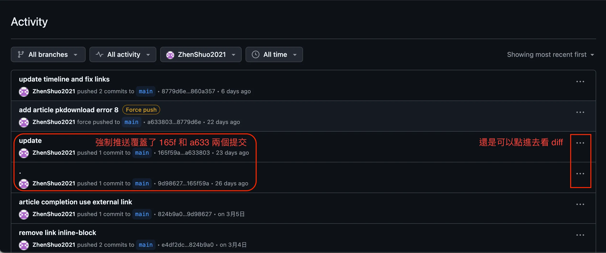
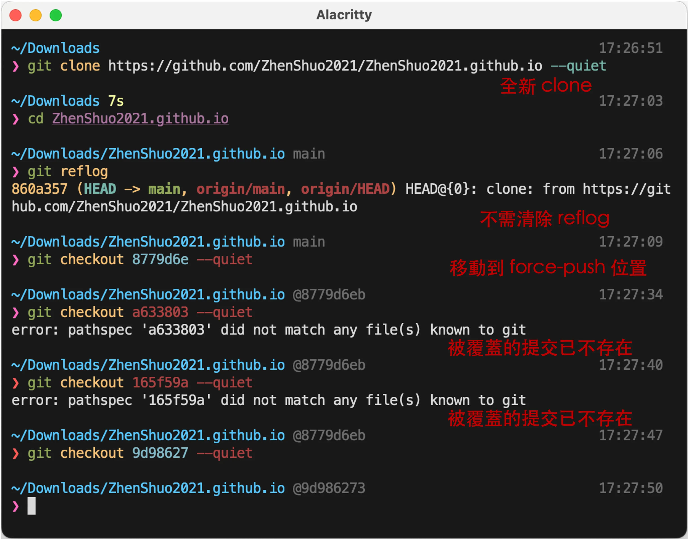
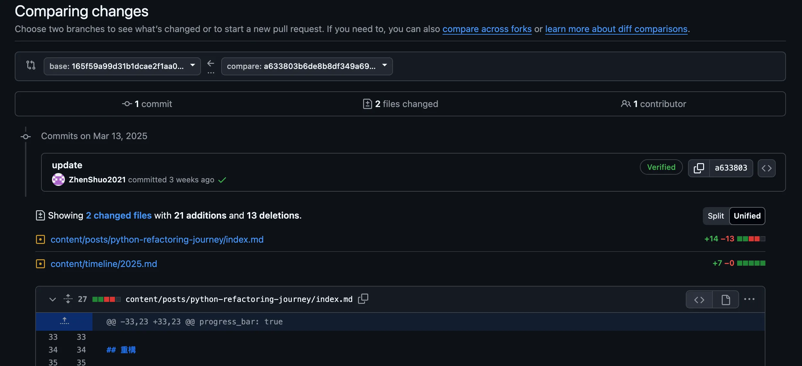

# {{ $frontmatter.title }}

不小心把金鑰、API 鑰匙、密碼等敏感資訊提交甚至推送時，網路上有很多文章說明不同的清除方式，但是中文文章沒有任何一篇的處理方式，怎麼老是在說別人做錯？因為那些人連文檔都不看就上網寫文章了，該怎麼做[文檔寫的一清二楚](https://docs.github.com/en/authentication/keeping-your-account-and-data-secure/removing-sensitive-data-from-a-repository)。

講重點不廢話，Git 根本就不會把 reflog 記錄推送到遠端鏡像，所以不用擔心 reflog 也不用擔心垃圾回收 (GC) 問題，處理方式只分成這三種情況

1. **還沒有被推送上去，而且還是很近的提交**：直接 reset 或者 rebase 覆蓋就可以了，不需要任何額外處理[^pushed]
2. **還沒有被推送上去，但已經是很久遠的提交了**：請見本文的[清除本地歷史](#clear-local-history)
3. **已經被推送上去**：非常麻煩，除非刪庫，否則除了完成第二點的工作以外還要找客服幫你刪，沒有其他解決方式

[^pushed]: 除非你擔心電腦的 reflog 記錄被翻出來，但是如果有這個風險你應該擔心的是整台電腦的安全問題。

## 說明和測試

關於第一點，試想如果 reflog 會被推送，那麼所有人的 reflog 都不一樣怎麼搞？筆者連冷門指令 `git fsck` 也測試過了，這些東西不會被推送到遠端，git 的 GC 問題下方也有測試，結論是這些都不需要處理，不會被推送，網路上所有中文文章都在做無用功。然而被推送之後問題就大了，網路文章不只無用功甚至沒有成功清除，因為就算強制推送覆蓋也沒有用：不管 Github 和 Gitlab 都會記錄 repository activity。以下是 Github repository activity 的實際範例，可以看到即使強制推送記錄還是存在



這是 Git 雲端平台提供的「[加值服務 (value-adding thing)](https://stackoverflow.com/questions/65837109/when-should-i-use-git-push-force-if-includes#:~:text=Git%20as%20it%20is%2C%20%22out%20of%20the%20box%22%2C%20does%20not%20have%20this%20kind%20of%20permissions%20checking%2C%20but%20hosting%20providers%20like%20GitHub%20and%20Bitbucket%20add%20it%2C%20as%20part%20of%20their%20value%2Dadding%20thing%20to%20convince%20us%20to%20use%20their%20hosting%20systems.)」，Github 和 Gitlab 都一樣會記錄被強制推送覆蓋的記錄，[Github 文檔](https://docs.github.com/en/authentication/keeping-your-account-and-data-secure/removing-sensitive-data-from-a-repository)說了唯一的刪除方式就是找客服，沒第二種方法。

半信半疑也沒關係，本文直接測試給你看，以上圖為例，force push 覆蓋了兩個提交，直接 clone 下來完全沒有使用 filter-repo 等方式過濾，可以看到**根本沒有 reflog 記錄，兩個被覆蓋的提交 (165f59a, a633803) 也確實不存在**



但是**點開 Github repository Activity 還是看的到提交歷史，包含修改的內容都完整記錄**



所以必須聯繫 Github 才能徹底的清除記錄。

## 清除本地歷史{#clear-local-history}

<u><b>如果敏感資料首次提交是在前一個提交歷史，直接 reset 或者 rebase 改掉就可以了，有很多歷史記錄無法輕鬆修改才需要用到這個段落</b></u>的強力修改方式 git filter-repo，方式來自於文檔 [Removing sensitive data from a repository](https://docs.github.com/en/authentication/keeping-your-account-and-data-secure/removing-sensitive-data-from-a-repository)。

1. 先安裝 [git-filter-repo](https://github.com/newren/git-filter-repo/blob/main/INSTALL.md)，mac 可以直接使用 `brew install git-filter-repo`
2. 移除記錄，如果檔案移動過，`<PATH-TO-SENSITIVE-DATA>` 需要填寫所有的歷史路徑

```sh
git-filter-repo --sensitive-data-removal --invert-paths --path <PATH-TO-SENSITIVE-DATA>
```

`git-filter-repo` 也提供覆寫功能，直接找到對應文字並且移除

```sh
git-filter-repo --sensitive-data-removal --replace-text ../passwords.txt
```

`--replace-text` 詳細用法請見 [Git Filter-Repo: The Best Way to Rewrite Git History](https://www.git-tower.com/learn/git/faq/git-filter-repo) 以及 [Clever uses for git-filter-repo](https://peterbabic.dev/blog/clever-uses-for-git-filter-repo/)。

3. 強制推送到遠端

```sh
git push --force --mirror origin
```

## 清除遠端記錄：Github

只能找客服，請見[文檔流程](https://docs.github.com/en/authentication/keeping-your-account-and-data-secure/removing-sensitive-data-from-a-repository#fully-removing-the-data-from-github)。

## 從根本避免意外提交

最基本的當然是 .gitignore，除此之外也請務必善用 pre-commit，簡單列出幾個可以檢查敏感訊息的工具，有非常多種請自行比較選擇：

- [trufflehog](https://github.com/trufflesecurity/trufflehog)
- [Yelp/detect-secrets](https://github.com/Yelp/detect-secrets)
- [awslabs/git-secrets](https://github.com/awslabs/git-secrets)
- [gitleaks](https://github.com/gitleaks/gitleaks)

Github 付費可以啟用 [Secret Protection](https://docs.github.com/en/code-security/secret-scanning/using-advanced-secret-scanning-and-push-protection-features/custom-patterns/defining-custom-patterns-for-secret-scanning) 功能，可以自訂 pattern，文檔沒說免費版沒有但是免費版實際上找不到。
