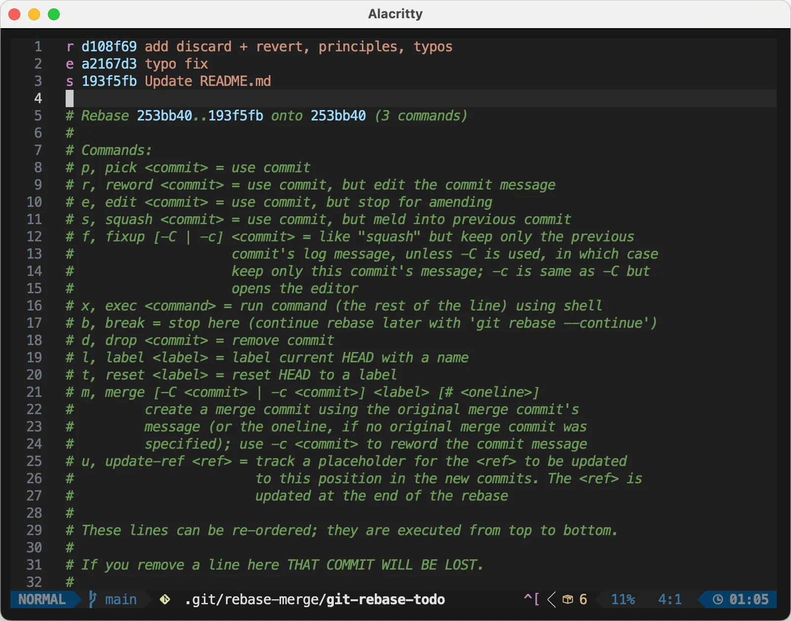
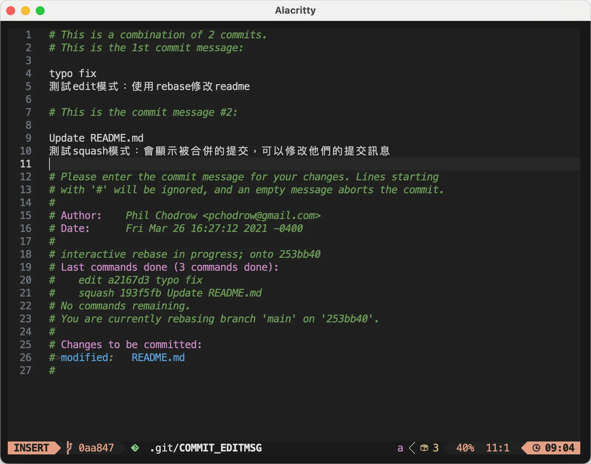
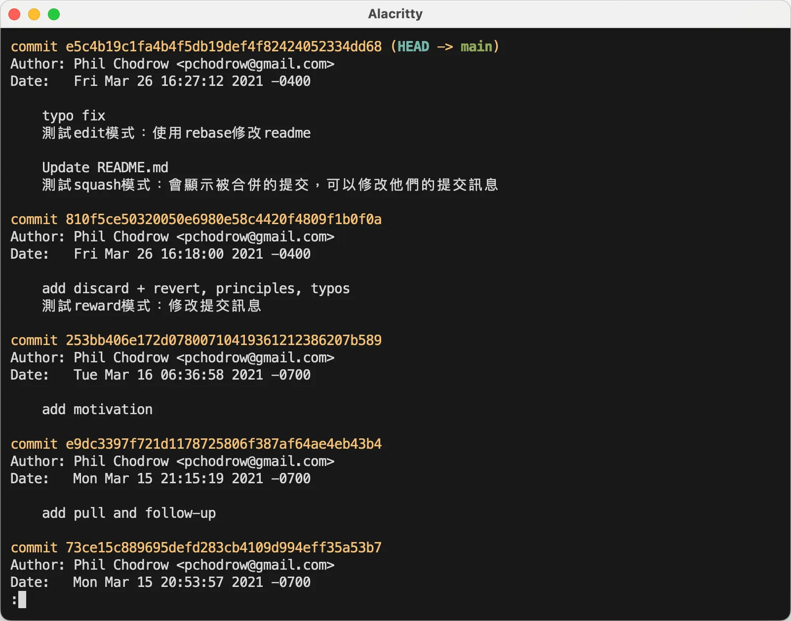

import EmblaCarousel from '@site/src/components/EmblaCarousel';

互動式變基是 Git 最強大的指令，包含移動提交、刪除提交、修改提交內容、修改提交訊息全部都可以做到。原理仍舊是基於變基，但是使用時完全不會感覺到分支操作。互動式變基常用的選項有五個：

- **p, pick**：預設，選擇該提交  
- **r, reword**：修改提交訊息  
- **e, edit**：修改提交內容  
- **s, squash**：合併到前一個提交  
- **f, fixup**：合併到前一個提交，不顯示被合併的提交訊息

本文簡單示範幾個 rebase 選項，要練習的話請使用 [範例 repo](https://github.com/PIC16B/git-practice) 操作，還想學會大魔王 onto 的話請看[搞懂 Rebase Onto](/git/rebase-onto)。

## 修改範例

import image1 from './data/rebase-1.webp';
import image2 from './data/rebase-2.webp';
import image4 from './data/rebase-4.webp';
import image5 from './data/rebase-5.webp';
import image6 from './data/rebase-6.webp';
import image7 from './data/rebase-7.webp';
import image8 from './data/rebase-8.webp';

我們使用範例 repo 對最近的三個提交分別進行 reward, edit 和 squash 操作。

```sh
# 複製範例 repo
git clone https://github.com/PIC16B/git-practice -q && cd git-practice

# rebase 最近三個提交
git rebase -i HEAD~3
```

接下來就會進入互動式變基的修改頁面，預設都是 pick 也就是不改變，從上到下分別是由舊到新。我們把三個 pick，由上到下依序改為 r (reward 修改提交訊息) e (edit 編輯提交) s (squash 合併到前一個提交)，修改完的結果如圖，之後按下 `Esc` 回到 Vim 命令模式，輸入 `wq` 儲存並離開



之後會由舊到新開始進行互動式變基，第一個會進入 reward 模式修改提交訊息，跳出提交訊息修改視窗，修改完成後儲存退出


接著進入 edit 修改模式，edit 模式中可以任意更改，我們修改 README.md 文件，簡單加上一句測試文字，這裡要注意，如果只是要修改提交，改完後使用 `git add README.md` 預存，再使用 `git rebase --continue` 前往下一個 rebase 作業，不需要使用 `git commit`。輸入 `git rebase --continue` 後會跳出提交訊息修改視窗，修改完成就會進入下一個提交的變基

:::tip

互動式變基過程中如果使用 `git commit` 會變成插入一個新的提交。

:::

<EmblaCarousel
  images={[image4, image5, image6]}
  options={{ loop: true }}
/>

最後進入合併模式 squash，這裡和第一個 reward 一樣只會顯示提交訊息修改的視窗，會顯示被合併的提交的訊息。我加上一行測試後儲存離開，互動式變基就結束了。



使用 `git log` 檢查，發現提交訊息確實被修改，最新的提交也確實被合併了。



## 改到一半想修改等一下的任務

使用 `--edit-todo` 選項。

## 進入 Vim 視窗後想要跳出繼續進行修改

進入 Vim 編輯器之後反悔，但是只要儲存 Git 就會執行任務，該怎麼辦？使用 `:cq` 告訴 Git 這是強制退出，他就不會執行後續任務，這不限制 rebase，amend 等等操作也都適用。

## 可以在互動式提交過程中進行提交嗎？

在互動式變基過程中使用 `git commit` 會插入一個新的提交。

在[使用變基 Rebase 合併分支](./rebase)有提到變基過程中的提交只是被暫存，沒有限制你哪些事情不能做，所以甚至可以在變基過程中使用 `git cherry-pick` 等等指令任意的修改提交。

## 使用 exec 選項自動執行任務

這個功能超強！把每個互動式提交中間自動加上要執行的指令，於是你就可以批量處理提交，對於小範圍的修改非常有用，不用再學超慢的 filter-branch，也不用看文檔 filter-repo 令人痛苦的文檔。簡單的範例是我們可以在每個提交後面自動執行 `prettier` 進行 format

```sh
git rebase -i --exec 'prettier --write {**/*,*}.js' <commit-ish>
```

甚至是[幫提交簽名](https://peterbabic.dev/blog/git-sign-previous-commits-keeping-dates/)

```sh
git rebase --exec 'git commit --amend --no-edit --no-verify -S' -i --root
git rebase --committer-date-is-author-date -i --root
```

## 我想修改 committer date

Git 有 author date 和 committer date 兩種時間，分別記錄一個提交最初和最後一次修改的時間，可以使用這個選項一鍵完成

```sh
git rebase --committer-date-is-author-date
```

不需要再使用超慢且危險的 filter-branch，也不用 `GIT_COMMITTER_DATE="$DATE" git commit --amend --date="$DATE" --allow-empty --no-edit;` 打超長的指令。

## 重構初始提交

使用 `--root` 可以重構初始提交，但是 rebase 就已經夠危險了，除非有絕對需求要重構 root 否則還是盡量避免吧。
