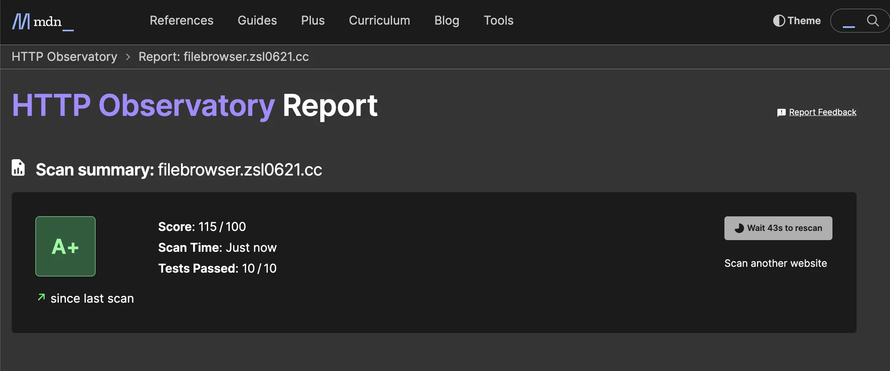
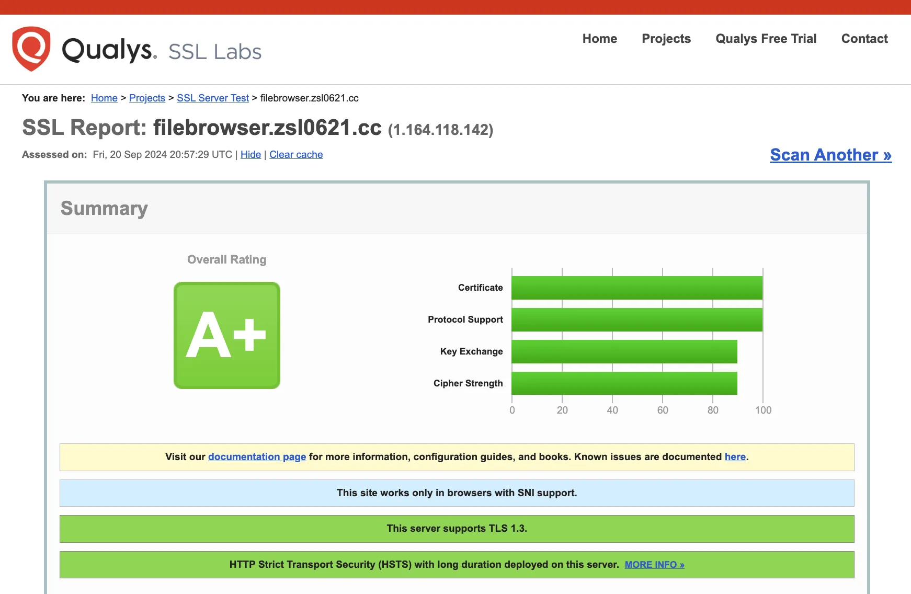

import Tabs from '@theme/Tabs';
import TabItem from '@theme/TabItem';

# 在 NAS 中設定 Traefik 反向代理 Docker 服務

本文記錄使用 NAS 中如何使用 Traefik 反向代理，在把各種 docker 服務反向代理使用，此方法可以自動簽署 TLS 證書。

沒有很複雜但是再度被 Google 搜尋搞，前三篇文章放了三個不同的設定方式然後我就炸了，其實只有一種最常使用。本文專注介紹 NAS 如何設定，作為用戶我們只關心設定是否成功，外網連接是否安全，所以本文不會有任何原理，沒有由淺入深教學，就是複製貼上結束，快點設定完成服務上線才是最重要的。

## 寫在前面

對於預設讀者的一般 NAS 用戶來說，我認為絕大多數場景都不需要自行配置反向代理，直接使用 Cloudflare Tunnel 就完事了，會有這篇文章是我一開始不知道 filebrowser 有[區塊傳輸功能](https://github.com/filebrowser/filebrowser/discussions/1182)可規避 Tunnel 的檔案大小上限，這篇文章就給有其他用途的人做參考。

## 為何選擇 Traefik

常見的反向代理供具有 Nginx、Apache、Caddy 和 Cloudflare Tunnel，一樣先說明為何選擇 Traefik。

- Cloudflare Tunnel: 最好的反向代理，還不需開 port，唯一缺點是單一檔案大小上限 100MB。
- Nginx: 設定複雜，沒有自動證書更新，需要複雜設定才使用他。
- Apache: 因為使用他代理 Docker 服務的文章很少所以沒試過[^1]。
- Caddy: 設定非常簡單，但他不是專注在反向代理，所以需要過濾其他教學文章。
- Traefik: 專注反向代理，設定簡單，自動證書更新，文檔充足，Docker 支援完善。

所以我也是有個人雲端硬碟的需求才開始使用 Traefik，Cloudflare Tunnel 光是免費版就可以完成 99% 需求，更別說整合 Zero Trust Access 後基本上安全無敵。

[^1]: 身為老牌反向代理工具，Nginx 和 Apache 整合的資安防護工具更完善，Traefik 則是只有看到 [modsecurity](https://plugins.traefik.io/plugins/628c9eadffc0cd18356a9799/modsecurity-plugin) 有官方插件，其他如 [GeoBlock](https://plugins.traefik.io/plugins/62d6ce04832ba9805374d62c/geo-block) 則是社群用愛發電。

## 安全性

先上人權照，依照文中設定 MDN 安全評分來到 115 已經是前 2% 安全的網站，也用 [OWASP ZAP](https://www.zaproxy.org/)/[nikto](https://github.com/sullo/nikto) 掃描過基本沒有問題：





除了 Traefik 直連伺服器以外，我們還可以開啟 Cloudflare proxy （預設開啟除非特地取消），這樣可隱藏主機 IP 地址避免主機被攻擊；開啟 Cloudflare proxy 後還可以設定 WAF，如最基本的國籍封鎖，或者是開啟 Bot fight mode/DDoS protection 等 Cloudflare 的免費服務；或者接上 Cloudflare Zero Trust 設定 Access 保護，如使用 OAuth 認證。

我知道中英混雜看了眼睛很痛，這裡總結：

- WAF/DDoS protection (requires Cloudflare proxy)
- Zero Trust Access with OAuth
- Cloudflare proxy to hide IP

也就是說攻擊者需要越過三道安全防線。首先得面對 WAF 和 DDoS 保護的挑戰，再繞過 Zero Trust Access 認證，最後是 Cloudflare 代理才能知道主機的真實 IP 地址。更重要的是，即使攻擊者突破了這些防線接觸到的也只是 Traefik 的反向代理層，並沒有直接接觸到真正的主機或應用服務[^2]。

[^2]: 但是對於每天掃 IP 的無聊人，他們可以直接碰到 Traefik 反向代理層，也就是說只要 Traefik 被攻破就可以透過 Docker network 和其他容器進行通訊，雖然這樣還是要繞過第二個容器的安全漏洞，但總沒有 Cloudflare 連 port 都不開來的安全。

## 版本資訊

- Ubuntu server 22
- traefik v2.9 v3.1 都可正常運行。
- 以 [filebrowser](https://github.com/filebrowser/filebrowser) v2.31 示範被代理的服務

如何設定 DDNS 請見先前文章。

## 方法一：合併其他容器部署 (BAD)

此設定基本和[官方教學](https://doc.traefik.io/traefik/user-guides/docker-compose/acme-tls/)一致，但是要部署多個容器時就有問題，可以當作一個基本範例練習。

```yaml
services:
  traefik:
    image: traefik:latest
    container_name: traefik
    command:
      - "--providers.docker=true"
      - "--entrypoints.websecure.address=:443"
      - "--certificatesresolvers.myresolver.acme.tlschallenge=true"
      - "--certificatesresolvers.myresolver.acme.email=leo01412123@gmail.com"
      - "--certificatesresolvers.myresolver.acme.storage=/letsencrypt/acme.json"
    ports:
      - "443:443"
    volumes:
      - /var/run/docker.sock:/var/run/docker.sock:ro
      - ./letsencrypt:/letsencrypt
    networks:
      - proxy

  filebrowser:
    container_name: filebrowser
    image: filebrowser/filebrowser:s6
    restart: always
    volumes:
      - /mnt/filebrowser/srv:/srv
      - /home/leo/docker/filebrowser/filebrowser.db:/database/filebrowser.db
      - /home/leo/docker/filebrowser/settings.json:/config/settings.json
    environment:
      - PUID=$(id -u)
      - PGID=$(id -g)
    networks:
      - proxy
    ports:
      - 80:80
    labels:
      # 設定 filebrowser 在 traefik 中的路由
      - "traefik.enable=true"
      - "traefik.http.routers.filebrowser.rule=Host(`filebrowser.zsl0621.cc`)"
      - "traefik.http.routers.filebrowser.entrypoints=websecure"
      - "traefik.http.routers.filebrowser.tls.certresolver=myresolver"

      # 設定 security headers
      - "traefik.http.middlewares.securityHeaders.headers.customResponseHeaders.X-Content-Type-Options=nosniff"
      # 啟用 middlewares
      - "traefik.http.routers.filebrowser.middlewares=securityHeaders"

networks:
  proxy:
    external: true
```

這個方法和官方教學的差異在於多了一個 `proxy` docker network，並且加入 security headers。這是符合大多數教學的範例。使用時先啟用網路 `docker network create proxy` 後即可 `docker compose up -d` 啟動容器。

## 方法二：獨立部署 (Good)

這個方法獨立 traefik 和其他應用部署，方便調整。

在 `docker/traefik` 中建立 `docker-compose.yml` 和 `letsencrypt` 資料夾：

```sh
mkdir letsencrypt
vim docker-compose.yml
```

然後兩個 yaml 檔案分別是：

<Tabs
    values={[
        { label: 'docker/traefik', value: 'traefik', },
        { label: 'docker/filebrowser', value: 'filebrowser', },
    ]
    }>
  <TabItem value="traefik">

    ```yaml
    services:
      traefik:
        image: traefik:latest
        container_name: traefik
        restart: always
        command:
          - "--log.level=DEBUG"
          - "--providers.docker=true"
          - "--entrypoints.websecure.http3"
          - "--entrypoints.websecure.address=:443"
          - "--certificatesresolvers.myresolver.acme.tlschallenge=true"
          - "--certificatesresolvers.myresolver.acme.email=leo01412123@gmail.com"
          - "--certificatesresolvers.myresolver.acme.storage=/letsencrypt/acme.json"
          - "--api.insecure=true"
          - "--api.dashboard=true"
        ports:
          - "443:443"
          - "4315:8080"
        volumes:
          - /var/run/docker.sock:/var/run/docker.sock:ro
          - ./letsencrypt:/letsencrypt
        networks:
          - proxy
        labels:
          # Traefik dashboard
          - "traefik.http.routers.dashboard.rule=Host(`traefik.example.com`) && (PathPrefix(`/api`) || PathPrefix(`/dashboard`))"
          - "traefik.http.routers.dashboard.service=api@internal"
          - "traefik.http.routers.dashboard.middlewares=auth"
          - "traefik.http.middlewares.auth.basicauth.users=test:$$apr1$$H6uskkkW$$IgXLP6ewTrSuBkTrqE8wj/,test2:$$apr1$$d9hr9HBB$$4HxwgUir3HP4EsggP/QNo0"

          # Security headers
          - "traefik.http.middlewares.securityHeaders.headers.customResponseHeaders.Permissions-Policy=geolocation=(self), microphone=(), camera=(), fullscreen=*"
          - "traefik.http.middlewares.securityHeaders.headers.customResponseHeaders.X-Frame-Options=SAMEORIGIN"
          - "traefik.http.middlewares.securityHeaders.headers.customResponseHeaders.X-XSS-Protection=1; mode=block"
          - "traefik.http.middlewares.securityHeaders.headers.customResponseHeaders.Referrer-Policy=strict-origin-when-cross-origin"
          - "traefik.http.middlewares.securityHeaders.headers.customResponseHeaders.Strict-Transport-Security=max-age=63072000; includeSubDomains; preload"
          - "traefik.http.middlewares.securityHeaders.headers.customResponseHeaders.Access-Control-Allow-Origin=https://*.zsl0621.cc"
          - "traefik.http.middlewares.securityHeaders.headers.customResponseHeaders.Access-Control-Allow-Methods=GET, POST, OPTIONS"
          - "traefik.http.middlewares.securityHeaders.headers.customResponseHeaders.Access-Control-Allow-Headers=Content-Type, Authorization"
          - "traefik.http.middlewares.securityHeaders.headers.customResponseHeaders.Access-Control-Expose-Headers=X-Total-Count"

          # 簡易版 CSP 設定，到 https://developer.mozilla.org/en-US/observatory 測試 80 分
          - "traefik.http.middlewares.securityHeaders.headers.customResponseHeaders.Content-Security-Policy=default-src 'self' 'unsafe-inline' https: data: blob:"

          # 手動版 CSP 設定，測試 115 分，但不可能去維護這東西
          #- "traefik.http.middlewares.securityHeaders.headers.customResponseHeaders.Content-Security-Policy=default-src 'self'; script-src 'self' 'sha256-244nvlHWdCM1kA8RZKfY3bUf3110bXhBCG22rCB4Ctw=' 'sha256-VA8O2hAdooB288EpSTrGLl7z3QikbWU9wwoebO/QaYk=' 'sha256-+5XkZFazzJo8n0iOP4ti/cLCMUudTf//Mzkb7xNPXIc=' https://cdnjs.cloudflare.com; style-src 'self' 'sha256-ZLN3N05ogeY2hIjEaMJwxgAJCpLsgSAoVZsTatKONMo=' 'sha256-w+cEYFEmAoad15jfTJgep5pwxjGpd9UJSHmyuIz6eos=' 'sha256-47DEQpj8HBSa+/TImW+5JCeuQeRkm5NMpJWZG3hSuFU='; img-src 'self' data:; font-src 'self' data: https://fonts.gstatic.com; manifest-src 'self' blob:; connect-src 'self'; frame-ancestors 'self'"

          - "traefik.http.middlewares.blockMetadataServer.headers.customResponseHeaders.X-Block=This request is blocked"
          - "traefik.http.routers.myrouter.middlewares=blockMetadataServer"
          - "traefik.http.routers.myrouter.rule=Host(`169.254.169.254`)"

          - "traefik.http.middlewares.securityHeaders.headers.customResponseHeaders.X-Content-Type-Options=nosniff"

    networks:
      proxy:
        external: true
    ```

  </TabItem>
  <TabItem value="filebrowser">

    ```yaml
    services:
      filebrowser:
        container_name: filebrowser
        image: filebrowser/filebrowser:s6
        restart: always
        volumes:
          - /mnt/filebrowser/srv:/srv
          - /home/leo/docker/filebrowser/filebrowser.db:/database/filebrowser.db
          - /home/leo/docker/filebrowser/settings.json:/config/settings.json
        environment:
          - PUID=$(id -u)
          - PGID=$(id -g)
        networks:
          - proxy
        ports:
          - 80:80
        labels:
          - "traefik.enable=true"
          - "traefik.http.routers.filebrowser.rule=Host(`filebrowser.zsl0621.cc`)"
          - "traefik.http.routers.filebrowser.entrypoints=websecure"
          - "traefik.http.routers.filebrowser.tls.certresolver=myresolver"
          - "traefik.http.routers.filebrowser.middlewares=securityHeaders"

    networks:
      proxy:
        external: true
    ```

  </TabItem>
</Tabs>

啟用方法一樣是先啟用網路 `docker network create proxy`，之後分別在兩個資料夾 `docker compose up -d` 啟動容器。與本文方式最相近的文章應該是 [Docker 下的 Traefik 上手教程](https://blog.bling.moe/post/14/) 和 [Traefik v3.0 Docker 全面使用指南：基础篇](https://soulteary.com/2023/07/18/traefik-v3-docker-comprehensive-user-guide-basics.html) ，可作為遇到問題時的參考。

## 下一步

如果使用 Cloudflare 的工具，從域名來的攻擊應該是非常安全了，但是對於直接攻擊伺服器 IP 的保護還沒有設定，可以參考[這篇文章](https://www.reddit.com/r/Traefik/comments/17ed6nr/question_about_security/)：

> - Hardening the SSH service. Use pubkey auth, disable root login, install fail2ban and/or crowdsec and configure strong ciphers and algorithms. Search for ssh-audit on GitHub to evaluate your config.
> - Harden your Traefik config. Enable strong TLS ciphers only, enable HTTP logs, may configure rate limiting or IP whitelist middlewares and http security headers for your proxy services.
> - May implement crowdsec and/or fail2ban to inspect the traefik logs. Watch out for many 404 or 403/401 http error logs. Indication that someone conducts forceful browsing or bruteforcing attacks. May put those traefik logs into Grafana+Loki to gain visibility. See https://blog.lrvt.de/traefik-metrics-and-http-logs-in-grafana/
> - May add another authentication wall in front of your exposed services. For example via Authelia or Authentik.
> - Patch Patch Patch. Use watchtower or diun or any other dockerized service to get notified about new docker image versions. Upgrade regularly.
> - Backups and disaster recovery

這邊整理成一個列表

- 強化 Traefik:
  - 啟用 HTTP 日誌
  - 配置速率限制或 IP 白名單 middleware
  - 配置 HTTP 安全標頭
  - 啟用強 TLS 密碼套件
    - [geoblock](https://github.com/PascalMinder/GeoBlock) ([example](https://github.com/Tarow/traefik-geoblock-example/))
    - [fail2ban](https://github.com/tomMoulard/fail2ban)
    - [OIDC](https://doc.traefik.io/traefik-enterprise/middlewares/oidc/)
- 監控 Traefik 日誌:
  - 使用 CrowdSec 或 Fail2Ban 檢查 Traefik 日誌
  - 注意 404 或 403/401 錯誤日誌，可能是強制瀏覽或暴力破解攻擊的跡象
  - 將 Traefik 日誌整合到 Grafana+Loki 以提升可見性
- 額外的身份驗證層:
  - 使用 Authelia 或 Authentik 進行身份驗證
- 定期升級與補丁管理:
  - 使用 Watchtower 或 Diun 監控 Docker 映像的版本更新
  - 定期升級並修補漏洞
- 備份與災難恢復

也加上我自己整理的一些防護工具

- UFW 基本封包過濾
- CrowdSec 強化版的 fail2ban，避免 DDoS 和暴力破解
- Suricata 沒搞懂差異，GPT說他是（強大的網路入侵檢測與防禦）
- ModSecurity 沒搞懂差異，GPT說他是（Web應用防火牆）
- OSSEC 沒搞懂差異，GPT說他是（主機入侵檢測系統）
- ClamAV: 病毒掃描
- OpenVAS: 漏洞掃描
- [整合日誌並視覺化](https://tprc.tanet.edu.tw/tpnet2018/training/10708.pdf) page 22
- 工具比較可以看[這裡](https://www.cnblogs.com/Hi-blog/p/intrusion-detection-tools.html)

整理完都想乾脆買 Fortinet 就好了，全部弄完還不累死自己，雖然撰文前一週防火牆公司[被駭](https://www.ithome.com.tw/news/165013)，還有前一個月網路安全公司解引用了一個空指標[^4]讓[全球大當機](https://www.google.com/search?q=%E5%BE%AE%E8%BB%9F+%E5%85%A8%E7%90%83%E7%95%B6%E6%A9%9F+crowdstrike&sca_esv=b92988c8c5d34d5a&sca_upv=1&ei=LwzvZp-wJqKzvr0P9s_rwQQ&ved=0ahUKEwjfg8ed0dSIAxWima8BHfbnOkgQ4dUDCA8&uact=5&oq=%E5%BE%AE%E8%BB%9F+%E5%85%A8%E7%90%83%E7%95%B6%E6%A9%9F+crowdstrike&gs_lp=Egxnd3Mtd2l6LXNlcnAiH-W-rui7nyDlhajnkIPnlbbmqZ8gY3Jvd2RzdHJpa2UyCBAAGIAEGKIEMggQABiABBiiBDIIEAAYgAQYogQyCBAAGIAEGKIEMggQABiABBiiBEiKjwJQzfQBWKuKAnAKeACQAQCYATmgAZYFqgECMTO4AQPIAQD4AQGYAhOgAu4DwgIIEAAYgAQYsAPCAgsQABiABBiwAxiiBMICBRAAGIAEwgIGEAAYCBgewgIIEAAYogQYiQWYAwCIBgGQBgWSBwIxOaAHthk&sclient=gws-wiz-serp)。至於為什麼會搞到這麼麻煩是伺服器平常不會看他，怕等到發現的時候資料全中勒索病毒了。也是現在才知道以前沒開通訊埠轉發有多幸福，完全不擔心主機直接被接觸，只要內建防毒就可以高枕無憂，開了轉發之後才知道原來還分入侵偵測和入侵防禦阿，好不容易每個都設定完成還要自己設定 crontab 例行檢查，檢查完一堆記錄要用 Elasticsearch 整理，整理完還沒有視覺化，再用 Kibana 把數據可視化...我先減一，乖乖用 Cloudflare Tunnel。

[^4]: [錯誤永遠會有](https://www.youtube.com/watch?v=d9KcUziiF60)，但是竟然沒有分段推送，也沒有寫測試，滿神奇的。

## 結語

整理完結果很簡單，但是從測試到成功不知道打了幾百次 vim docker-compose.yml。
