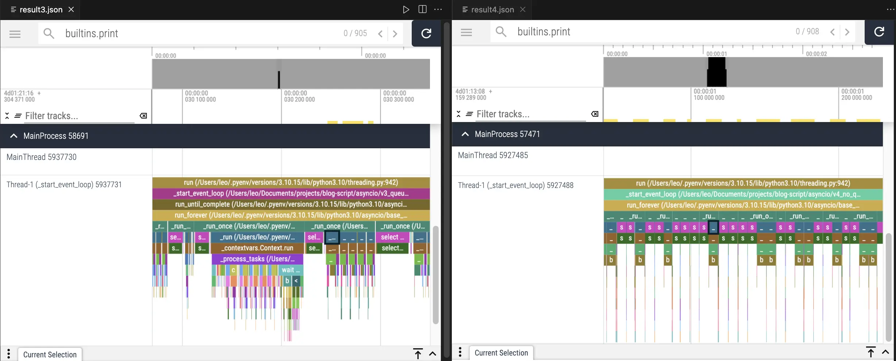

# 在獨立子線程中執行非同步操作

第一次寫 Python 非同步語法的紀錄，網路上很多非同步文章，但是沒看過有把非同步操作放在獨立線程中執行的程式碼實例，於是自己寫了一個。

## 程式說明

設計思路是把函式和參數打包後丟給事件迴圈運行，用一個單獨的線程用於執行事件迴圈，再把任務註冊到這個事件迴圈。

首先先建立一個 dataclass 用於把要執行函式的以及函式輸入打包

```py
@dataclass
class Task:
    task_id: str
    func: Callable[..., Any]
    args: Tuple[Any, ...] = ()
    kwargs: Optional[Dict[str, Any]] = None

    def __post_init__(self) -> None:
        self.kwargs = self.kwargs or {}
```

接下來就是建立負責管理事件迴圈和線程的類別，初始化如下，項目有點多。

- max_workers 用於限制最高並發數量
- is_running 是程式旗標，標記線程是否還在運行
- sem 是限制最高並發的 semaphore 鎖
- task_queue 用於緩衝任務，存放還未執行的任務列表，因為有 max_workers 限制最高並發數量
- current_tasks 是馬上要執行的任務列表，內容是從 task_queue 取出的
- results 用於儲存運行結果，使用字典以便根據 task_id 尋找結果，queue 無法完成這項要求

```py
class AsyncService:
    def __init__(self, logger: Logger, max_workers: int = 5) -> None:
        self.max_workers = max_workers
        self.logger = logger

        self.is_running = False
        self.loop: Optional[asyncio.AbstractEventLoop] = None
        self.sem = asyncio.Semaphore(self.max_workers)
        self.thread: Optional[threading.Thread] = None
        self._lock = threading.Lock()

        self.task_queue: queue.Queue[Task] = queue.Queue()
        self.current_tasks: list[asyncio.Task[Any]] = []
        self.results: Dict[str, Any] = {}
```

接下來我們介紹程式架構：

- `add_task` 和 `add_tasks` 作為外部接口把任務放進 task_queue 中
- 每次 `add_task` 呼叫 `_ensure_thread_active` 確認子線程是否存活
- 子線程執行 `_start_event_loop`，這個函式會呼叫 `_schedule_tasks`，並且使用 try-finally 語法管理事件迴圈的關閉
- `_schedule_tasks` 是一個無限迴圈，用於從 task_queue 中取出任務，使用 asyncio.create_task 註冊到事件迴圈
- `_run_task` 把輸入函式解包並且 await 執行，再把輸出結果放進 results 字典

有點繞，先看最簡單的 `_run_task`，把 `Task` dataclass 內容取出後執行再用線程鎖控制輸出寫入，雖然只有單線程應該不需要線程鎖，但是考量三個原因還是把他加上去：

1. 防範於未然，字典不是線程安全的，要是哪天忘了他只能用單線程就造成競爭危害了
2. 雖然 99.9999% 確定不會造成競爭危害（因為事件迴圈本質是順序執行，除非在寫入時也 await 才有可能造成非原子操作導致競爭危害），但是不想賭那個 0.00001% 的問題
3. 相較 io 任務而言這個鎖的開銷簡直微乎其微

```py
async def _run_task(self, task: Task) -> Any:
    async with self.sem:
        print(
            f"Task {task.func.__name__} with args {task.args} and kwargs {task.kwargs} start running!"
        )
        try:
            result = await task.func(*task.args, **task.kwargs)  # type: ignore
            with self._lock:
                self.results[task.task_id] = result
            return result
        except Exception as e:
            self.logger.error(f"Error processing task {task.task_id}: {e}")
            with self._lock:
                self.results[task.task_id] = None
```

剛才介紹完 `_run_task`，接下來介紹呼叫 `_run_task` 的 `_schedule_tasks`，前者真正執行任務，後者管理任務，是一個中間人的角色，負責從 task_queue 中取出任務註冊到事件迴圈中，並且放到 current_tasks 這個列表中準備執行。

```py
async def _schedule_tasks(self) -> None:
    while True:
        self.current_tasks = [task for task in self.current_tasks if not task.done()]

        if self.task_queue.empty() and not self.current_tasks:
            break

        while not self.task_queue.empty() and len(self.current_tasks) < self.max_workers:
            try:
                task = self.task_queue.get_nowait()
                task_obj = asyncio.create_task(self._run_task(task))
                self.current_tasks.append(task_obj)
            except queue.Empty:
                break

        if self.current_tasks:
            await asyncio.wait(self.current_tasks, return_when=asyncio.FIRST_COMPLETED)
```

現在完成了事件註冊和運行事件，為了把非同步操作放在獨立線程中執行，還缺少運行事件迴圈以及把事件迴圈放到線程中執行這兩件事情，使用 `_start_event_loop` 還有 `_ensure_thread_active` 完成，完整程式碼如下，也可以在[我的 Github 中找到](https://github.com/ZhenShuo2021/blog-script/tree/main/asyncio)：

```py
import asyncio
import queue
import threading
import time
from dataclasses import dataclass
from logging import Logger, getLogger
from typing import Any, Dict, Tuple, Callable, Optional

from help import BLOCK_MSG, NOT_BLOCK_MSG, io_task, print_thread_id, timer


@dataclass
class Task:
    task_id: str
    func: Callable[..., Any]
    args: Tuple[Any, ...] = ()
    kwargs: Optional[Dict[str, Any]] = None

    def __post_init__(self) -> None:
        self.kwargs = self.kwargs or {}


class AsyncService:
    def __init__(self, logger: Logger, max_workers: int = 5) -> None:
        # 載入變數
        self.max_workers = max_workers
        self.logger = logger

        # 任務運行相關設定
        self.is_running = False
        self.loop: Optional[asyncio.AbstractEventLoop] = None
        self.sem = asyncio.Semaphore(self.max_workers)
        self.thread: Optional[threading.Thread] = None
        self._lock = threading.Lock()

        # 儲存任務和結果的資料結構
        self.task_queue: queue.Queue[Task] = queue.Queue()
        self.current_tasks: list[asyncio.Task[Any]] = []
        self.results: Dict[str, Any] = {}

    def add_task(self, task: Task) -> None:
        self.task_queue.put(task)
        self._ensure_thread_active()

    def add_tasks(self, tasks: list[Task]) -> None:
        for task in tasks:
            self.task_queue.put(task)
        self._ensure_thread_active()

    def fetch_result(self, task_id: str) -> Optional[Any]:
        with self._lock:
            return self.results.pop(task_id, None)

    def fetch_results(self, max_results: int = 0) -> Dict[str, Any]:
        with self._lock:
            if max_results <= 0:
                results_to_return = self.results.copy()
                self.results.clear()
                return results_to_return

            keys = list(self.results.keys())[:max_results]
            return {key: self.results.pop(key) for key in keys}

    def shutdown(self, timeout: Optional[float] = None) -> None:
        if self.thread is not None:
            self.thread.join(timeout=timeout)
            print(f"\n===no job! clearing thread {self.thread.native_id}===")
            self.thread = None
            self.is_running = False
            print(f"===thread cleared! result: {self.thread}===\n")

    def _ensure_thread_active(self) -> None:
        with self._lock:
            if not self.is_running or self.thread is None or not self.thread.is_alive():
                self.is_running = True
                self.thread = threading.Thread(target=self._start_event_loop)
                self.thread.start()

    def _start_event_loop(self) -> None:
        self.loop = asyncio.new_event_loop()
        asyncio.set_event_loop(self.loop)
        try:
            self.loop.run_until_complete(self._schedule_tasks())
        finally:
            self.loop.close()
            self.loop = None
            self.is_running = False
            self.current_tasks.clear()

    async def _schedule_tasks(self) -> None:
        while True:
            self.current_tasks = [task for task in self.current_tasks if not task.done()]

            if self.task_queue.empty() and not self.current_tasks:
                break

            while not self.task_queue.empty() and len(self.current_tasks) < self.max_workers:
                try:
                    task = self.task_queue.get_nowait()
                    task_obj = asyncio.create_task(self._run_task(task))
                    self.current_tasks.append(task_obj)
                except queue.Empty:
                    break

            if self.current_tasks:
                await asyncio.wait(self.current_tasks, return_when=asyncio.FIRST_COMPLETED)

    async def _run_task(self, task: Task) -> Any:
        async with self.sem:
            print(
                f"Task {task.func.__name__} with args {task.args} and kwargs {task.kwargs} start running!"
            )
            try:
                result = await task.func(*task.args, **task.kwargs)  # type: ignore
                with self._lock:
                    self.results[task.task_id] = result
                return result
            except Exception as e:
                self.logger.error(f"Error processing task {task.task_id}: {e}")
                with self._lock:
                    self.results[task.task_id] = None


@timer
def test() -> None:
    print_thread_id()
    logger = getLogger()
    task_groups = [
        [(1, "A1"), (2, "A2"), (3, "A3")],
        [(3, "B1"), (4, "B2"), (5, "B3")],
        [(3, "C1"), (4, "C2"), (5, "C3")],
        [(1, "D1"), (2, "D2"), (3, "D3")],
    ]

    manager = AsyncService(logger, max_workers=5)

    # 新增第一批任務
    for group in task_groups[:-1]:
        tasks = [Task(task[1], io_task, task) for task in group]
        manager.add_tasks(tasks)

    print(NOT_BLOCK_MSG)

    # 模擬主執行緒工作需要 2.5 秒，在程式中間取得結果
    # 會顯示 A1/A2 的結果，因為它們在 2.5 秒後完成
    time.sleep(2.5)
    results = manager.fetch_results()
    print(NOT_BLOCK_MSG, "(2s waiting for main thread itself)")  # not blocked
    for result in results:
        print(result)

    # 等待子執行緒結束，造成阻塞
    manager.shutdown()
    print(BLOCK_MSG)

    for _ in range(3):
        results = manager.fetch_results()
        for result in results:
            print(result)

    # 在thread關閉後新增第二批任務
    tasks = [Task(task[1], io_task, task) for task in task_groups[-1]]
    manager.add_tasks(tasks)
    manager.shutdown()
    results = manager.fetch_results()
    for result in results:
        print(result)


if __name__ == "__main__":
    print_thread_id()
    test()
```

`test` 函式是一個簡單的使用範例，實際運行是 11 秒，讀者可以自行計算秒數驗證是否和理論相符。

## 自我檢討和心得

搜尋資料時看到有人建議撰寫主程式是非同步，然後把同步語法放到子線程中執行會比較好，寫的時候不太認同，真的用函式的時候就認同了，因為即使已經包裝成只要呼叫 `add_task` 和輸入 `Task`，實際使用時還是不太方便。

第二個是層層包裹的語句造成理解不易，使用 `add_task` 加入任務後會經過 `_ensure_thread_active` 確認線程是否存活並且建立線程，線程裡面要使用 `_start_event_loop` 建立事件迴圈，再使用 `_schedule_tasks` 把事件註冊到迴圈中，最後用 `_run_task` 把 `Task` dataclass 解包並且執行。這呼應第一個問題：如果去掉在子線程執行事件迴圈這件事，就可以刪掉前兩個方法，簡化為只需要註冊和運行而已。會這樣寫的原因除了自己想練習以外，也是因為前陣子寫了一個「把任務丟到子線程中執行」，所以用同樣想法寫了事件迴圈版本，結果比想像中的麻煩多了。不過都是試了才知道，畢竟網路上又沒這種文章。

第三是子線程中包含多個事件迴圈的運行管理，但筆者還沒到那個程度，以這個架構繼續延伸的話應該是輸入時加上 loop id 選擇要使用哪個迴圈。

第四有關記憶體效率，`task_queue` 和 `current_tasks` 疊床架屋，`task_queue` 用於暫存還沒執行的任務，`current_tasks` 存放已經從 `task_queue` 取出準備要執行的任務，要兩個物件管理有點浪費資源，有 semaphore 應該就不需要這兩個東西。附帶一提 `results` 不使用 queue 的原因是用戶可能會想根據 task_id 取得結果，但是 queue 只能從頭尾取值達不到這項要求。

最後補充，這個腳本跑 mypy --strict 可以過的唷。

## 更新：移除佇列版本

關於檢討中說到的疊床架屋問題，寫了一個不需要 `task_queue` 和 `current_tasks` 的版本，並且根據[這篇文章](https://medium.com/chris-place/python-asyncio-1c2f7903a193)使用 `run_coroutine_threadsafe` 和 `call_soon_threadsafe` 在主線程要求子線程運行任務，並且加上 threading.Event 確保事件迴圈正常啟動避免死鎖。

```py
class AsyncService:
    def __init__(self, logger: Logger, max_workers: int = 5) -> None:
        self.logger = logger

        # 任務運行相關設定
        self._running_tasks = 0
        self.loop: Optional[asyncio.AbstractEventLoop] = None
        self.thread: Optional[threading.Thread] = None
        self._lock = threading.Lock()
        self._loop_ready = threading.Event()
        self.sem = asyncio.Semaphore(max_workers)

        # 儲存結果
        self.results: Dict[str, Any] = {}

    def add_task(self, task: Task) -> None:
        self._ensure_thread_active()

        with self._lock:
            self._running_tasks += 1
            assert self.loop is not None
            asyncio.run_coroutine_threadsafe(self._schedule_tasks(task), self.loop)

    def add_tasks(self, tasks: list[Task]) -> None:
        for task in tasks:
            self.add_task(task)

    def fetch_result(self, task_id: str) -> Optional[Any]:
        with self._lock:
            return self.results.pop(task_id, None)

    def fetch_results(self, max_results: int = 0) -> Dict[str, Any]:
        with self._lock:
            if max_results <= 0:
                results_to_return = self.results.copy()
                self.results.clear()
                return results_to_return

            keys = list(self.results.keys())[:max_results]
            return {key: self.results.pop(key) for key in keys}

    def shutdown(self, timeout: Optional[float] = None) -> None:
        if self.thread is None or self.loop is None:
            return

        while True:
            with self._lock:
                if self._running_tasks == 0:
                    break

        self.loop.call_soon_threadsafe(self.loop.stop)  # 停止事件迴圈
        self.thread.join(timeout=timeout)

        print(f"\n===no job! clearing thread {self.thread.native_id}===")
        self.thread = None
        print(f"===thread cleared! result: {self.thread}===\n")

    def _ensure_thread_active(self) -> None:
        with self._lock:
            if self.thread is None or not self.thread.is_alive():
                self._loop_ready.clear()
                self.thread = threading.Thread(target=self._start_event_loop)
                self.thread.start()
                self._loop_ready.wait()  # 等待事件迴圈啟動

    def _start_event_loop(self) -> None:
        self.loop = asyncio.new_event_loop()
        asyncio.set_event_loop(self.loop)
        self._loop_ready.set()
        self.loop.run_forever()
        try:
            self.loop.close()
        finally:
            self.loop = None
            self._loop_ready.clear()

    async def _schedule_tasks(self, task: Task) -> None:
        async with self.sem:
            print(
                f"Task {task.func.__name__} with args {task.args} and kwargs {task.kwargs} start running!"
            )
            try:
                result = await task.func(*task.args, **task.kwargs)
                with self._lock:
                    self.results[task.task_id] = result
            except Exception as e:
                self.logger.error(f"Error processing task {task.task_id}: {e}")
                with self._lock:
                    self.results[task.task_id] = None
            finally:
                with self._lock:
                    self._running_tasks -= 1
```

### 討論：死鎖問題

藉此機會練習多線程的問題，剛改成這個版本時沒有使用 `threading.Event` 會產生死鎖，以下分析死鎖產生原因：

1. 在 `add_task` 時馬上呼叫 `_ensure_thread_active`，得到鎖，建立並且啟動線程，釋放鎖，return，同一時間子線程正在執行 `_start_event_loop`
2. 回到 `add_task`，取得鎖，執行 `run_coroutine_threadsafe`，但是 `_start_event_loop` 中建立 self.loop 的工作尚未完成，引發 NoneTypeError
3. 鎖釋放失敗，下一次 `add_task` 又要求鎖，造成死鎖（這也會造成 `run_coroutine_threadsafe` 本身的鎖產生死鎖）

加上 Event 則確保 self.loop 成功建立，在 `asyncio.set_event_loop` 完成之後才發送 `set` 訊號告訴主線程可以繼續工作，避免死鎖問題。這裡和網路教學相反的是是由子線程告訴主線程可以繼續了，網路教學通常是由主線程輸入 Event 告訴子線程開始工作。

```py
# 一開始沒有鎖的版本，方便讀者比較

def _start_event_loop(self) -> None:
    self.loop = asyncio.new_event_loop()
    asyncio.set_event_loop(self.loop)
    # self._loop_ready.set()  # 不使用Event
    self.loop.run_forever() # 阻塞線程
    # ...

def _ensure_thread_active(self) -> None:
    with self._lock:
        if self.thread is None or not self.thread.is_alive():
            # self._loop_ready.clear()  # 不使用Event
            self.thread = threading.Thread(target=self._start_event_loop)
            self.thread.start()
            # self._loop_ready.wait()  # 不使用Event
```

### 討論：效能問題

新的版本不只要處理死鎖，效能也比原版的差，這裡我以放入三百個睡眠時間 0 的 `io_task` 作為範例，單純測試事件迴圈對於事件註冊的吞吐量，並且幫新版作弊把所有 `self._lock` 刪除降低影響因素。實驗結果很意外，舊版只需要 0.063 秒，新版卻耗時高達 2.88 秒，表示 `run_coroutine_threadsafe` 這個方法開銷很大。

更進一步研究問題發生的原因，使用 [viztracer](https://www.youtube.com/watch?v=xFtEg_e54as) 作 profiler 檢查效能瓶頸，左右分別是新舊版。用黑框框起來的靛藍色方塊是 asyncio 執行輸入的任務時，被呼叫的內部函式 `_run`，可以看到 `run_forever` 會調用多次內部的 `_run_once`，但是新版每次 `_run_once` 不一定都會執行 `_run` 而是調用了很多次紫色的 `select` 函式，舊版就沒有這個問題。

總結兩版最大的差異是從 `create_task` + `asyncio.wait` 變成 `run_coroutine_threadsafe`，雖然都會呼叫到 `run_forever` 但是函式運行方式卻不一樣。



原本想 zoom in 繼續討論的，但研究後發現每次執行 `_run_task` 的時間和內容都不太一樣所以就不多作分析了，但我們可以確定的是使用 `run_coroutine_threadsafe` 和單純的 `asyncio.create_task` 確實有差別，除了本身有鎖以外呼叫 `select` 函式的時間也更久，該函式目的是控制 Linux 的 `kqueue`，viztracer 顯示舊版呼叫次數是新版的兩倍，但是每次只需要 10 microseconds，新版每次呼叫則需要消耗大概 5 milliseconds，這樣算下來光是 `kqueue` 就佔據新版整體運行時間的六成左右了。

有想到這問題會不會在新版被解決，原本是在 3.10 測試又在 3.13 跑了一次，時間從 2.8 秒變成 2.2 秒，原版直接從 0.6 砍半剩下 0.3，這裡提供 `select` CPython 原始碼提供大家參考。

```py
# 位置: lib/selectors.py/KqueueSelector/select

# 3.10.15 版本
def select(self, timeout=None):
    timeout = None if timeout is None else max(timeout, 0)
    # If max_ev is 0, kqueue will ignore the timeout. For consistent
    # behavior with the other selector classes, we prevent that here
    # (using max). See https://bugs.python.org/issue29255
    max_ev = max(len(self._fd_to_key), 1)
    ready = []
    try:
        kev_list = self._selector.control(None, max_ev, timeout)
    except InterruptedError:
        return ready
    for kev in kev_list:
        fd = kev.ident
        flag = kev.filter
        events = 0
        if flag == select.KQ_FILTER_READ:
            events |= EVENT_READ
        if flag == select.KQ_FILTER_WRITE:
            events |= EVENT_WRITE

        key = self._key_from_fd(fd)
        if key:
            ready.append((key, events & key.events))
    return ready


# 3.13.0 版本
def select(self, timeout=None):
    timeout = None if timeout is None else max(timeout, 0)
    # If max_ev is 0, kqueue will ignore the timeout. For consistent
    # behavior with the other selector classes, we prevent that here
    # (using max). See https://bugs.python.org/issue29255
    max_ev = self._max_events or 1
    ready = []
    try:
        kev_list = self._selector.control(None, max_ev, timeout)
    except InterruptedError:
        return ready

    fd_to_key_get = self._fd_to_key.get
    for kev in kev_list:
        fd = kev.ident
        flag = kev.filter
        key = fd_to_key_get(fd)
        if key:
            events = ((flag == select.KQ_FILTER_READ and EVENT_READ)
                        | (flag == select.KQ_FILTER_WRITE and EVENT_WRITE))
            ready.append((key, events & key.events))
    return ready
```

### 更新的心得

用非同步就是要快，結果為了省 queue 和 list 變這麼慢的話那還是乖乖用好了，看起來這些久經考驗的資料結構在 Python 中的實現比較不會出問題，asyncio 相對之下還是新東西，直接用他內建的方法進行跨線程溝通會導致非預期的慢，當然也有可能是筆者使用錯誤，如果有錯請告知我再修正，謝謝。

## 總結

本文提供了一個網路上少見的嘗試：在子線程中執行事件迴圈，並且不使用 `run_coroutine_threadsafe`（一開始根本不知道有他），並且補充了沒有用 queue 的版本，也提供效能分析，使用一般的 `create_task` 比 `run_coroutine_threadsafe` 更高效。
